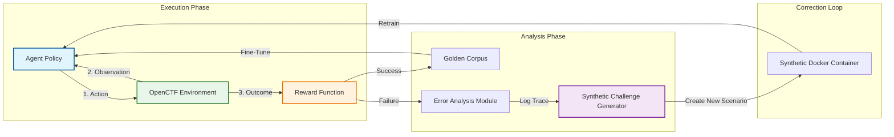

# Open CTF Environment

A **Cybersecurity Reinforcement Learning Environment** built on the [OpenEnv](https://huggingface.co/docs/openenv) framework, wrapping the [XBow Validation Benchmarks](https://github.com/xbow-engineering/validation-benchmarks) for safe, diverse, and verifiable offensive security training.

## Project Goals

This project demonstrates how generally intelligent security agents can be trained efficiently and safely utilizing open-source tools.

1.  **Green Intelligence:** Demonstrating energy-efficient training using [Unsloth](https://unsloth.ai).
2.  **Interactive Scaling:** Focusing on long-horizon task solving (400+ steps) via data augmentation.
3.  **Real-World Relevance:** Providing access to 90+ real-world vulnerability scenarios (SQLi, XSS, RCE, SSRF) in a safe, sandboxed Docker environment.

## Project Structure

```
open-ctf-env/
├── benchmarks/         # Cloned XBow challenges (Dockerized)
├── src/
│   ├── envs/           # OpenEnv / Gymnasium wrappers
│   └── utils/          # Energy monitoring & metrics
├── data/               # Datasets and training data
├── scripts/
│   ├── run_agent.py    # Agent runner script
│   ├── data/           # Data augmentation scripts
│   └── train/          # Unsloth training pipeline
├── references/
│   └── Cyber-AutoAgent/  # Baseline agent (Strands SDK)
└── README.md
```

## Quick Start

### 1. Requirements

- Docker & Docker Compose
- Python 3.11+
- Ollama (for local inference)

### 2. Setup

```bash
# Clone this repo
git clone https://github.com/your-org/open-ctf-env.git
cd open-ctf-env

# Clone XBow benchmarks
git clone https://github.com/xbow-engineering/validation-benchmarks.git benchmarks/xbow

# Install dependencies
uv pip install -e .

# Clone and install the baseline agent
git clone https://github.com/double16/Cyber-AutoAgent.git references/Cyber-AutoAgent
cd references/Cyber-AutoAgent && uv pip install -e . && cd ../..

# Pull required Ollama models
ollama pull qwen3:8b
ollama pull mxbai-embed-large

# Copy environment config
cp env.example .env
```

### 3. Run the Baseline Agent

```bash
# Test against a public vulnerable site
caa --target "http://testphp.vulnweb.com" \
    --objective "Find SQL injection vulnerabilities" \
    --provider ollama \
    --model qwen3:8b \
    --module ctf \
    --iterations 20

# Or use cloud providers (faster)
export GEMINI_API_KEY=your_key
caa --target "http://testphp.vulnweb.com" \
    --objective "Find SQL injection" \
    --provider litellm \
    --model gemini/gemini-2.5-flash \
    --iterations 20
```

### 4. Run Against XBow Challenges (Automated)

Use the helper script to auto-start challenges and run the agent:

```bash
# Run against a specific challenge ID (starts docker, runs agent, cleanup optional)
python scripts/run_agent.py --challenge XBEN-001-24 --iterations 50

# Check environment setup
python scripts/run_agent.py --check
```

### 5. Manual Execution

```bash
# Start a challenge manually
cd benchmarks/xbow/benchmarks/XBEN-001-24
docker compose up -d

# Run agent against it
caa --target "http://localhost:8080" \
    --objective "Find and capture the flag (format: FLAG{...})" \
    --provider ollama \
    --model qwen3:8b \
    --module ctf

# Stop challenge
docker compose down
```

## Environment Configuration

Copy `env.example` to `.env` and customize:

| Variable | Description | Default |
|----------|-------------|---------|
| `CYBER_AGENT_PROVIDER` | Model provider: `ollama`, `litellm`, `bedrock` | `litellm` |
| `CYBER_AGENT_LLM_MODEL` | LLM model ID | `ollama/qwen3:8b` |
| `MEM0_EMBEDDING_MODEL` | Embedding model for memory | `mxbai-embed-large` |
| `OLLAMA_HOST` | Ollama server URL | `http://localhost:11434` |

## OpenEnv Usage (RL Training)

```python
from src.envs.open_ctf import OpenCTFEnv

# Initialize a specific challenge
env = OpenCTFEnv(challenge_id="sqli-login-1")
obs, info = env.reset()

# Step 1: Recon
obs, reward, done, _, _ = env.step("nmap -p- target")
print(obs['stdout']) 

# Step 2: Attack
obs, reward, done, _, _ = env.step("sqlmap -u target ...")
if reward > 0:
    print("Flag captured!")
```

## Strategic Roadmap

### Phase 1: Foundation (✅ Complete)
- [x] **Integration:** Integrated OpenEnv with XBow Benchmarks (104 challenges).
- [x] **Baseline:** Established Cyber-AutoAgent (CAA) as the strong baseline.
- [x] **Infrastructure:** Validated Docker orchestration and Local LLM (Ollama) support.

### Phase 2: Data Engine (Current Focus)
- [ ] **Data Generation:** Execute CAA across all 104 XBow challenges to capture diverse attack vectors (SQLi, XSS, RCE).
- [ ] **Refinement:** Convert raw cyber logs into structured `{Instruction, Thought, Action, Reward}` tuples in `ShareGPT` format.
- [ ] **Augmentation:** Apply *Hindsight Experience Replay (HER)* to relabel close-call failures as partial successes for denser rewards.

### Phase 3: Green Intelligence Training (Next)
- [ ] **Model Selection:** Fine-tune **Devstral 24B** (Code-Specialized) or **OpenThoughts-8B** (Reasoning-Specialized) to balance performance and efficiency.
- [ ] **Methodology:** Utilize [Unsloth](https://github.com/unslothai/unsloth) for 4-bit quantized QLoRA training to minimize VRAM usage and carbon footprint.
- [ ] **Success Metrics:** Surpass baseline capture rates while reducing inference energy cost (Joules/Flag) by >30%.

### Phase 4: Interactive Scaling
**Objective:** Enable autonomous, unbounded improvement without human-labeled data.  
**Goal:** Achieve "Infinite Curriculum" capability where the agent generates its own training signals.

**Methodology (Self-Correction Loop):**
1.  **Exploration:** Agent attempts XBow challenges.
2.  **Verification:** `GreenScoreCard` provides deterministic feedback (Flag=1, Cost=Penalty).
3.  **Correction:**
    *   **Success:** Saved to "Golden Corpus".
    *   **Failure:** Teacher model analyzes logs -> Generates synthetic correction -> Retrains agent.



#### Detailed Task Workflow
1.  **Diagnosis (Error Analysis):** The system parses the execution trace to identify the root cause of failure (e.g., *"Used `sqlmap` with the wrong tamper script"*, *"Failed to identify base64 encoding"*).
2.  **Synthesis (Challenge Generation):** A "Teacher Agent" modifies the `docker-compose.yml` and application code of the failed challenge to create a **variant**.
    *   *Example:* If injection failed due to a specific WAF rule, the generator creates a new container with that specific WAF rule isolated for focused practice.
3.  **Validation:** The agent retrains on this new synthetic environment until it succeeds, proving it has learned the underlying concept (e.g., *"WAF Evasion"*) rather than just memorizing a specific flag path.

## License

MIT License - See [LICENSE](./LICENSE) for details.
