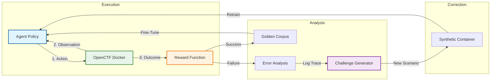

# Open CTF Environment

A **Cybersecurity Reinforcement Learning Environment** built on the [OpenEnv](https://huggingface.co/docs/openenv) framework, wrapping the [XBow Validation Benchmarks](https://github.com/xbow-engineering/validation-benchmarks) for safe, diverse, and verifiable offensive security training.

## What We Are Building

A small, deployable security agent that can autonomously assess and exploit web application vulnerabilities,
trained on real Docker-based CTF challenges rather than simulated environments.

**Base Model:** [GLM-4.7-Flash](https://huggingface.co/THUDM/GLM-4.7-Flash) (30B MoE, ~3.6B active params, 200K context, native tool-calling)

## Competitive Landscape

[Dreadnode "Worlds"](https://dreadnode.io/blog/worlds-a-simulation-engine-for-agentic-pentesting) demonstrated that an 8B model trained on purely synthetic trajectories achieved Domain Admin on GOAD. Key lessons from their work:

| Dreadnode Approach | Our Approach |
|--------------------|--------------|
| Simulated networks (no real infra) | Real Docker containers (XBow benchmarks) |
| Active Directory / network pentest focus | Web application vulnerability focus (SQLi, XSS, RCE, SSRF) |
| Synthetic tool outputs from templates | Real tool outputs from live services |
| Nemotron 8B base | GLM-4.7-Flash (~3.6B active, 200K context) |
| LoRA on Nemotron | QLoRA via Unsloth on GLM-4.7-Flash |

**Critical takeaway from Dreadnode:** Tool trajectories alone produced zero improvement. Only when they added **synthetic reasoning traces** (`<think>` tags grounded in full trajectory context) and **failure recovery examples** did the model go from 0 to Domain Admin.

**Our differentiation:**
1. **Real environments** eliminate the Sim2Real gap entirely (no template fidelity concerns).
2. **Web-first** focus targets the largest attack surface in enterprise (not just AD).
3. **GLM-4.7-Flash** delivers frontier-class reasoning with 3.6B active parameters, enabling on-prem deployment.

## Project Structure

```
open-ctf-env/
├── benchmarks/           # XBow challenges (104 Dockerized targets)
├── src/
│   ├── envs/             # OpenEnv / Gymnasium wrappers
│   └── utils/            # Energy monitoring, scoring
├── data/                 # Training datasets
├── scripts/
│   ├── run_agent.py      # Agent runner (Docker orchestration)
│   ├── train/            # Fine-tuning pipeline
│   └── validate_xbow.py  # Benchmark validation
├── references/
│   └── Cyber-AutoAgent/  # Baseline agent (Strands SDK)
└── README.md
```

## Quick Start

### 1. Requirements

- Docker and Docker Compose
- Python 3.11+
- [llama.cpp](https://github.com/ggml-org/llama.cpp) (for GLM-4.7-Flash inference)

### 2. Setup

```bash
# Clone this repo
git clone https://github.com/westonbrown/open-ctf-env.git
cd open-ctf-env

# Clone XBow benchmarks
git clone https://github.com/xbow-engineering/validation-benchmarks.git benchmarks/xbow

# Install dependencies
uv pip install -e .

# Clone and install the baseline agent
git clone https://github.com/double16/Cyber-AutoAgent.git references/Cyber-AutoAgent
cd references/Cyber-AutoAgent && uv pip install -e . && cd ../..

# Copy environment config
cp env.example .env
```

### 3. Serve GLM-4.7-Flash Locally

GLM-4.7-Flash runs on 24GB unified memory via llama.cpp (not recommended for Ollama due to chat template issues):

```bash
# Download the GGUF
pip install -U huggingface_hub
hf download unsloth/GLM-4.7-Flash-GGUF \
    --local-dir models/GLM-4.7-Flash-GGUF \
    --include "*UD-Q4_K_XL*"

# Serve via llama-server (OpenAI-compatible API)
./llama.cpp/llama-server \
    --model models/GLM-4.7-Flash-GGUF/GLM-4.7-Flash-UD-Q4_K_XL.gguf \
    --alias "glm-4.7-flash" \
    --ctx-size 16384 \
    --temp 0.7 --top-p 1.0 --min-p 0.01 \
    --port 8001 --jinja --fit on
```

Note: Use `--temp 0.7 --top-p 1.0` for tool-calling tasks. Disable repeat penalty (`--repeat-penalty 1.0`).

### 4. Run Against XBow Challenges

```bash
# Automated: start challenge, run agent, optional cleanup
python scripts/run_agent.py --challenge XBEN-001-24 --iterations 50

# Check environment setup
python scripts/run_agent.py --check
```

### 5. Manual Execution

```bash
# Start a challenge
cd benchmarks/xbow/benchmarks/XBEN-001-24
docker compose up -d

# Run agent against it
caa --target "http://localhost:8080" \
    --objective "Find and capture the flag (format: FLAG{...})" \
    --provider litellm \
    --model openai/glm-4.7-flash \
    --module ctf

# Stop challenge
docker compose down
```

## Environment Configuration

Copy `env.example` to `.env` and customize:

| Variable | Description | Default |
|----------|-------------|---------|
| `CYBER_AGENT_PROVIDER` | Model provider: `ollama`, `litellm` | `ollama` |
| `CYBER_AGENT_LLM_MODEL` | LLM model ID | `ollama/qwen3:8b` |
| `MEM0_EMBEDDING_MODEL` | Embedding model for memory | `mxbai-embed-large` |
| `OLLAMA_HOST` | Ollama server URL | `http://localhost:11434` |

For GLM-4.7-Flash via llama-server, set `CYBER_AGENT_PROVIDER=litellm` and `CYBER_AGENT_LLM_MODEL=openai/glm-4.7-flash` with `OPENAI_API_BASE=http://localhost:8001/v1`.

## OpenEnv Usage (RL Training)

```python
from src.envs.open_ctf import OpenCTFEnv

env = OpenCTFEnv(challenge_id="sqli-login-1")
obs, info = env.reset()

obs, reward, done, _, _ = env.step("nmap -p- target")
print(obs['stdout'])

obs, reward, done, _, _ = env.step("sqlmap -u target ...")
if reward > 0:
    print("Flag captured!")
```

## Strategic Roadmap

### Phase 1: Foundation (Complete)
- [x] Integrated OpenEnv with XBow Benchmarks (104 challenges).
- [x] Established Cyber-AutoAgent (CAA) as strong baseline.
- [x] Validated Docker orchestration and local LLM support.

### Phase 2: Data Engine (Current Focus)
- [ ] Execute CAA across all 104 XBow challenges to capture diverse attack trajectories.
- [ ] Format execution logs into structured `{Instruction, Thought, Action, Observation}` tuples in ShareGPT format.
- [ ] Generate synthetic `<think>` reasoning traces grounded in full trajectory context (per Dreadnode findings).
- [ ] Include failure recovery examples (tool errors, WAF blocks, timeouts) with corrective reasoning.

### Phase 3: Green Intelligence Training
- [ ] Fine-tune **GLM-4.7-Flash** (~3.6B active params) using [Unsloth](https://github.com/unslothai/unsloth) QLoRA (4-bit).
- [ ] Dataset composition: 75% reasoning traces, 25% direct tool-call sequences (per Unsloth recommendation for MoE reasoning models).
- [ ] Success metric: surpass baseline capture rate while reducing inference energy cost (Joules/Flag) by >30%.

### Phase 4: Interactive Scaling
**Objective:** Enable autonomous, unbounded improvement without human-labeled data.
**Goal:** Achieve "Infinite Curriculum" capability where the agent generates its own training signals.

**Methodology (Self-Correction Loop):**
1. **Exploration:** Agent attempts XBow challenges.
2. **Verification:** `GreenScoreCard` provides deterministic feedback (Flag=1, Cost=Penalty).
3. **Correction:**
    * **Success:** Trajectory saved to Golden Corpus.
    * **Failure:** Teacher model analyzes logs, generates synthetic correction, retrains agent.



#### Detailed Task Workflow
1. **Diagnosis:** Parse the execution trace to identify root cause of failure (wrong tool flags, missed encoding, blocked by WAF).
2. **Synthesis:** Teacher model modifies the failed challenge to create a focused variant that isolates the weakness.
3. **Validation:** Agent retrains on the synthetic variant until it demonstrates concept mastery (not flag memorization).

## License

MIT License - See [LICENSE](./LICENSE) for details.
