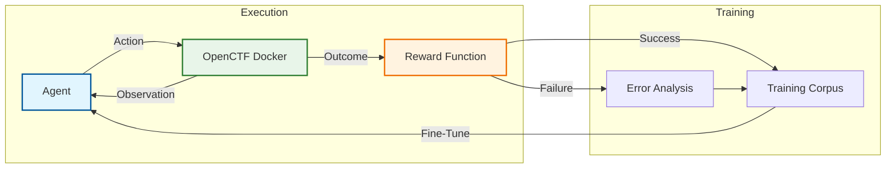

# Open CTF Environment

A **Cybersecurity Reinforcement Learning Environment** built on the [OpenEnv](https://huggingface.co/docs/openenv) framework, wrapping the [XBow Validation Benchmarks](https://github.com/xbow-engineering/validation-benchmarks) for safe, diverse, and verifiable offensive security training.

## Overview

Open CTF Environment provides a standardized interface for training and evaluating security agents against real, Dockerized web application challenges. It supports 104 challenges spanning SQL injection, XSS, RCE, SSRF, and more.

**Key Features:**
- Gymnasium-compatible RL interface for security tasks
- Docker-based challenge orchestration with automatic lifecycle management
- Energy-efficient training via [Unsloth](https://unsloth.ai) QLoRA
- Deterministic scoring with flag verification
- Compatible with any OpenAI-compatible LLM backend

## Project Structure

```
open-ctf-env/
├── benchmarks/           # XBow challenges (104 Dockerized targets)
├── src/
│   ├── envs/             # OpenEnv / Gymnasium wrappers
│   └── utils/            # Energy monitoring, scoring
├── data/                 # Training datasets
├── scripts/
│   ├── run_agent.py      # Agent runner (Docker orchestration)
│   ├── train/            # Fine-tuning pipeline
│   └── validate_xbow.py  # Benchmark validation
├── references/
│   └── Cyber-AutoAgent/  # Baseline agent (Strands SDK)
└── README.md
```

## Quick Start

### 1. Requirements

- Docker and Docker Compose
- Python 3.11+
- An LLM backend (Ollama, llama.cpp, vLLM, or any OpenAI-compatible API)

### 2. Setup

```bash
git clone https://github.com/westonbrown/open-ctf-env.git
cd open-ctf-env

# Clone XBow benchmarks
git clone https://github.com/xbow-engineering/validation-benchmarks.git benchmarks/xbow

# Install dependencies
uv pip install -e .

# Clone and install the baseline agent
git clone https://github.com/double16/Cyber-AutoAgent.git references/Cyber-AutoAgent
cd references/Cyber-AutoAgent && uv pip install -e . && cd ../..

# Copy environment config
cp env.example .env
```

### 3. Run the Baseline Agent

```bash
# Against a public test target
caa --target "http://testphp.vulnweb.com" \
    --objective "Find SQL injection vulnerabilities" \
    --provider ollama \
    --model qwen3:8b \
    --module ctf \
    --iterations 20
```

### 4. Run Against XBow Challenges

```bash
# Automated: start challenge, run agent, optional cleanup
python scripts/run_agent.py --challenge XBEN-001-24 --iterations 50

# Check environment setup
python scripts/run_agent.py --check
```

### 5. Manual Execution

```bash
cd benchmarks/xbow/benchmarks/XBEN-001-24
docker compose up -d

caa --target "http://localhost:8080" \
    --objective "Find and capture the flag (format: FLAG{...})" \
    --provider ollama \
    --model qwen3:8b \
    --module ctf

docker compose down
```

## Environment Configuration

Copy `env.example` to `.env` and customize:

| Variable | Description | Default |
|----------|-------------|---------|
| `CYBER_AGENT_PROVIDER` | Model provider: `ollama`, `litellm` | `ollama` |
| `CYBER_AGENT_LLM_MODEL` | LLM model ID | `ollama/qwen3:8b` |
| `MEM0_EMBEDDING_MODEL` | Embedding model for memory | `mxbai-embed-large` |
| `OLLAMA_HOST` | Ollama server URL | `http://localhost:11434` |

## OpenEnv Usage (RL Training)

```python
from src.envs.open_ctf import OpenCTFEnv

env = OpenCTFEnv(challenge_id="sqli-login-1")
obs, info = env.reset()

obs, reward, done, _, _ = env.step("nmap -p- target")
print(obs['stdout'])

obs, reward, done, _, _ = env.step("sqlmap -u target ...")
if reward > 0:
    print("Flag captured!")
```

## Roadmap

### Phase 1: Foundation (Complete)
- [x] Integrated OpenEnv with XBow Benchmarks (104 challenges)
- [x] Established Cyber-AutoAgent as baseline agent
- [x] Validated Docker orchestration and local LLM support

### Phase 2: Data Collection
- [ ] Execute baseline agent across all challenges to collect trajectories
- [ ] Format logs into structured training data (ShareGPT format)

### Phase 3: Fine-Tuning
- [ ] Fine-tune a small, efficient model using Unsloth QLoRA
- [ ] Evaluate against baseline on capture rate and efficiency

### Phase 4: Online Learning
- [ ] Implement GRPO loop using OpenEnv reward signals
- [ ] Enable self-improvement through iterative challenge attempts



## Related Work

- [OpenEnv](https://huggingface.co/docs/openenv) - Open environment framework
- [XBow Validation Benchmarks](https://github.com/xbow-engineering/validation-benchmarks) - CTF challenge suite
- [Cyber-AutoAgent](https://github.com/double16/Cyber-AutoAgent) - Baseline security agent
- [Dreadnode Worlds](https://dreadnode.io/blog/worlds-a-simulation-engine-for-agentic-pentesting) - Synthetic trajectory generation for security training
- [Unsloth](https://github.com/unslothai/unsloth) - Efficient fine-tuning

## License

MIT License - See [LICENSE](./LICENSE) for details.
