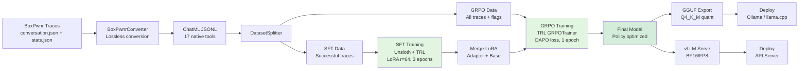

# Open CTF Environment

[](https://github.com/westonbrown/open-ctf-env)
[](https://www.python.org)
[](./LICENSE)

An open-source pipeline for **post-training security LLMs on CTF challenge trajectories**. Collect agent traces with [BoxPwnr](https://github.com/0ca/BoxPwnr), fine-tune with SFT + GRPO, evaluate on [CyBench](https://cybench.github.io/), and deploy locally on NVIDIA DGX Spark.

> Presented at **[un]prompted — The AI Security Practitioner Conference**
> March 3-4, 2026 | Salesforce Tower, San Francisco

## Thesis

Base open-weight models understand security concepts but cannot execute multi-step exploits. A 24B model can plan a 5-phase attack but fails to enumerate user IDs. A 20B model gets stuck thinking on step 1. We show that **trajectory-aware post-training** (SFT on expert traces, then GRPO with a multi-signal CTF reward function) closes this gap — producing a deployable security agent from GLM-4.7-Flash (30B MoE, ~3.6B active parameters) that runs locally on modest hardware.

## Overview


```mermaid
graph LR
    A[BoxPwnr Traces<br/>conversation.json + stats.json] --> B[BoxPwnrConverter<br/>Lossless conversion]
    B --> C[ChatML JSONL<br/>17 native tools]
    C --> D[DatasetSplitter]

    D --> E[SFT Data<br/>Successful traces]
    D --> F[GRPO Data<br/>All traces + flags]

    E --> G[SFT Training<br/>Unsloth + TRL<br/>LoRA r=64, 3 epochs]
    F --> H[GRPO Training<br/>TRL GRPOTrainer<br/>DAPO loss, 1 epoch]

    G --> I[Merge LoRA<br/>Adapter + Base]
    I --> H
    H --> J[Final Model<br/>Policy optimized]

    J --> K[GGUF Export<br/>Q4_K_M quant]
    J --> L[vLLM Serve<br/>BF16/FP8]

    K --> M[Deploy<br/>Ollama / llama.cpp]
    L --> N[Deploy<br/>API Server]

    style G fill:#e1f5e1
    style H fill:#e1f5e1
    style J fill:#d4edda
```

1. **Collect** — Run BoxPwnr against [CyBench](https://cybench.github.io/) Docker challenges (crypto, web, pwn, forensics, reverse engineering)
2. **Convert** — Lossless trace conversion preserving all 17 native tool names
3. **Train** — 3-stage pipeline: SFT → Offline GRPO → Online GRPO
4. **Evaluate** — Compare base vs fine-tuned on CyBench challenge suite
5. **Deploy** — Export to GGUF for local inference on DGX Spark or any GPU

### Offline vs Online GRPO

The pipeline uses GRPO in two complementary modes:

**Offline GRPO** — The model generates completions from static prompts without interacting with a live environment. Rewards come from the CTF reward function scoring the generated text against `ground_truth_flag` and `optimal_steps` from the dataset. This is fast (vLLM-accelerated generation) and stable, but the model never sees real tool output — it learns to *plan* exploits, not *execute* them.

**Online GRPO** — The model generates completions *and* executes tool calls against a live CTF challenge via the OpenEnv server. TRL's `tools=` parameter routes `shell_command`, `python_code`, and `submit_flag` calls to the environment, which returns real stdout/stderr. The model learns from actual execution feedback — commands that fail, outputs that reveal information, flags that verify. This closes the plan-execute gap that offline training leaves open.

Running both in sequence (offline first, then online) gives the model a strong prior on tool format and attack methodology before exposing it to the noisy, slow feedback loop of real environments.

## Results

> Training in progress — results will be published before the [un]prompted talk (March 3-4, 2026).

| Model | Solve Rate | Avg Steps | Avg Tokens | Avg Time | False Flags |
|-------|-----------|-----------|------------|----------|-------------|
| GLM-4.7-Flash (base) | TBD | TBD | TBD | TBD | TBD |
| + SFT | TBD | TBD | TBD | TBD | TBD |
| + Offline GRPO | TBD | TBD | TBD | TBD | TBD |
| + Online GRPO | TBD | TBD | TBD | TBD | TBD |

*For context: Claude Sonnet 4.5 achieves ~76.5% on CyBench. No open-weight model under 100B has published CyBench results.*

## Quick Start

### Requirements

- Python 3.10+
- PyTorch 2.4+ with CUDA support
- Docker and Docker Compose
- NVIDIA GPU with 24GB+ VRAM (60GB+ for GLM-4.7-Flash BF16 LoRA)

### Setup

```bash
git clone https://github.com/westonbrown/open-ctf-env.git
cd open-ctf-env

# Install PyTorch first (see https://pytorch.org/get-started/)
pip install torch torchvision --index-url https://download.pytorch.org/whl/cu121

# Install open-ctf-env
pip install -e .

# Optional: training dependencies (Unsloth, wandb)
pip install -e ".[train]"

# Clone BoxPwnr reference
git clone https://github.com/0ca/BoxPwnr.git references/boxpwnr

# Copy environment config
cp env.example .env
```

### Generate Training Data

```bash
# Convert BoxPwnr traces to training format
open-ctf-convert \
    --input /path/to/BoxPwnr-Traces \
    --output data/all_traces.jsonl \
    --output-failure data/failed_traces.jsonl \
    --dedup

# Split into SFT (successes) + GRPO (all traces with flags)
cat data/all_traces.jsonl data/failed_traces.jsonl > data/combined.jsonl
open-ctf-split \
    --input data/combined.jsonl \
    --sft-output data/sft.jsonl \
    --grpo-output data/grpo.jsonl
```

### Train

```bash
# Stage 1: SFT (tool format + domain knowledge)
open-ctf-train sft \
    --model unsloth/GLM-4.7-Flash \
    --data data/sft.jsonl \
    --output outputs/sft

# Merge LoRA adapter into base
open-ctf-train merge \
    --adapter outputs/sft/final \
    --output outputs/sft/merged

# Stage 2: GRPO (exploitation efficiency)
open-ctf-train grpo \
    --model outputs/sft/merged \
    --data data/grpo.jsonl \
    --output outputs/grpo
```

### Evaluate

```bash
# Compare base vs fine-tuned on CyBench
open-ctf-eval \
    --model outputs/grpo/final \
    --baseline unsloth/GLM-4.7-Flash \
    --challenges cybench
```

### Deploy

```bash
# Export to GGUF
open-ctf-export \
    --adapter outputs/grpo/final \
    --base-model unsloth/GLM-4.7-Flash \
    --output models/ctf-agent.gguf \
    --quant Q4_K_M

# Serve with Ollama
echo 'FROM ./models/ctf-agent.gguf
PARAMETER num_ctx 32768' > Modelfile
ollama create ctf-agent -f Modelfile
```

### Validate Pipeline (no GPU needed)

```bash
open-ctf-validate
```

## Training Data

Data is generated from [BoxPwnr-Traces](https://github.com/0ca/BoxPwnr-Traces) — real agent trajectories across 6 CTF platforms, collected by running frontier models (Claude Sonnet 4.5, GPT-5, Grok 4, Gemini 3) against Dockerized challenges.

| Dataset | Traces | Size | Description |
|---------|--------|------|-------------|
| `data/sft.jsonl` | 441 | 37MB | Successful solves — expert demonstrations for SFT |
| `data/grpo.jsonl` | 779 | 46MB | All traces with cross-referenced flags for GRPO |

**Source platforms:** HackTheBox (518), PicoCTF (393), PortSwigger (358), CyBench (142), HackBench (3)

Each trace is a full multi-turn conversation (avg 74 messages, up to 454) with structured tool calls in ChatML format. GRPO traces include `ground_truth_flag` and `optimal_steps` for reward computation.

## Reward Function

The CTF reward for GRPO training uses **6 signals + 1 penalty**. All process signals are **ungated** — they provide gradient signal in offline GRPO where the model generates completions without environment interaction and rarely captures the exact flag. Flag capture still provides a bonus when it occurs.

| Signal | Weight | Description |
|--------|--------|-------------|
| **Flag Capture** | 0.20 | `metadata.success` > exact match > pattern match (0.1) |
| **Efficiency** | 0.25 | `min(optimal / actual, 1.0)` |
| **Format** | 0.20 | Valid tool call JSON structure |
| **Progression** | 0.15 | RECON → ENUM → EXPLOIT phase ordering |
| **Exploration** | 0.10 | Novel tool usage weighted toward early trajectory |
| **Uniqueness** | 0.10 | Command diversity (detects stuck loops) |
| **Hallucination** | -0.10 | Penalty for `flag_found` calls with wrong flag |

**Design principles:**
- **No regex in process signals.** Progression uses set-based binary lookup on 60+ command names. Classification covers 90.6% of shell commands in the dataset.
- **`metadata.success` is authoritative.** BoxPwnr's platform validation signal overrides string matching in both directions.
- **Noise injection (+-0.05)** guarantees variance for GRPO gradients.

## Training Configuration

Edit `src/open_ctf/configs/training.yaml`:

```yaml
model:
  name: "unsloth/GLM-4.7-Flash"    # 30B MoE, ~3.6B active
  max_seq_length: 4096
  load_in_4bit: false               # MoE requires BF16 LoRA

lora:
  r: 64
  alpha: 64
  target_modules: [q_proj, k_proj, v_proj, o_proj, gate_proj, up_proj, down_proj]

sft:
  epochs: 3
  batch_size: 1
  learning_rate: 2.0e-4
  packing: true                     # 3x throughput

grpo:
  epochs: 1
  learning_rate: 5.0e-6
  beta: 0.0
  loss_type: dapo                   # Removes length bias
  num_generations: 8
```

**Hardware notes:**
- SFT + GRPO: Cloud H100/H200 recommended. DGX Spark GB10 works for SFT only (use `training_dgx.yaml`)
- Deployment: Q4_K_M GGUF fits in ~15GB — runs on any GPU including DGX Spark

## Project Structure

```
open-ctf-env/
├── data/                        # Training data (generated)
│   ├── sft.jsonl                # 441 successful traces
│   └── grpo.jsonl               # 779 traces with flags
├── docs/                        # Guides (quickstart, training, deployment, etc.)
├── Dockerfile                   # Container build
├── src/open_ctf/
│   ├── cli/                     # 7 CLI entry points
│   ├── agent/                   # BoxPwnr agent runner
│   ├── configs/                 # training.yaml, training_dgx.yaml
│   ├── data/                    # Trace converter + dataset splitter
│   ├── formatters/              # Qwen3, Devstral, GLM-4 formatters
│   │   └── tool_registry.py     # 17 BoxPwnr tool definitions
│   ├── rewards/reward.py        # CTFReward (6 signals + penalty)
│   ├── training/                # SFT + GRPO with Unsloth/HF fallback
│   │   ├── grpo.py              # GRPO trainer (offline + OpenEnv tools= mode)
│   │   └── tools.py             # TRL tool wrappers for live environment
│   ├── eval/                    # CyBench evaluation harness
│   └── envs/
│       ├── gym_env.py           # Gymnasium RL interface
│       └── openenv/             # OpenEnv server + client (online GRPO)
├── tests/
│   ├── test_rewards.py          # Reward function tests
│   └── test_openenv.py          # OpenEnv integration tests
└── references/boxpwnr/          # BoxPwnr agent framework
```

## CLI Commands

| Command | Purpose |
|---------|---------|
| `open-ctf-train` | SFT, GRPO, and LoRA merge |
| `open-ctf-convert` | Convert BoxPwnr traces to training format |
| `open-ctf-split` | Split datasets into SFT and GRPO sets |
| `open-ctf-agent` | Run agent against CyBench challenges |
| `open-ctf-eval` | Evaluate and compare models on CyBench |
| `open-ctf-validate` | Validate pipeline without GPU |
| `open-ctf-export` | Export LoRA adapter to GGUF |

## Roadmap

### Phase 1: Pipeline + Infrastructure (Done)
- [x] Lossless trace converter (tool-calling + chat-command formats)
- [x] Training data: 441 SFT + 779 GRPO traces from BoxPwnr across 6 platforms
- [x] 3-stage training pipeline: SFT + offline GRPO + online GRPO (Unsloth + TRL)
- [x] Multi-signal CTF reward function (6 signals + hallucination penalty)
- [x] OpenEnv server + TRL `tools=` integration for online GRPO with live environments
- [x] TRL prefix-preserving patch for GLM-4.7-Flash chat template
- [x] Model-specific formatters (Qwen3, Devstral, GLM-4)
- [x] BoxPwnr agent integration with 17 native security tools
- [x] CyBench challenge configs
- [x] GGUF export pipeline
- [x] Validation pipeline (`open-ctf-validate`)

### Phase 2: Train + Evaluate + Release (In Progress — Target: March 3)

**Train**
- [ ] SFT on cloud H100/H200 — data: 441 historical BoxPwnr success traces (BF16 LoRA, 3 epochs)
- [ ] Offline GRPO on cloud H100/H200 — data: 779 historical BoxPwnr traces with cross-referenced flags (DAPO, 8 generations, vLLM)
- [ ] Online GRPO on cloud H100/H200 — data: live CyBench challenges via OpenEnv `tools=` mode, model generates and executes against real targets
- [ ] Rejection sampling: use online-GRPO model to generate new traces, filter by success, retrain SFT
- [ ] Curriculum learning: order challenges by difficulty across training

**Evaluate** — metrics: solve rate, avg steps to flag, avg tokens generated, wall-clock time, tool call success rate, false flag submissions
- [ ] Baseline GLM-4.7-Flash (base) on CyBench challenge subset
- [ ] Evaluate base vs SFT vs offline-GRPO vs online-GRPO on same challenges
- [ ] Scale evaluation to full CyBench 40-challenge suite

**Release**
- [ ] Export final model to GGUF, validate on DGX Spark
- [ ] Publish results table (solve rate, avg steps, avg tokens, time per challenge)
- [ ] Upload fine-tuned weights to HuggingFace
- [ ] Tag v1.0.0 release

## BoxPwnr Tools

The converter preserves all 17 native BoxPwnr tool names:

| Category | Tools |
|----------|-------|
| Shell | `shell_command`, `execute_command` |
| Interactive | `exec_command`, `write_stdin` |
| Tmux | `tmux_send_and_read`, `tmux_wait_and_read`, `tmux_read_output`, `tmux_cancel_command` |
| Session | `list_sessions`, `close_session` |
| Code | `python_code` |
| Files | `read_file`, `grep`, `file_search`, `apply_patch` |
| Other | `flag_found`, `web_search` |

## Documentation

- [Quick Start](docs/quickstart.md) — Installation and first run
- [Data Collection Guide](docs/data-collection.md) — Collect traces with BoxPwnr on CyBench
- [Training Guide](docs/training.md) — 2-stage SFT + GRPO pipeline
- [Deployment Guide](docs/deployment.md) — GGUF export, Ollama, DGX Spark
- [Architecture](docs/architecture.md) — Module overview and data flow

## Contributing

```bash
# Run tests
pip install -e ".[dev]"
pytest tests/ -v

# Validate pipeline (no GPU)
open-ctf-validate

# Add a new CyBench challenge
# Edit src/open_ctf/configs/challenges.yaml
```

The reward function lives in `src/open_ctf/rewards/reward.py`. To add a new signal:
1. Add a `_new_signal_score()` method to `CTFReward`
2. Add the weight parameter to `__init__` (weights must sum to 1.0)
3. Add to the scoring formula in `__call__`
4. Add tests in `tests/test_rewards.py`

## Related Work

- [CyBench](https://cybench.github.io/) — Cybersecurity benchmark, 40 challenges, ICLR 2025 Oral ([paper](https://arxiv.org/abs/2408.08926), [repo](https://github.com/andyzorigin/cybench))
- [BoxPwnr](https://github.com/0ca/BoxPwnr) — LLM-powered CTF solver (our data collection engine)
- [Unsloth](https://github.com/unslothai/unsloth) — Efficient fine-tuning with MoE Grouped GEMM
- [TRL](https://github.com/huggingface/trl) — Transformer Reinforcement Learning (GRPOTrainer + DAPO)
- [DeepSeek R1](https://arxiv.org/abs/2501.12948) — SFT → GRPO pipeline inspiration
- [Dreadnode Worlds](https://dreadnode.io/blog/worlds) — "Reasoning traces are the critical delta" finding

## License

MIT License — See [LICENSE](./LICENSE) for details.
