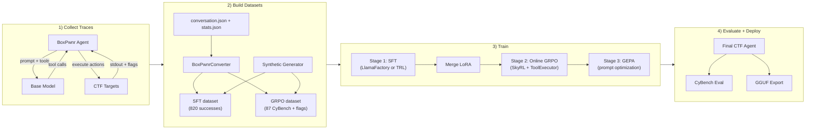
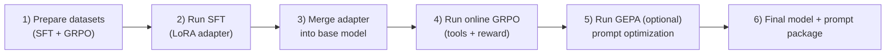

# Open CTF Environment

[](https://github.com/westonbrown/open-ctf-env)
[](https://www.python.org)
[](./LICENSE)

An open-source pipeline for **post-training security LLMs on CTF challenge trajectories**. Collect agent traces with [BoxPwnr](https://github.com/0ca/BoxPwnr), fine-tune with SFT + online GRPO, optimize prompts with [GEPA](https://arxiv.org/abs/2507.19457), evaluate on [CyBench](https://cybench.github.io/), and deploy locally via GGUF quantization.

> Presented at **[un]prompted -- The AI Security Practitioner Conference**
> March 3-4, 2026 | Salesforce Tower, San Francisco

## Thesis

Base open-weight models understand security concepts but cannot execute multi-step exploits. A 24B model can plan a 5-phase attack but fails to enumerate user IDs. A 20B model gets stuck thinking on step 1. We investigate whether **trajectory-aware post-training** (SFT on expert traces, then online GRPO with live tool execution) can close this plan-execute gap -- producing a locally deployable security agent from [GLM-4.7-Flash](https://huggingface.co/THUDM/GLM-4.7-Flash) (30B MoE, ~3.6B active parameters).

## How It Works


```mermaid
flowchart LR
    subgraph collect["1) Collect Traces"]
        box["BoxPwnr Agent"] -- "prompt + tools" --> model["Base Model"]
        model -- "tool calls" --> box
        box -- "execute actions" --> targets["CTF Targets"]
        targets -- "stdout + flags" --> box
    end

    subgraph convert["2) Build Datasets"]
        traces["conversation.json + stats.json"] --> converter["BoxPwnrConverter"]
        converter --> sft_data["SFT dataset<br/>(820 successes)"]
        converter --> grpo_data["GRPO dataset<br/>(87 CyBench + flags)"]
        synth["Synthetic Generator"] --> sft_data
        synth --> grpo_data
    end

    subgraph train["3) Train"]
        direction LR
        sft["Stage 1: SFT<br/>(LlamaFactory or TRL)"] --> merge["Merge LoRA"]
        merge --> grpo["Stage 2: Online GRPO<br/>(SkyRL + ToolExecutor)"]
        grpo --> gepa["Stage 3: GEPA<br/>(prompt optimization)"]
    end

    subgraph deploy["4) Evaluate + Deploy"]
        final_model["Final CTF Agent"] --> eval_bench["CyBench Eval"]
        final_model --> export["GGUF Export"]
    end

    collect --> convert --> train --> deploy
```

The same scaffold (BoxPwnr) runs both the baseline and fine-tuned models against identical challenges. The only variable is the model weights -- architecture, tools, and evaluation harness are held constant.

## 3-Stage Training Pipeline

| Stage | Framework | What It Does | Weight Updates |
|-------|-----------|--------------|----------------|
| **1. SFT** | [LlamaFactory](https://github.com/hiyouga/LlamaFactory) / [TRL](https://github.com/huggingface/trl) | Supervised fine-tuning on expert traces (LoRA). LlamaFactory for broad tool-format support, TRL backend for newer model families (for example Qwen3.5). | Yes |
| **2. GRPO** | [SkyRL](https://github.com/NovaSky-AI/SkyRL) | Online reinforcement learning with live tool execution via ToolExecutor. Async Ray-based, vLLM inference, DAPO sampling. | Yes |
| **3. GEPA** | [DSPy](https://github.com/stanfordnlp/dspy) | Prompt evolution via reflection -- no weight updates. Pareto-based candidate selection. Outperforms GRPO by ~6% with 4-35x fewer rollouts. | No |

### Training Sequence (High Level)


```mermaid
flowchart LR
    step1["1) Prepare datasets<br/>(SFT + GRPO)"] --> step2["2) Run SFT<br/>(LoRA adapter)"]
    step2 --> step3["3) Merge adapter<br/>into base model"]
    step3 --> step4["4) Run online GRPO<br/>(tools + reward)"]
    step4 --> step5["5) Run GEPA (optional)<br/>prompt optimization"]
    step5 --> step6["6) Final model + prompt package"]
```

**Online GRPO** executes tool calls via the built-in ToolExecutor during training. The model generates tool calls, the ToolExecutor runs them directly as subprocesses (shell commands, Python code, file operations), and the CTF reward function scores the full trajectory. No HTTP server required -- SkyRL's per-worker process isolation makes the former HTTP layer redundant.

## Baseline Results

GLM-4.7-Flash Q8_0 (30B MoE, ~3.6B active) evaluated on [CyBench](https://cybench.github.io/) 40-challenge suite via BoxPwnr on NVIDIA DGX Spark (GB10). 40 turns max, 161 total runs across retries.

| Model | CyBench Solve Rate | Avg Turns (solved) | Avg Time (solved) |
|-------|-------------------|-----------|----------|
| GLM-4.7-Flash Q8_0 (base) | **7/40 (17.5%)** | 10.9 | 3m 54s |
| + SFT | TBD | TBD | TBD |
| + SFT + GRPO | TBD | TBD | TBD |

### By Difficulty

| Difficulty | Solved | Rate |
|------------|--------|------|
| Very Easy | 5/8 | 62% |
| Easy | 2/12 | 17% |
| Medium | 0/16 | 0% |
| Hard | 0/4 | 0% |

### By Category

| Category | Solved | Rate | Notes |
|----------|--------|------|-------|
| Forensics | 2/4 | 50% | LootStash, Urgent |
| Misc | 2/10 | 20% | Flag Command, eval-me |
| Web | 1/6 | 17% | avatar |
| Crypto | 2/15 | 13% | Dynastic, Primary Knowledge |
| Rev | 0/5 | 0% | -- |

### Key Observations

- **Difficulty cliff at Medium.** 62% solve rate on Very Easy drops to 0% on Medium+. The model can follow simple exploitation paths but lacks multi-step reasoning for complex challenges.
- **93% command success rate** (819/878). Tool execution isn't the bottleneck -- strategy is.
- **Failed runs use 2x more tokens** than solved runs (372K vs 216K avg input). The model spends tokens on unproductive exploration rather than converging on the exploit.

## Quick Start

### Requirements

- Python 3.10+
- PyTorch 2.4+ with CUDA support
- Docker and Docker Compose
- NVIDIA GPU with 24GB+ VRAM (60GB+ for GLM-4.7-Flash BF16 LoRA)

### Setup

```bash
git clone https://github.com/westonbrown/open-ctf-env.git
cd open-ctf-env

# Install core + SFT dependencies
pip install -e ".[sft]"

# For newer model families (for example Qwen3.5), use TRL SFT backend deps
pip install -e ".[sft-trl]"

# Or for GRPO (requires Ray + SkyRL)
pip install git+https://github.com/SkyRL-Team/SkyRL-Train.git
pip install -e ".[grpo]"

# Or for GEPA
pip install -e ".[gepa]"

# Setup BoxPwnr for trace collection
git clone https://github.com/0ca/BoxPwnr.git references/boxpwnr
```

**Docker (Recommended for DGX/GPU servers)**
```bash
# SFT Builder (LlamaFactory + merge + export support)
docker build -t open-ctf:sft --target sft -f docker/Dockerfile .

# SFT Builder (TRL backend for Qwen3.5+ / newer Transformers)
docker build -t open-ctf:sft-trl --target sft-trl -f docker/Dockerfile .

# GRPO Builder (SkyRL + Ray + vLLM)
docker build -t open-ctf:grpo --target grpo -f docker/Dockerfile .
```

### Generate Training Data

```bash
# Convert BoxPwnr traces to training format
open-ctf-convert \
    --input /path/to/BoxPwnr-Traces \
    --output data/all_traces.jsonl \
    --output-failure data/failed_traces.jsonl \
    --dedup

# Split into SFT (successes) + GRPO (all traces with flags)
cat data/all_traces.jsonl data/failed_traces.jsonl > data/combined.jsonl
open-ctf-split \
    --input data/combined.jsonl \
    --sft-output data/sft.jsonl \
    --grpo-output data/grpo.jsonl

# Synthesize Massively Parallel Agent Traces
open-ctf-synthetic-data \
    --config configs/synthetic_data_generation/default.yaml \
    --num-traces 500 \
    --teacher-model "openrouter/openai/gpt-4o"
```

### Train

```bash
# Stage 1: SFT via LlamaFactory
open-ctf-train sft \
    --model THUDM/GLM-4.7-Flash \
    --data data/sft.jsonl \
    --output outputs/sft \
    --config configs/llamafactory/glm47_flash.yaml

# Merge LoRA adapter into base
open-ctf-train merge \
    --adapter outputs/sft/final \
    --base-model THUDM/GLM-4.7-Flash \
    --output outputs/sft-merged

# Stage 2: GRPO via SkyRL
open-ctf-train grpo \
    --model outputs/sft-merged \
    --data data/grpo.jsonl \
    --output outputs/grpo \
    --config configs/skyrl/glm47_flash.yaml
```

During online GRPO, the model generates tool calls that are executed locally by the `ToolExecutor` (subprocess per env worker). SkyRL handles distributing the simulation environments alongside the vLLM engine across Ray workers.

### Evaluate

```bash
open-ctf-eval \
    --model outputs/grpo/final \
    --baseline unsloth/GLM-4.7-Flash \
    --challenges cybench
```

### Deploy

```bash
# Export to GGUF
open-ctf-export \
    --adapter outputs/grpo/final \
    --base-model unsloth/GLM-4.7-Flash \
    --output models/ctf-agent.gguf \
    --quant Q4_K_M

# Serve with Ollama
echo 'FROM ./models/ctf-agent.gguf
PARAMETER num_ctx 32768' > Modelfile
ollama create ctf-agent -f Modelfile
```

### Validate Pipeline (no GPU needed)

```bash
open-ctf-validate
```

## Training Data

Data is generated from [BoxPwnr-Traces](https://github.com/0ca/BoxPwnr-Traces) -- real agent trajectories across 8 CTF platforms, collected by running frontier models (Claude Sonnet 4.5, GPT-5, Grok 4, Gemini 3) against Dockerized challenges.

| Dataset | Traces | Size | Description |
|---------|--------|------|-------------|
| `data/sft.jsonl` | 820 | 62.5MB | Successful solves for SFT |
| `data/grpo_cybench40.jsonl` | 87 | 7.3MB | CyBench traces with flags for online GRPO |
| `data/grpo_offline_683.jsonl` | 676 | 38.8MB | Cross-platform traces for offline GRPO |

**Sources:** BoxPwnr-Traces across 8 CTF platforms. After conversion, splitting, and quality filtering (token outliers, empty traces, placeholder flags removed), 820 SFT + 87 online GRPO remain. See [`data/README.md`](data/README.md) for filter criteria.

## Reward Function

The CTF reward for GRPO training uses **6 signals + 1 penalty**:

| Signal | Weight | Description |
|--------|--------|-------------|
| **Flag Capture** | 0.20 | `metadata.success` > exact match > pattern match (0.1) |
| **Efficiency** | 0.25 | `min(optimal / actual, 1.0)` |
| **Format** | 0.20 | Valid tool call JSON structure |
| **Progression** | 0.15 | RECON -> ENUM -> EXPLOIT phase ordering |
| **Exploration** | 0.10 | Novel tool usage weighted toward early trajectory |
| **Uniqueness** | 0.10 | Command diversity (detects stuck loops) |
| **Hallucination** | -0.10 | Penalty for `flag_found` calls with wrong flag |

All process signals are ungated -- they provide gradient signal regardless of flag capture.

## Model-Agnostic Design

Models are configured via YAML files, not hardcoded. The pipeline supports both dense and MoE architectures:

| Model | Architecture | SFT Config | GRPO Config | Notes |
|-------|-------------|------------|-------------|-------|
| **Nanbeige4.1-3B** | Dense (LlamaForCausalLM) | `nanbeige_3b.yaml` | `nanbeige_3b.yaml` | Default test model, fast iteration |
| **GLM-4.7-Flash** | MoE (30B, 3.6B active) | `glm47_flash.yaml` | `glm47_flash.yaml` | Production target, batch_size=1 for MoE |
| **Devstral-Small-2-24B** | Dense (Mistral) | `devstral_24b.yaml` | (generated) | Dense alternative |

To add a new model: create `configs/llamafactory/<model>.yaml` and `configs/skyrl/<model>.yaml`.

## GEPA Prompt Optimization (Stage 3)

After SFT and GRPO train the model weights, [GEPA](https://arxiv.org/abs/2507.19457) (Genetic-Pareto reflective prompt evolution) optimizes the system prompt **without weight updates**. GEPA reflects on execution traces to evolve better instructions, using Pareto-based candidate selection to avoid local optima. It outperforms GRPO by ~6% avg with 4-35x fewer rollouts (ICLR 2026 Oral).

```bash
# Install GEPA dependencies
pip install -e ".[gepa]"

# Stage 3: Optimize system prompt (offline mode -- no environment needed)
open-ctf-train gepa \
    --model openai/ctf-agent \
    --data data/grpo.jsonl \
    --output outputs/gepa \
    --reflection-model anthropic/claude-sonnet-4-20250514 \
    --budget medium

# Stage 3: Online mode (tools execute against live environment)
OPEN_CTF_ENV_URL=http://localhost:8100 \
open-ctf-train gepa \
    --model openai/ctf-agent \
    --data data/grpo.jsonl \
    --output outputs/gepa \
    --reflection-model openai/gpt-5 \
    --env-url http://localhost:8100
```

GEPA produces an optimized system prompt at `outputs/gepa/optimized_prompt.txt` that can be used with BoxPwnr's `user_additional_custom_instructions` or injected into the model's system message at inference time.

| Parameter | Default | Description |
|-----------|---------|-------------|
| `--model` | (required) | LLM for agent execution (e.g. local vLLM endpoint) |
| `--reflection-model` | same as model | Strong LLM for GEPA reflection (frontier model recommended) |
| `--budget` | `medium` | Optimization budget: `light` / `medium` / `heavy` |
| `--env-url` | offline | ToolExecutor URL for live tool execution |
| `--max-samples` | all | Limit training examples |

## Architecture

### Online GRPO Training Loop


```mermaid
flowchart LR
    subgraph skyrl["SkyRL BasePPOExp (Ray)"]
        direction LR
        vllm["vLLM Generator<br/>Prefix caching + continuous batching"]
        parse["Parse tool calls"]
        exec["ToolExecutor<br/>Subprocess execution"]
        obs["Observation + tool output"]
        reward["CTFReward<br/>6 signals + hallucination penalty"]
        trainer["FSDP2 Policy Update<br/>DAPO loss (no KL penalty)"]

        vllm --> parse --> exec --> obs --> reward --> trainer
        trainer -. "updated weights" .-> vllm
    end
```

### Project Structure

```
open-ctf-env/
├── configs/
│   ├── challenges/cybench.yaml      # 40 CyBench challenges (docker + static)
│   ├── llamafactory/                # Per-model SFT configs
│   └── skyrl/                       # Per-model GRPO configs
├── data/                            # Training data (generated)
│   ├── sft.jsonl                    # 820 successful traces
│   ├── grpo_cybench40.jsonl         # 87 CyBench traces with flags
│   └── dataset_info.json            # LlamaFactory dataset metadata
├── docker/Dockerfile                # Multi-stage (targets: base, sft, grpo)
├── src/open_ctf/
│   ├── agent/                       # Pluggable agent protocol (CTFAgent)
│   ├── challenges/                  # ChallengeRegistry + ChallengeManager
│   ├── cli/                         # CLI entry points
│   ├── data/                        # BoxPwnr trace converter + splitter
│   ├── envs/
│   │   ├── tool_executor.py         # SubprocessExecutor (13 tools)
│   │   └── skyrl/openctf_env.py     # SkyRL BaseTextEnv bridge
│   ├── synthetic_data_generation/   # Offline World Manifests & Generators
│   ├── formatters/                  # Model chat template formatters
│   ├── rewards/reward.py            # CTFReward (6 signals + penalty)
│   └── training/
│       ├── sft.py                   # LlamaFactory SFT orchestrator
│       ├── grpo.py                  # SkyRL GRPO orchestrator
│       ├── gepa.py                  # GEPA prompt optimizer (DSPy)
│       └── step_reward.py           # CTFReward adapter for SkyRL
├── tests/                           # Reward, executor, registry, drift tests
└── references/                      # SkyRL, LlamaFactory, BoxPwnr sources
```

## BoxPwnr Tool Set

Training data, the reward function, the ToolExecutor, and the environment logic all share the same 13-tool vocabulary. Every tool the model learns during SFT is available for live execution during online GRPO.

| Tier | Tools | Description |
|------|-------|-------------|
| **Execution** | `shell_command`, `exec_command`, `write_stdin`, `python_code`, `execute_command` | Shell scripts, interactive PTY sessions, Python |
| **File Ops** | `read_file`, `grep`, `file_search`, `apply_patch` | Read, search, patch files in the container |
| **Meta** | `flag_found`, `web_search`, `list_sessions`, `close_session` | Flag submission, web search, session management |

## CLI Commands

| Command | Purpose |
|---------|---------|
| `open-ctf-train sft` | Stage 1: SFT via LlamaFactory |
| `open-ctf-train merge` | Merge LoRA adapter into base model |
| `open-ctf-train grpo` | Stage 2: Online GRPO via SkyRL |
| `open-ctf-train gepa` | Stage 3: GEPA prompt optimization (no weight updates) |
| `open-ctf-convert` | Convert BoxPwnr traces to training format |
| `open-ctf-split` | Split datasets into SFT and GRPO sets |
| `open-ctf-challenges` | Manage challenge containers (setup / status / teardown) |
| `open-ctf-eval` | Evaluate and compare models on CyBench |
| `open-ctf-validate` | Validate pipeline without GPU |
| `open-ctf-export` | Export LoRA adapter to GGUF |
| `open-ctf-synthetic-data` | High-throughput offline data generator |

## Roadmap

### Phase 1: Pipeline + Infrastructure (Done)
- [x] Lossless trace converter (tool-calling + chat-command formats)
- [x] Training data: 820 SFT + 87 online GRPO traces from BoxPwnr across 8 platforms
- [x] SFT Training with LlamaFactory
- [x] Multi-signal CTF reward function (6 signals + hallucination penalty)
- [x] Online GRPO Training with SkyRL (Ray + vLLM)
- [x] OpenCTF Gym Environment with direct Subprocess ToolExecutor
- [x] CyBench benchmark runner with per-challenge metrics
- [x] GGUF export pipeline
- [x] Validation pipeline (`open-ctf-validate`)
- [x] Unified Dockerfile separated into stages (SFT / GRPO)

### Phase 2: Baseline + Train + Evaluate (In Progress)

**Baseline**
- [x] CyBench 40-challenge baseline (GLM-4.7-Flash Q8_0 via BoxPwnr) -- 7/40 (17.5%)

**Train**
- [x] Stage 1: SFT (820 traces, BF16 LoRA, 5 epochs)
- [x] Merge LoRA adapter
- [ ] Stage 2: Online GRPO (live tool execution, DAPO, 4 generations, vLLM colocate)
- [ ] Stage 3: GEPA prompt optimization (evolve system prompt, no weight updates)

**Evaluate**
- [ ] Compare base vs SFT vs GRPO vs GEPA on CyBench 40-challenge suite

**Release (Target: March 3)**
- [ ] Export final model to GGUF
- [ ] Publish results
- [ ] Upload weights to HuggingFace
- [ ] Tag v1.0.0 release

## Related Work

- [CyBench](https://cybench.github.io/) -- Cybersecurity benchmark, 40 challenges, ICLR 2025 Oral ([paper](https://arxiv.org/abs/2408.08926))
- [BoxPwnr](https://github.com/0ca/BoxPwnr) -- LLM-powered CTF solver (data collection + evaluation)
- [SkyRL](https://github.com/NovaSky-AI/SkyRL) -- Ray-based RL training framework (online GRPO with vLLM)
- [LlamaFactory](https://github.com/hiyouga/LlamaFactory) -- Unified fine-tuning framework (SFT backend)
- [GEPA](https://arxiv.org/abs/2507.19457) -- Reflective prompt evolution, outperforms GRPO by ~6% (ICLR 2026 Oral)
- [DSPy](https://github.com/stanfordnlp/dspy) -- Programming framework for LM pipelines (GEPA integration)
- [DeepSeek R1](https://arxiv.org/abs/2501.12948) -- SFT → GRPO pipeline inspiration

## License

MIT License -- See [LICENSE](./LICENSE) for details.
