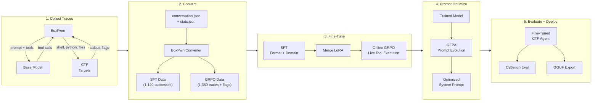

# Open CTF Environment

[](https://github.com/westonbrown/open-ctf-env)
[](https://www.python.org)
[](./LICENSE)

An open-source pipeline for **post-training security LLMs on CTF challenge trajectories**. Collect agent traces with [BoxPwnr](https://github.com/0ca/BoxPwnr), fine-tune with SFT + online GRPO, optimize prompts with [GEPA](https://arxiv.org/abs/2507.19457), evaluate on [CyBench](https://cybench.github.io/), and deploy locally via GGUF quantization.

> Presented at **[un]prompted -- The AI Security Practitioner Conference**
> March 3-4, 2026 | Salesforce Tower, San Francisco

## Thesis

Base open-weight models understand security concepts but cannot execute multi-step exploits. A 24B model can plan a 5-phase attack but fails to enumerate user IDs. A 20B model gets stuck thinking on step 1. We investigate whether **trajectory-aware post-training** (SFT on expert traces, then online GRPO with live tool execution) can close this plan-execute gap -- producing a locally deployable security agent from [GLM-4.7-Flash](https://huggingface.co/THUDM/GLM-4.7-Flash) (30B MoE, ~3.6B active parameters).

## How It Works


```mermaid
flowchart LR
    subgraph collect["1. Collect Traces"]
        scaffold["BoxPwnr"] -- "prompt + tools" --> llm["Base Model"]
        llm -- "tool calls" --> scaffold
        scaffold -- "shell, python, files" --> challenges["CTF\nTargets"]
        challenges -- "stdout, flags" --> scaffold
    end

    subgraph convert["2. Convert"]
        traces["conversation.json\n+ stats.json"] --> converter["BoxPwnrConverter"]
        converter --> sft_data["SFT Data\n(1,120 successes)"]
        converter --> grpo_data["GRPO Data\n(1,369 traces + flags)"]
    end

    subgraph train["3. Fine-Tune"]
        sft["SFT\nFormat + Domain"] --> merge["Merge LoRA"]
        merge --> grpo["Online GRPO\nLive Tool Execution"]
    end

    subgraph optimize["4. Prompt Optimize"]
        grpo_out["Trained Model"] --> gepa["GEPA\nPrompt Evolution"]
        gepa --> prompt["Optimized\nSystem Prompt"]
    end

    subgraph deploy["5. Evaluate + Deploy"]
        eval_model["Fine-Tuned\nCTF Agent"] --> eval_bench["CyBench Eval"]
        eval_model --> export["GGUF Export"]
    end

    collect --> convert --> train
    grpo --> optimize --> deploy
```

The same scaffold (BoxPwnr) runs both the baseline and fine-tuned models against identical challenges. The only variable is the model weights -- architecture, tools, and evaluation harness are held constant.

**Online GRPO** uses TRL's `tools=` parameter to execute tool calls against a live OpenEnv server during training. The model generates tool calls, the environment executes them (shell commands, Python code, file operations), and the CTF reward function scores the full trajectory. vLLM colocate mode accelerates generation 3-6x over HuggingFace generate.

## Baseline Results

GLM-4.7-Flash Q8_0 (30B MoE, ~3.6B active) evaluated on [CyBench](https://cybench.github.io/) 40-challenge suite via BoxPwnr on NVIDIA DGX Spark (GB10). 40 turns max, 161 total runs across retries.

| Model | CyBench Solve Rate | Avg Turns (solved) | Avg Time (solved) |
|-------|-------------------|-----------|----------|
| GLM-4.7-Flash Q8_0 (base) | **7/40 (17.5%)** | 10.9 | 3m 54s |
| + SFT | TBD | TBD | TBD |
| + SFT + GRPO | TBD | TBD | TBD |

### By Difficulty

| Difficulty | Solved | Rate |
|------------|--------|------|
| Very Easy | 5/8 | 62% |
| Easy | 2/12 | 17% |
| Medium | 0/16 | 0% |
| Hard | 0/4 | 0% |

### By Category

| Category | Solved | Rate | Notes |
|----------|--------|------|-------|
| Forensics | 2/4 | 50% | LootStash, Urgent |
| Misc | 2/10 | 20% | Flag Command, eval-me |
| Web | 1/6 | 17% | avatar |
| Crypto | 2/15 | 13% | Dynastic, Primary Knowledge |
| Rev | 0/5 | 0% | -- |

### Key Observations

- **Difficulty cliff at Medium.** 62% solve rate on Very Easy drops to 0% on Medium+. The model can follow simple exploitation paths but lacks multi-step reasoning for complex challenges.
- **93% command success rate** (819/878). Tool execution isn't the bottleneck -- strategy is.
- **Failed runs use 2x more tokens** than solved runs (372K vs 216K avg input). The model spends tokens on unproductive exploration rather than converging on the exploit.

## Quick Start

### Requirements

- Python 3.10+
- PyTorch 2.4+ with CUDA support
- Docker and Docker Compose
- NVIDIA GPU with 24GB+ VRAM (60GB+ for GLM-4.7-Flash BF16 LoRA)

### Setup

**Option A: Local Install**
```bash
git clone https://github.com/westonbrown/open-ctf-env.git
cd open-ctf-env
pip install torch torchvision --index-url https://download.pytorch.org/whl/cu121
pip install -e ".[dev,train]"

# Setup BoxPwnr for trace collection
git clone https://github.com/0ca/BoxPwnr.git references/boxpwnr
```

**Option B: Docker (Recommended for DGX/GPU servers)**
```bash
git clone https://github.com/westonbrown/open-ctf-env.git
cd open-ctf-env
docker build -t open-ctf-env:latest .
```

The Docker image includes vLLM (compiled for Blackwell GB10), TRL 0.28+, Unsloth, and all training dependencies.

### Generate Training Data

```bash
# Convert BoxPwnr traces to training format
open-ctf-convert \
    --input /path/to/BoxPwnr-Traces \
    --output data/all_traces.jsonl \
    --output-failure data/failed_traces.jsonl \
    --dedup

# Split into SFT (successes) + GRPO (all traces with flags)
cat data/all_traces.jsonl data/failed_traces.jsonl > data/combined.jsonl
open-ctf-split \
    --input data/combined.jsonl \
    --sft-output data/sft.jsonl \
    --grpo-output data/grpo.jsonl
```

### Train

```bash
# Stage 1: SFT (tool format + domain knowledge)
open-ctf-train sft \
    --model unsloth/GLM-4.7-Flash \
    --data data/sft.jsonl \
    --output outputs/sft

# Merge LoRA adapter into base
open-ctf-train merge \
    --adapter outputs/sft/final \
    --output outputs/sft-merged

# Stage 2: Online GRPO (live tool execution via OpenEnv)
# Start the environment server, then train with tools=
OPEN_CTF_ENV_URL=http://localhost:8100 \
open-ctf-train grpo \
    --model outputs/sft-merged \
    --data data/grpo.jsonl \
    --output outputs/grpo \
    --config src/open_ctf/configs/training_dgx.yaml
```

During online GRPO, the model generates tool calls that are executed against the OpenEnv server in real-time. The `OnlineGRPOTrainer` resets the environment before each batch and tracks episode completion across `num_generations`.

### Evaluate

```bash
open-ctf-eval \
    --model outputs/grpo/final \
    --baseline unsloth/GLM-4.7-Flash \
    --challenges cybench
```

### Deploy

```bash
# Export to GGUF
open-ctf-export \
    --adapter outputs/grpo/final \
    --base-model unsloth/GLM-4.7-Flash \
    --output models/ctf-agent.gguf \
    --quant Q4_K_M

# Serve with Ollama
echo 'FROM ./models/ctf-agent.gguf
PARAMETER num_ctx 32768' > Modelfile
ollama create ctf-agent -f Modelfile
```

### Validate Pipeline (no GPU needed)

```bash
open-ctf-validate
```

## Training Data

Data is generated from [BoxPwnr-Traces](https://github.com/0ca/BoxPwnr-Traces) -- real agent trajectories across 8 CTF platforms, collected by running frontier models (Claude Sonnet 4.5, GPT-5, Grok 4, Gemini 3) against Dockerized challenges.

| Dataset | Traces | Size | Description |
|---------|--------|------|-------------|
| `data/sft.jsonl` | 1,120 | 97MB | Successful solves for SFT |
| `data/grpo.jsonl` | 1,369 | 82MB | All traces with cross-referenced flags for GRPO |

**Sources:** HackTheBox (997), XBOW (462), PicoCTF (433), PortSwigger (377), CyBench (311), TryHackMe (204), 2712 (197), HackBench (3) -- 2,984 raw traces total. After conversion, splitting, and quality filtering (token outliers, empty traces, placeholder flags removed), 1,369 remain. See [`data/README.md`](data/README.md) for filter criteria and quality metrics.

## Reward Function

The CTF reward for GRPO training uses **6 signals + 1 penalty**:

| Signal | Weight | Description |
|--------|--------|-------------|
| **Flag Capture** | 0.20 | `metadata.success` > exact match > pattern match (0.1) |
| **Efficiency** | 0.25 | `min(optimal / actual, 1.0)` |
| **Format** | 0.20 | Valid tool call JSON structure |
| **Progression** | 0.15 | RECON -> ENUM -> EXPLOIT phase ordering |
| **Exploration** | 0.10 | Novel tool usage weighted toward early trajectory |
| **Uniqueness** | 0.10 | Command diversity (detects stuck loops) |
| **Hallucination** | -0.10 | Penalty for `flag_found` calls with wrong flag |

All process signals are ungated -- they provide gradient signal regardless of flag capture.

## Training Configuration

Edit `src/open_ctf/configs/training_dgx.yaml`. Key settings:

| Parameter | SFT | GRPO |
|-----------|-----|------|
| Model | `unsloth/GLM-4.7-Flash` | SFT merged output |
| LoRA rank | 64 | 64 |
| Learning rate | 2e-4 | 5e-6 |
| Epochs | 3 | 1 |
| Loss | Cross-entropy | DAPO |
| Packing | Yes (3x throughput) | N/A |
| vLLM colocate | N/A | Yes (3-6x faster) |
| KV cache dtype | N/A | FP8 (halves cache memory) |
| Tool iterations | N/A | 15 max per generation |
| Generations | N/A | 4 per prompt |

## GEPA Prompt Optimization (Stage 3)

After SFT and GRPO train the model weights, [GEPA](https://arxiv.org/abs/2507.19457) (Genetic-Pareto reflective prompt evolution) optimizes the system prompt **without weight updates**. GEPA reflects on execution traces to evolve better instructions, using Pareto-based candidate selection to avoid local optima. It outperforms GRPO by ~6% avg with 4-35x fewer rollouts (ICLR 2026 Oral).

```bash
# Install GEPA dependencies
pip install -e ".[gepa]"

# Stage 3: Optimize system prompt (offline mode -- no environment needed)
open-ctf-train gepa \
    --model openai/ctf-agent \
    --data data/grpo.jsonl \
    --output outputs/gepa \
    --reflection-model anthropic/claude-sonnet-4-20250514 \
    --budget medium

# Stage 3: Online mode (tools execute against live environment)
OPEN_CTF_ENV_URL=http://localhost:8100 \
open-ctf-train gepa \
    --model openai/ctf-agent \
    --data data/grpo.jsonl \
    --output outputs/gepa \
    --reflection-model openai/gpt-5 \
    --env-url http://localhost:8100
```

GEPA produces an optimized system prompt at `outputs/gepa/optimized_prompt.txt` that can be used with BoxPwnr's `user_additional_custom_instructions` or injected into the model's system message at inference time.

| Parameter | Default | Description |
|-----------|---------|-------------|
| `--model` | (required) | LLM for agent execution (e.g. local vLLM endpoint) |
| `--reflection-model` | same as model | Strong LLM for GEPA reflection (frontier model recommended) |
| `--budget` | `medium` | Optimization budget: `light` / `medium` / `heavy` |
| `--env-url` | offline | OpenEnv server URL for live tool execution |
| `--max-samples` | all | Limit training examples |

## Architecture

### Online GRPO Training Loop

```
OnlineGRPOTrainer (extends TRL GRPOTrainer)
    |
    +-- _tool_call_loop() override
    |       |
    |       +-- mark_step_begin()    # Reset environment
    |       +-- super()._tool_call_loop()
    |       |       |
    |       |       +-- vLLM generate  # Fast inference
    |       |       +-- parse tool calls
    |       |       +-- execute via tools.py  # HTTP to OpenEnv
    |       |       +-- append results
    |       |       +-- repeat (max 15 iterations)
    |       |
    |       +-- log statistics
    |
    +-- CTFReward scores full trajectory
    +-- DAPO policy gradient update
```

### Project Structure

```
open-ctf-env/
├── data/                        # Training data (generated)
│   ├── sft.jsonl                # 1,120 successful traces
│   ├── grpo.jsonl               # 1,369 traces with flags
│   └── README.md                # Filter criteria + quality metrics
├── src/open_ctf/
│   ├── cli/                     # CLI entry points (train, convert, split, etc.)
│   ├── configs/                 # training.yaml, training_dgx.yaml
│   ├── data/                    # Trace converter + dataset splitter
│   │   ├── converter.py         # BoxPwnr -> ChatML (lossless, 13 tools)
│   │   └── splitter.py          # Success -> SFT, All -> GRPO
│   ├── envs/openenv/            # OpenEnv server (live tool execution)
│   │   ├── server.py            # HTTP server with 13 tool handlers
│   │   └── models.py            # Action, Observation, State dataclasses
│   ├── rewards/reward.py        # CTFReward (6 signals + penalty)
│   └── training/
│       ├── sft.py               # SFTTrainer (Unsloth + HF fallback)
│       ├── grpo.py              # OnlineGRPOTrainer (TRL tools= + vLLM)
│       ├── gepa.py              # GEPA prompt optimizer (DSPy + ReAct)
│       └── tools.py             # 13 TRL tool wrappers with episode mgmt
├── scripts/
│   ├── run_cybench_benchmark.py # Full CyBench benchmark runner
│   └── spawn_all_cybench.py     # Docker setup for all 40 challenges
├── tests/
│   ├── test_rewards.py          # Reward function tests
│   └── test_openenv.py          # OpenEnv integration tests
├── Dockerfile                   # Unified container (vLLM + TRL + Unsloth)
└── references/
    └── boxpwnr/                 # BoxPwnr agent framework
```

## BoxPwnr Tool Set

Training data, the reward function, the OpenEnv server, and the TRL tool wrappers all share the same 13-tool vocabulary. Every tool the model learns during SFT is available for live execution during online GRPO.

| Tier | Tools | Description |
|------|-------|-------------|
| **Execution** | `shell_command`, `exec_command`, `write_stdin`, `python_code`, `execute_command` | Shell scripts, interactive PTY sessions, Python |
| **File Ops** | `read_file`, `grep`, `file_search`, `apply_patch` | Read, search, patch files in the container |
| **Meta** | `flag_found`, `web_search`, `list_sessions`, `close_session` | Flag submission, web search, session management |

## CLI Commands

| Command | Purpose |
|---------|---------|
| `open-ctf-train sft` | Stage 1: Supervised fine-tuning with Unsloth |
| `open-ctf-train merge` | Merge LoRA adapter into base model |
| `open-ctf-train grpo` | Stage 2: Online GRPO with live tool execution |
| `open-ctf-train gepa` | Stage 3: GEPA prompt optimization (no weight updates) |
| `open-ctf-convert` | Convert BoxPwnr traces to training format |
| `open-ctf-split` | Split datasets into SFT and GRPO sets |
| `open-ctf-agent` | Run agent against CyBench challenges |
| `open-ctf-eval` | Evaluate and compare models on CyBench |
| `open-ctf-validate` | Validate pipeline without GPU |
| `open-ctf-export` | Export LoRA adapter to GGUF |

## Roadmap

### Phase 1: Pipeline + Infrastructure (Done)
- [x] Lossless trace converter (tool-calling + chat-command formats)
- [x] Training data: 1,120 SFT + 1,369 GRPO traces from BoxPwnr across 8 platforms
- [x] 2-stage training pipeline: SFT + Online GRPO with live tool execution
- [x] Multi-signal CTF reward function (6 signals + hallucination penalty)
- [x] OnlineGRPOTrainer with per-batch environment resets and episode tracking
- [x] OpenEnv HTTP server with 13 BoxPwnr tool handlers
- [x] TRL prefix-preserving patch for GLM-4.7-Flash
- [x] CyBench benchmark runner with per-challenge metrics
- [x] GGUF export pipeline
- [x] Validation pipeline (`open-ctf-validate`)
- [x] Unified Dockerfile with vLLM + TRL 0.28 + Unsloth for DGX Spark

### Phase 2: Baseline + Train + Evaluate (In Progress)

**Baseline**
- [x] CyBench 40-challenge baseline (GLM-4.7-Flash Q8_0 via BoxPwnr) -- 7/40 (17.5%)

**Train**
- [x] Stage 1: SFT (1,120 traces, BF16 LoRA, 3 epochs)
- [x] Merge LoRA adapter
- [ ] Stage 2: Online GRPO (live tool execution, DAPO, 4 generations, vLLM colocate)
- [ ] Stage 3: GEPA prompt optimization (evolve system prompt, no weight updates)

**Evaluate**
- [ ] Compare base vs SFT vs GRPO vs GEPA on CyBench 40-challenge suite

**Release (Target: March 3)**
- [ ] Export final model to GGUF
- [ ] Publish results
- [ ] Upload weights to HuggingFace
- [ ] Tag v1.0.0 release

## Related Work

- [CyBench](https://cybench.github.io/) -- Cybersecurity benchmark, 40 challenges, ICLR 2025 Oral ([paper](https://arxiv.org/abs/2408.08926))
- [BoxPwnr](https://github.com/0ca/BoxPwnr) -- LLM-powered CTF solver (data collection + evaluation)
- [OpenEnv](https://github.com/OpenEnvs/OpenEnv) -- Gymnasium-style RL environments for LLM agents (online GRPO backend)
- [Unsloth](https://github.com/unslothai/unsloth) -- Efficient fine-tuning with MoE Grouped GEMM
- [TRL](https://github.com/huggingface/trl) -- Transformer Reinforcement Learning (GRPOTrainer + DAPO + tools=)
- [GEPA](https://arxiv.org/abs/2507.19457) -- Reflective prompt evolution, outperforms GRPO by ~6% (ICLR 2026 Oral)
- [DSPy](https://github.com/stanfordnlp/dspy) -- Programming framework for LM pipelines (GEPA integration)
- [DeepSeek R1](https://arxiv.org/abs/2501.12948) -- SFT -> GRPO pipeline inspiration

## License

MIT License -- See [LICENSE](./LICENSE) for details.
