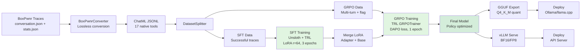

# Open CTF Environment

[](https://github.com/westonbrown/open-ctf-env)
[](https://www.python.org)
[](./LICENSE)

An open-source **CTF training pipeline** for security LLMs. Collect agent traces with [BoxPwnr](https://github.com/0ca/BoxPwnr), fine-tune with SFT + GRPO, and deploy efficient models for autonomous penetration testing.

**Latest**: v0.3.0 (February 2026) - Production-ready 2-stage training pipeline with Unsloth 2026.2.1, TRL 0.28.0, full DGX Spark GB10 support.

## Overview

Open CTF Environment provides an end-to-end pipeline:

1. **Run** a BoxPwnr agent against Dockerized CTF challenges
2. **Convert** traces to structured training data (lossless, all native tool names preserved)
3. **Train** with SFT (supervised) and GRPO (reinforcement) stages via Unsloth
4. **Deploy** as GGUF for Ollama/llama.cpp or serve with vLLM

**Key Features:**
- BoxPwnr integration for 17 native security tools (shell, tmux, python, grep, etc.)
- Structure-preserving trace converter handling both tool-calling and chat-command formats
- 2-stage training: SFT for knowledge, GRPO for efficiency optimization
- CTF reward function with flag capture, skill grammar, and efficiency scoring
- Model-specific formatters (Qwen3, Devstral, GLM-4)
- GGUF export pipeline for local deployment
- Gymnasium-compatible RL interface for [CyBench](https://arxiv.org/abs/2408.08926) challenges

## Project Structure

```
open-ctf-env/
├── data/                        # Training data (generated, gitignored)
│   ├── sft.jsonl                # SFT dataset (successful traces)
│   └── grpo.jsonl               # GRPO dataset (all traces + flags)
├── docs/
│   ├── quickstart.md            # Installation + first run
│   ├── training.md              # 2-stage pipeline details
│   ├── deployment.md            # Deploy trained models
│   └── architecture.md          # Module overview, data flow
├── scripts/
│   ├── launch_training.sh       # End-to-end training launcher
│   └── demo/
│       └── run_demo.sh          # One-command live demo
├── src/
│   └── open_ctf/                # Main package
│       ├── cli/                 # CLI entry points
│       │   ├── train.py         # open-ctf-train (sft/grpo/merge)
│       │   ├── convert_traces.py # open-ctf-convert
│       │   ├── split_dataset.py # open-ctf-split
│       │   ├── run_agent.py     # open-ctf-agent
│       │   ├── evaluate.py      # open-ctf-eval
│       │   ├── validate_pipeline.py # open-ctf-validate
│       │   └── export_gguf.py   # open-ctf-export
│       ├── agent/               # BoxPwnr agent runner
│       ├── configs/             # Training + challenge YAML configs
│       ├── data/                # Data processing
│       │   ├── converter.py     # Lossless BoxPwnr trace converter
│       │   └── splitter.py      # SFT/GRPO dataset splitter
│       ├── formatters/          # Model-specific formatters
│       │   ├── base.py          # Base formatter class
│       │   ├── qwen3.py         # Qwen3 formatter
│       │   ├── devstral.py      # Devstral formatter
│       │   ├── glm4.py          # GLM-4 formatter
│       │   └── tool_registry.py # BoxPwnr tool definitions
│       ├── rewards/             # GRPO reward functions
│       │   └── ctf_reward.py    # CTFReward (flag + grammar + efficiency)
│       ├── training/            # Training stages
│       │   ├── sft.py           # SFT with Unsloth + TRL
│       │   └── grpo.py          # GRPO with DAPO loss
│       ├── envs/                # Gymnasium RL wrappers
│       └── eval/                # Model evaluation harness
└── references/
    └── boxpwnr/                 # BoxPwnr reference (agent framework)
```

## Quick Start

### 1. Requirements

**Prerequisites:**
- Python 3.10+
- PyTorch 2.4+ with CUDA support (install separately for your platform)
- Docker and Docker Compose (for training)
- NVIDIA GPU with 24GB+ VRAM (80GB+ recommended for full training)

**For Agent Running:**
- An LLM backend (Ollama, llama.cpp, vLLM, or any OpenAI-compatible API)

### 2. Setup

```bash
git clone https://github.com/westonbrown/open-ctf-env.git
cd open-ctf-env

# Install PyTorch first (CUDA-specific, see https://pytorch.org/get-started/)
pip install torch torchvision --index-url https://download.pytorch.org/whl/cu121

# Install open-ctf-env (includes transformers, trl, datasets, etc.)
pip install -e .

# Optional: Install training dependencies (Unsloth, wandb)
pip install -e ".[train]"

# Clone BoxPwnr reference
git clone https://github.com/0ca/BoxPwnr.git references/boxpwnr

# Clone CyBench benchmarks (optional, for evaluation)
git clone https://github.com/andyzorigin/cybench.git benchmarks/cybench

# Copy environment config
cp env.example .env
```

### 3. Run the Agent

```bash
# Against a CyBench challenge
open-ctf-agent \
    --platform cybench \
    --target sqli-login-1 \
    --model openrouter/openai/gpt-oss-120b \
    --max-turns 30

# Check setup
open-ctf-agent --check

# With a local Ollama model
open-ctf-agent \
    --platform cybench \
    --target sqli-login-1 \
    --model ollama/qwen3:8b
```

### 4. Generate Training Data

Convert BoxPwnr traces into SFT and GRPO datasets:

```bash
# Convert raw traces (from BoxPwnr-Traces repo or your own runs)
open-ctf-convert \
    --input /path/to/BoxPwnr-Traces \
    --output data/all_traces.jsonl \
    --output-failure data/failed_traces.jsonl \
    --dedup

# Merge and split into SFT + GRPO
cat data/all_traces.jsonl data/failed_traces.jsonl > data/combined.jsonl
open-ctf-split \
    --input data/combined.jsonl \
    --sft-output data/sft.jsonl \
    --grpo-output data/grpo.jsonl
```

See [Data Collection Guide](docs/data-collection.md) for collecting your own traces with BoxPwnr.

### 5. Train a Model

```bash
open-ctf-train sft \
    --model unsloth/GLM-4.7-Flash \
    --data data/sft.jsonl \
    --output outputs/sft

# GRPO (reinforcement learning stage)
open-ctf-train grpo \
    --model outputs/sft/final \
    --data data/grpo.jsonl \
    --output outputs/grpo
```

### 6. Deploy

```bash
# Export to GGUF
open-ctf-export \
    --adapter outputs/sft/final \
    --base-model unsloth/GLM-4.7-Flash \
    --output models/ctf-agent.gguf \
    --quant Q4_K_M

# Serve with Ollama
echo 'FROM ./models/ctf-agent.gguf
PARAMETER num_ctx 32768' > Modelfile
ollama create ctf-agent -f Modelfile
ollama run ctf-agent
```

### One-Command Demo

```bash
./scripts/demo/run_demo.sh
# or with options:
./scripts/demo/run_demo.sh --challenge sqli-login-1 --model ollama/qwen3:8b
```

## Training Data

Data is generated from [BoxPwnr-Traces](https://github.com/0ca/BoxPwnr-Traces) using `open-ctf-convert` + `open-ctf-split`. The JSONL files are gitignored (83MB total).

| File | Traces | Size | Description |
|------|--------|------|-------------|
| `data/sft.jsonl` | 441 | 37MB | Successful solves (SFT demonstrations) |
| `data/grpo.jsonl` | 779 | 46MB | All traces with cross-referenced flags (GRPO RL) |

**Source platforms:** HTB (518), PicoCTF (393), PortSwigger (358), XBOW (322), CyBench (142), HackBench (3)

Each trace is a full multi-turn conversation with tool calls preserved in ChatML format. GRPO traces include `ground_truth_flag` and `optimal_steps` for reward computation.

## CLI Commands

After `pip install -e .`, these commands are available:

| Command | Purpose |
|---------|---------|
| `open-ctf-train` | SFT, GRPO, and LoRA merge |
| `open-ctf-convert` | Convert BoxPwnr traces to training format |
| `open-ctf-split` | Split datasets into SFT and GRPO sets |
| `open-ctf-agent` | Run agent against CTF challenges |
| `open-ctf-eval` | Evaluate and compare models |
| `open-ctf-validate` | Validate pipeline without GPU |
| `open-ctf-export` | Export LoRA adapter to GGUF |

## Environment Configuration

Copy `env.example` to `.env` and customize:

| Variable | Description | Default |
|----------|-------------|---------|
| `OPEN_CTF_PROVIDER` | Model provider | `ollama` |
| `OPEN_CTF_MODEL` | LLM model ID | `ollama/qwen3:8b` |
| `OLLAMA_HOST` | Ollama server URL | `http://localhost:11434` |
| `OPEN_CTF_OUTPUT_DIR` | Output directory | `./outputs` |

## Training Pipeline


```mermaid
graph LR
    A[BoxPwnr Traces<br/>conversation.json + stats.json] --> B[BoxPwnrConverter<br/>Lossless conversion]
    B --> C[ChatML JSONL<br/>17 native tools]
    C --> D[DatasetSplitter]

    D --> E[SFT Data<br/>Successful traces]
    D --> F[GRPO Data<br/>Multi-turn + flag]

    E --> G[SFT Training<br/>Unsloth + TRL<br/>LoRA r=64, 3 epochs]
    F --> H[GRPO Training<br/>TRL GRPOTrainer<br/>DAPO loss, 1 epoch]

    G --> I[Merge LoRA<br/>Adapter + Base]
    I --> H
    H --> J[Final Model<br/>Policy optimized]

    J --> K[GGUF Export<br/>Q4_K_M quant]
    J --> L[vLLM Serve<br/>BF16/FP8]

    K --> M[Deploy<br/>Ollama/llama.cpp]
    L --> N[Deploy<br/>API Server]

    style G fill:#e1f5e1
    style H fill:#e1f5e1
    style J fill:#d4edda
```

### Training Configuration

Edit `src/open_ctf/configs/training.yaml`:

```yaml
model:
  name: "unsloth/GLM-4.7-Flash"
  max_seq_length: 8192
  load_in_4bit: true

lora:
  r: 64
  alpha: 128
  target_modules: [q_proj, k_proj, v_proj, o_proj, gate_proj, up_proj, down_proj]

sft:
  epochs: 3
  batch_size: 2
  learning_rate: 2.0e-4
  packing: true

grpo:
  epochs: 1
  learning_rate: 5.0e-6
  beta: 0.001
  loss_type: dapo
  num_generations: 4
```

## Reward Function

The CTF reward for GRPO training scores completions on four dimensions:

| Component | Weight | Description |
|-----------|--------|-------------|
| Flag Capture | 0.30 | Exact flag match (1.0) or pattern match (0.1) |
| Skill Grammar | 0.20 | RECON -> ENUM -> EXPLOIT phase ordering |
| Efficiency | 0.35 | Fewer steps = higher reward |
| Format | 0.15 | Valid tool call structure |

## Documentation

- [Quick Start](docs/quickstart.md) - Installation and first run
- [Data Collection Guide](docs/data-collection.md) - **Collect real training data from CyBench**
- [Training Guide](docs/training.md) - Full 2-stage pipeline details
- [Deployment Guide](docs/deployment.md) - Deploy trained models
- [Architecture](docs/architecture.md) - Module overview and data flow

## BoxPwnr Tools (Preserved in Training Data)

The converter preserves all 17 native BoxPwnr tool names:

| Category | Tools |
|----------|-------|
| Shell | `shell_command`, `execute_command` |
| Interactive | `exec_command`, `write_stdin` |
| Tmux | `tmux_send_and_read`, `tmux_wait_and_read`, `tmux_read_output`, `tmux_cancel_command` |
| Session | `list_sessions`, `close_session` |
| Code | `python_code` |
| Files | `read_file`, `grep`, `file_search`, `apply_patch` |
| Other | `flag_found`, `web_search` |

## Gymnasium RL Interface

```python
from open_ctf.envs import OpenCTFEnv

env = OpenCTFEnv(challenge_id="sqli-login-1")
obs, info = env.reset()

obs, reward, done, _, _ = env.step("nmap -p- target")
print(obs['stdout'])

obs, reward, done, _, _ = env.step("sqlmap -u target ...")
if reward > 0:
    print("Flag captured!")
```

## Roadmap

### Phase 1: Foundation (Complete)
- [x] BoxPwnr agent integration
- [x] Structure-preserving trace converter (tool-calling + chat-command formats)
- [x] SFT + GRPO training pipeline with Unsloth
- [x] CTF reward function
- [x] Model-specific formatters (Qwen3, Devstral, GLM-4)
- [x] GGUF export pipeline
- [x] CyBench benchmark integration

### Phase 2: Scale
- [ ] Collect traces across CyBench's 40+ challenges (SQLi, LFI, IDOR, SSRF, XSS, etc.)
- [ ] Train and evaluate fine-tuned models across difficulty levels
- [ ] Publish trained models and datasets
- [ ] Multi-platform support (HackTheBox, PortSwigger, CTFd)

### Phase 3: Online Learning
- [ ] GRPO with live environment rewards
- [ ] Self-play training loop
- [ ] Curriculum learning across difficulty levels

## Related Work

- [BoxPwnr](https://github.com/0ca/BoxPwnr) - LLM-powered CTF solver
- [CyBench](https://arxiv.org/abs/2408.08926) - Cybersecurity benchmark suite (40+ challenges)
- [OpenEnv](https://huggingface.co/docs/openenv) - Open environment framework
- [Unsloth](https://github.com/unslothai/unsloth) - Efficient fine-tuning
- [TRL](https://github.com/huggingface/trl) - Transformer Reinforcement Learning

## License

MIT License - See [LICENSE](./LICENSE) for details.
