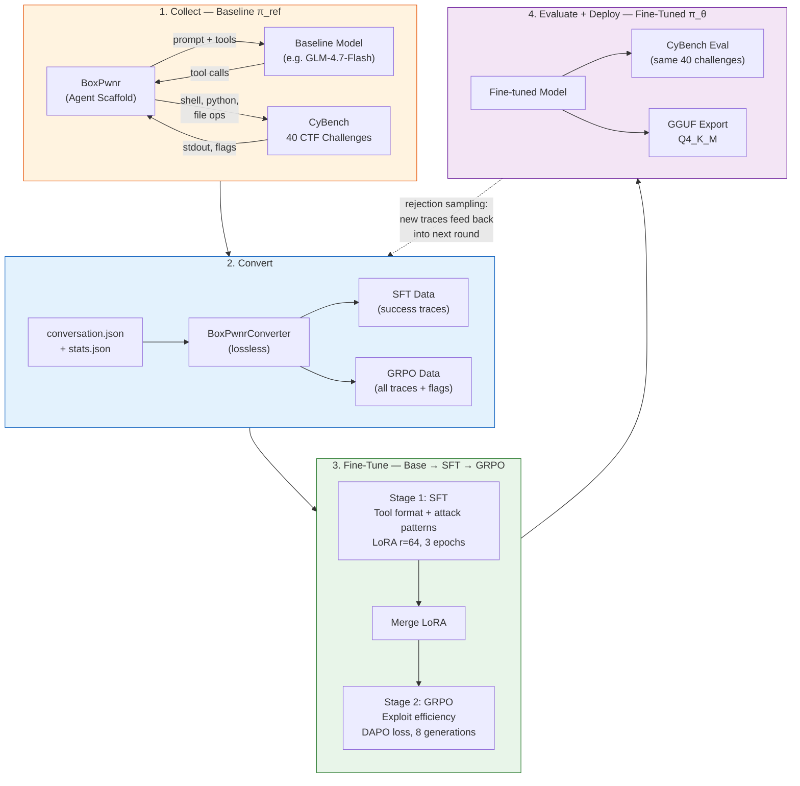
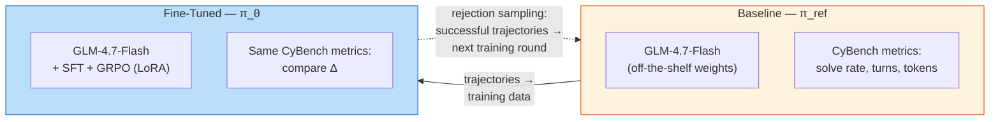
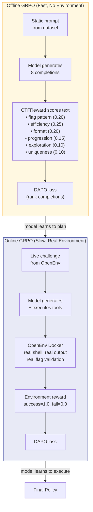
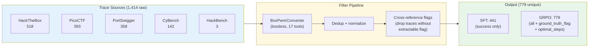
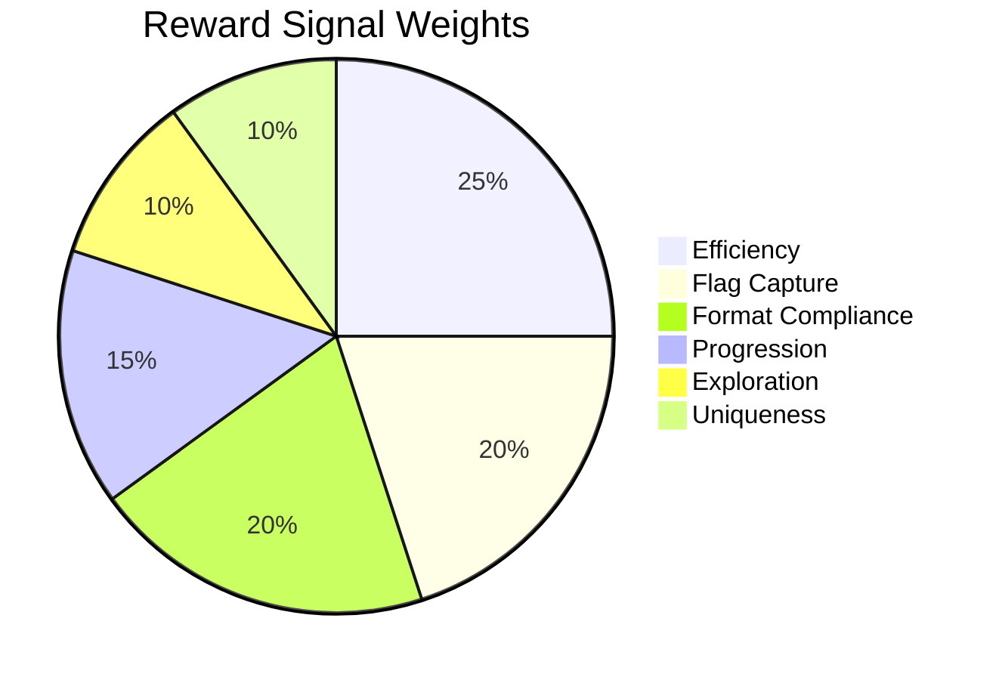
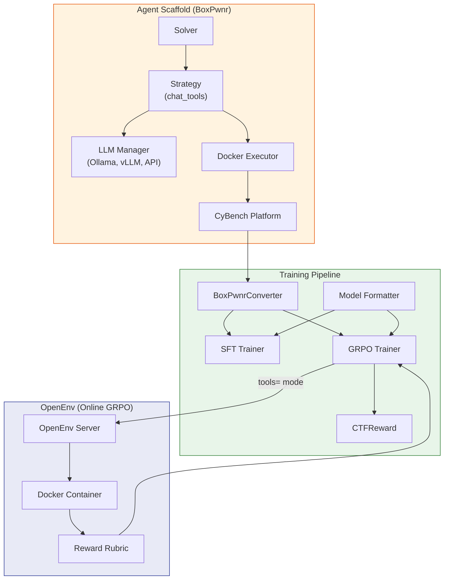

# Open CTF Environment

[](https://github.com/westonbrown/open-ctf-env)
[](https://www.python.org)
[](./LICENSE)

An open-source pipeline for **post-training security LLMs on CTF challenge trajectories**. Collect agent traces with [BoxPwnr](https://github.com/0ca/BoxPwnr), fine-tune with SFT + GRPO, evaluate on [CyBench](https://cybench.github.io/), and deploy locally via GGUF quantization.

> Presented at **[un]prompted — The AI Security Practitioner Conference**
> March 3-4, 2026 | Salesforce Tower, San Francisco

## Thesis

Base open-weight models understand security concepts but cannot execute multi-step exploits. A 24B model can plan a 5-phase attack but fails to enumerate user IDs. A 20B model gets stuck thinking on step 1. We investigate whether **trajectory-aware post-training** (SFT on expert traces, then GRPO with a multi-signal CTF reward function) can close this plan-execute gap — producing a locally deployable security agent from [GLM-4.7-Flash](https://huggingface.co/THUDM/GLM-4.7-Flash) (30B MoE, ~3.6B active parameters).

## How It Works

The pipeline has three actors: a **scaffold** (BoxPwnr), a **baseline model** (π_ref), and a **fine-tuned model** (π_θ). The scaffold drives the model through CTF challenges, collects trajectories, and feeds them into a two-stage fine-tuning loop.


```mermaid
flowchart TB
    subgraph collect["1. Collect — Baseline π_ref"]
        direction LR
        scaffold["BoxPwnr<br/>(Agent Scaffold)"]
        llm["Baseline Model<br/>(e.g. GLM-4.7-Flash)"]
        challenges["CyBench<br/>40 CTF Challenges"]
        scaffold -- "prompt + tools" --> llm
        llm -- "tool calls" --> scaffold
        scaffold -- "shell, python,<br/>file ops" --> challenges
        challenges -- "stdout, flags" --> scaffold
    end

    subgraph convert["2. Convert"]
        traces["conversation.json<br/>+ stats.json"]
        converter["BoxPwnrConverter<br/>(lossless)"]
        sft_data["SFT Data<br/>(success traces)"]
        grpo_data["GRPO Data<br/>(all traces + flags)"]
        traces --> converter
        converter --> sft_data
        converter --> grpo_data
    end

    subgraph train["3. Fine-Tune — Base → SFT → GRPO"]
        direction TB
        sft["Stage 1: SFT<br/>Tool format + attack patterns<br/>LoRA r=64, 3 epochs"]
        merge["Merge LoRA"]
        grpo["Stage 2: GRPO<br/>Exploit efficiency<br/>DAPO loss, 8 generations"]
        sft --> merge --> grpo
    end

    subgraph deploy["4. Evaluate + Deploy — Fine-Tuned π_θ"]
        direction LR
        eval_model["Fine-tuned Model"]
        eval_bench["CyBench Eval<br/>(same 40 challenges)"]
        export["GGUF Export<br/>Q4_K_M"]
        eval_model --> eval_bench
        eval_model --> export
    end

    collect --> convert --> train --> deploy
    deploy -. "rejection sampling:<br/>new traces feed back<br/>into next round" .-> convert

    style collect fill:#fff3e0,stroke:#e65100
    style convert fill:#e3f2fd,stroke:#1565c0
    style train fill:#e8f5e9,stroke:#2e7d32
    style deploy fill:#f3e5f5,stroke:#6a1b9a
```

### Baseline vs Fine-Tuned: Measuring the Delta

The same scaffold (BoxPwnr) runs both the baseline and fine-tuned models against identical challenges. The only variable is the model weights — architecture, quantization, scaffold, tools, and evaluation harness are held constant:


```mermaid
flowchart LR
    subgraph baseline["Baseline — π_ref"]
        g_model["GLM-4.7-Flash<br/>(off-the-shelf weights)"]
        g_result["CyBench metrics:<br/>solve rate, turns, tokens"]
    end

    subgraph finetuned["Fine-Tuned — π_θ"]
        b_model["GLM-4.7-Flash<br/>+ SFT + GRPO (LoRA)"]
        b_result["Same CyBench metrics:<br/>compare Δ"]
    end

    baseline -- "trajectories →<br/>training data" --> finetuned
    finetuned -. "rejection sampling:<br/>successful trajectories →<br/>next training round" .-> baseline

    style baseline fill:#fff3e0,stroke:#e65100
    style finetuned fill:#bbdefb,stroke:#1565c0
```

The **baseline** (π_ref) establishes performance before fine-tuning. The progression is **Base → SFT → GRPO**, where each stage is evaluated on the same benchmark to isolate its contribution. Successful trajectories from π_θ can feed back as training data for the next iteration (rejection sampling).

### Offline vs Online GRPO


```mermaid
flowchart TB
    subgraph offline["Offline GRPO (Fast, No Environment)"]
        direction TB
        o_prompt["Static prompt<br/>from dataset"]
        o_gen["Model generates<br/>8 completions"]
        o_reward["CTFReward scores text<br/>• flag pattern (0.20)<br/>• efficiency (0.25)<br/>• format (0.20)<br/>• progression (0.15)<br/>• exploration (0.10)<br/>• uniqueness (0.10)"]
        o_loss["DAPO loss<br/>(rank completions)"]
        o_prompt --> o_gen --> o_reward --> o_loss
    end

    subgraph online["Online GRPO (Slow, Real Environment)"]
        direction TB
        n_prompt["Live challenge<br/>from OpenEnv"]
        n_gen["Model generates<br/>+ executes tools"]
        n_env["OpenEnv Docker<br/>real shell, real output<br/>real flag validation"]
        n_reward["Environment reward<br/>success=1.0, fail=0.0"]
        n_loss["DAPO loss"]
        n_prompt --> n_gen --> n_env --> n_reward --> n_loss
    end

    offline -- "model learns to plan" --> online
    online -- "model learns to execute" --> final["Final Policy"]

    style offline fill:#fff8e1,stroke:#f9a825
    style online fill:#e8eaf6,stroke:#283593
```

The intended sequence is offline first (fast iteration on format and methodology), then online (real execution feedback). Online GRPO via OpenEnv is implemented but not yet validated end-to-end at scale — see [Roadmap](#roadmap).

## Results

Results will be published after training and evaluation are complete.

| Model | CyBench Solve Rate | Avg Turns | Avg Time |
|-------|-------------------|-----------|----------|
| GLM-4.7-Flash Q8_0 (base) | TBD | TBD | TBD |
| + SFT | TBD | TBD | TBD |
| + Offline GRPO | TBD | TBD | TBD |
| + Online GRPO | TBD | TBD | TBD |

## Quick Start

### Requirements

- Python 3.10+
- PyTorch 2.4+ with CUDA support
- Docker and Docker Compose
- NVIDIA GPU with 24GB+ VRAM (60GB+ for GLM-4.7-Flash BF16 LoRA)

### Setup

```bash
git clone https://github.com/westonbrown/open-ctf-env.git
cd open-ctf-env

# Install PyTorch first (see https://pytorch.org/get-started/)
pip install torch torchvision --index-url https://download.pytorch.org/whl/cu121

# Install open-ctf-env
pip install -e .

# Optional: training dependencies (Unsloth, wandb)
pip install -e ".[train]"

# Clone BoxPwnr reference
git clone https://github.com/0ca/BoxPwnr.git references/boxpwnr

# Copy environment config
cp env.example .env
```

### Generate Training Data

```bash
# Convert BoxPwnr traces to training format
open-ctf-convert \
    --input /path/to/BoxPwnr-Traces \
    --output data/all_traces.jsonl \
    --output-failure data/failed_traces.jsonl \
    --dedup

# Split into SFT (successes) + GRPO (all traces with flags)
cat data/all_traces.jsonl data/failed_traces.jsonl > data/combined.jsonl
open-ctf-split \
    --input data/combined.jsonl \
    --sft-output data/sft.jsonl \
    --grpo-output data/grpo.jsonl
```

### Train

```bash
# Stage 1: SFT (tool format + domain knowledge)
open-ctf-train sft \
    --model unsloth/GLM-4.7-Flash \
    --data data/sft.jsonl \
    --output outputs/sft

# Merge LoRA adapter into base
open-ctf-train merge \
    --adapter outputs/sft/final \
    --output outputs/sft/merged

# Stage 2: GRPO (exploitation efficiency)
open-ctf-train grpo \
    --model outputs/sft/merged \
    --data data/grpo.jsonl \
    --output outputs/grpo
```

### Evaluate

```bash
# Compare base vs fine-tuned on CyBench
open-ctf-eval \
    --model outputs/grpo/final \
    --baseline unsloth/GLM-4.7-Flash \
    --challenges cybench
```

### Deploy

```bash
# Export to GGUF
open-ctf-export \
    --adapter outputs/grpo/final \
    --base-model unsloth/GLM-4.7-Flash \
    --output models/ctf-agent.gguf \
    --quant Q4_K_M

# Serve with Ollama
echo 'FROM ./models/ctf-agent.gguf
PARAMETER num_ctx 32768' > Modelfile
ollama create ctf-agent -f Modelfile
```

### Validate Pipeline (no GPU needed)

```bash
open-ctf-validate
```

## Training Data

Data is generated from [BoxPwnr-Traces](https://github.com/0ca/BoxPwnr-Traces) — real agent trajectories across 6 CTF platforms, collected by running frontier models (Claude Sonnet 4.5, GPT-5, Grok 4, Gemini 3) against Dockerized challenges.

| Dataset | Traces | Size | Description |
|---------|--------|------|-------------|
| `data/sft.jsonl` | 441 | 37MB | Successful solves — expert demonstrations for SFT |
| `data/grpo.jsonl` | 779 | 46MB | All traces with cross-referenced flags for GRPO |

**Source platforms:** HackTheBox (518), PicoCTF (393), PortSwigger (358), CyBench (142), HackBench (3) — 1,414 raw traces total. After deduplication, format normalization, and filtering traces without extractable flags, 779 unique traces remain. Of those, 441 are successful solves (used for SFT). All 779 include `ground_truth_flag` cross-referenced from successful solves of the same challenge (used for GRPO).

Each trace is a full multi-turn conversation (avg 74 messages, up to 454) with structured tool calls in ChatML format. GRPO traces include `ground_truth_flag` and `optimal_steps` for reward computation.

> **441 traces is small for SFT.** This is an intentional starting point — the pipeline is designed to grow the dataset iteratively via rejection sampling (run trained model → filter successful traces → retrain). Additional CyBench baseline traces from the current benchmark run will supplement the dataset.

### Data Flow


```mermaid
flowchart LR
    subgraph sources["Trace Sources (1,414 raw)"]
        htb["HackTheBox<br/>518"]
        pico["PicoCTF<br/>393"]
        ps["PortSwigger<br/>358"]
        cb["CyBench<br/>142"]
        hb["HackBench<br/>3"]
    end

    subgraph filter["Filter Pipeline"]
        conv["BoxPwnrConverter<br/>(lossless, 17 tools)"]
        dedup["Dedup + normalize"]
        flags["Cross-reference flags<br/>(drop traces without<br/>extractable flag)"]
    end

    subgraph split["Output (779 unique)"]
        sft["SFT: 441<br/>(success only)"]
        grpo["GRPO: 779<br/>(all + ground_truth_flag<br/>+ optimal_steps)"]
    end

    sources --> conv --> dedup --> flags --> split

    style sources fill:#e3f2fd
    style filter fill:#fff8e1
    style split fill:#e8f5e9
```

## Reward Function

The CTF reward for GRPO training uses **6 signals + 1 penalty**. All process signals are **ungated** — they provide gradient signal in offline GRPO where the model generates completions without environment interaction and rarely captures the exact flag.


```mermaid
pie title Reward Signal Weights
    "Efficiency" : 25
    "Flag Capture" : 20
    "Format Compliance" : 20
    "Progression" : 15
    "Exploration" : 10
    "Uniqueness" : 10
```

| Signal | Weight | Description |
|--------|--------|-------------|
| **Flag Capture** | 0.20 | `metadata.success` > exact match > pattern match (0.1) |
| **Efficiency** | 0.25 | `min(optimal / actual, 1.0)` |
| **Format** | 0.20 | Valid tool call JSON structure |
| **Progression** | 0.15 | RECON → ENUM → EXPLOIT phase ordering |
| **Exploration** | 0.10 | Novel tool usage weighted toward early trajectory |
| **Uniqueness** | 0.10 | Command diversity (detects stuck loops) |
| **Hallucination** | -0.10 | Penalty for `flag_found` calls with wrong flag |

**Design principles:**
- **No regex in process signals.** Progression uses set-based binary lookup on 60+ command names.
- **`metadata.success` is authoritative.** BoxPwnr's platform validation overrides string matching.
- **Noise injection (+-0.05)** guarantees variance for GRPO gradients.
- **All signals ungated.** Efficiency, progression, exploration, uniqueness, and format provide gradient even when `flag_score=0`.

## Training Configuration

Edit `src/open_ctf/configs/training.yaml`:

```yaml
model:
  name: "unsloth/GLM-4.7-Flash"    # 30B MoE, ~3.6B active
  max_seq_length: 4096
  load_in_4bit: false               # MoE requires BF16 LoRA

lora:
  r: 64
  alpha: 64
  target_modules: [q_proj, k_proj, v_proj, o_proj, gate_proj, up_proj, down_proj]

sft:
  epochs: 3
  batch_size: 1
  learning_rate: 2.0e-4
  packing: true                     # 3x throughput

grpo:
  epochs: 1
  learning_rate: 5.0e-6
  beta: 0.0
  loss_type: dapo                   # Removes length bias
  num_generations: 8
  max_completion_length: 4096
  use_vllm: true
```

**Hardware notes:**
- **Training:** Cloud H100/H200 recommended for SFT + GRPO. Single-GPU setups (e.g. 120GB unified memory) work for SFT only — use `training_dgx.yaml`.
- **Inference/Deploy:** Q4_K_M GGUF fits in ~15GB VRAM (RTX 4090, A6000). Q8_0 fits in ~31GB. Full BF16 requires 60GB+.
- **Baseline collection:** Any GPU that can serve the model via Ollama or vLLM.

## Architecture

### Project Structure

```
open-ctf-env/
├── data/                        # Training data (generated)
│   ├── sft.jsonl                # 441 successful traces
│   └── grpo.jsonl               # 779 traces with flags
├── src/open_ctf/
│   ├── cli/                     # 7 CLI entry points
│   ├── agent/                   # BoxPwnr agent runner
│   │   └── runner.py            # Wraps BoxPwnr Solver for evaluation
│   ├── configs/                 # training.yaml, training_single_gpu.yaml
│   ├── data/                    # Trace converter + dataset splitter
│   │   ├── converter.py         # BoxPwnr → ChatML (lossless, 17 tools)
│   │   └── splitter.py          # Success → SFT, All → GRPO
│   ├── formatters/              # Model-specific message formatting
│   │   ├── tool_registry.py     # 17 BoxPwnr tool definitions (Pydantic)
│   │   ├── qwen3.py             # Qwen3 (most compatible)
│   │   ├── glm4.py              # GLM-4.7-Flash (XML tools, non-prefix-preserving)
│   │   └── devstral.py          # Devstral (strict role alternation)
│   ├── rewards/reward.py        # CTFReward (6 signals + penalty)
│   ├── training/
│   │   ├── sft.py               # SFTTrainer (Unsloth + HF fallback)
│   │   ├── grpo.py              # GRPOTrainer (offline + online modes)
│   │   └── tools.py             # TRL tool wrappers for live OpenEnv
│   ├── eval/evaluator.py        # CyBench evaluation harness
│   └── envs/
│       ├── gym_env.py           # Gymnasium RL interface
│       └── openenv/             # OpenEnv server + client (online GRPO)
│           ├── server.py        # HTTP + WebSocket environment server
│           ├── client.py        # Client for TRL tools= integration
│           └── models.py        # Action, Observation, State dataclasses
├── scripts/
│   ├── run_cybench_benchmark.py # Full CyBench benchmark runner
│   └── spawn_all_cybench.py     # Docker setup for all 40 challenges
├── tests/
│   ├── test_rewards.py          # Reward function tests
│   └── test_openenv.py          # OpenEnv integration tests
└── references/
    ├── boxpwnr/                 # BoxPwnr agent framework (submodule)
    └── OpenEnv/                 # OpenEnv RL environment framework
```

### Component Interactions


```mermaid
flowchart TB
    subgraph scaffold["Agent Scaffold (BoxPwnr)"]
        solver["Solver"]
        strategy["Strategy<br/>(chat_tools)"]
        llm_mgr["LLM Manager<br/>(Ollama, vLLM, API)"]
        executor["Docker Executor"]
        platform["CyBench Platform"]
    end

    subgraph training["Training Pipeline"]
        converter["BoxPwnrConverter"]
        sft_trainer["SFT Trainer"]
        grpo_trainer["GRPO Trainer"]
        reward["CTFReward"]
        formatter["Model Formatter"]
    end

    subgraph env["OpenEnv (Online GRPO)"]
        server["OpenEnv Server"]
        docker["Docker Container"]
        rubric["Reward Rubric"]
    end

    solver --> strategy --> llm_mgr
    strategy --> executor --> platform
    platform --> converter
    converter --> sft_trainer
    converter --> grpo_trainer
    grpo_trainer --> reward
    grpo_trainer -- "tools= mode" --> server --> docker
    docker --> rubric --> grpo_trainer
    formatter --> sft_trainer
    formatter --> grpo_trainer

    style scaffold fill:#fff3e0,stroke:#e65100
    style training fill:#e8f5e9,stroke:#2e7d32
    style env fill:#e8eaf6,stroke:#283593
```

## CLI Commands

| Command | Purpose |
|---------|---------|
| `open-ctf-train` | SFT, GRPO, and LoRA merge |
| `open-ctf-convert` | Convert BoxPwnr traces to training format |
| `open-ctf-split` | Split datasets into SFT and GRPO sets |
| `open-ctf-agent` | Run agent against CyBench challenges |
| `open-ctf-eval` | Evaluate and compare models on CyBench |
| `open-ctf-validate` | Validate pipeline without GPU |
| `open-ctf-export` | Export LoRA adapter to GGUF |

## BoxPwnr Tool Set

Training data, the reward function, the OpenEnv server, and the TRL tool wrappers all share the same 13-tool vocabulary. Every tool the model learns during SFT is available for execution during online GRPO — no tool gap between training and inference.

| Tier | Tools | Description |
|------|-------|-------------|
| **Execution** | `shell_command`, `exec_command`, `write_stdin`, `python_code`, `execute_command` | Shell scripts, interactive PTY sessions, Python |
| **File Ops** | `read_file`, `grep`, `file_search`, `apply_patch` | Read, search, patch files in the container |
| **Meta** | `flag_found`, `web_search`, `list_sessions`, `close_session` | Flag submission, web search, session management |

```
                        ┌─────────────────────────────────────────┐
                        │          OpenEnv Server (13 tools)       │
                        │                                         │
  TRL GRPOTrainer       │  Tier 1: Execution                      │
  tools=[...]      ───► │    shell_command ──► bash -c "..."       │
                        │    exec_command  ──► PTY session start   │
                        │    write_stdin   ──► PTY stdin write     │
                        │    python_code   ──► python3 -c "..."    │
                        │    execute_command ► (alias → shell)     │
                        │                                         │
                        │  Tier 2: File Ops                       │
                        │    read_file     ──► cat -n <path>       │
                        │    grep          ──► grep -rn <pat>      │
                        │    file_search   ──► find -name <pat>    │
                        │    apply_patch   ──► patch / BoxPwnr fmt │
                        │                                         │
                        │  Tier 3: Meta                           │
                        │    flag_found    ──► validate vs ground  │
                        │    web_search    ──► ddgr / curl DDG     │
                        │    list_sessions ──► show active PTYs    │
                        │    close_session ──► kill PTY session    │
                        └─────────────────────────────────────────┘
```

The converter maps legacy tmux tools to PTY equivalents (`tmux_send_and_read` → `write_stdin`, `tmux_cancel_command` → `close_session`) with argument transforms (`session_name` → `session_id`, `command` → `chars`, `timeout_seconds` → `yield_time`). The `scripts/clean_tool_names.py` script applies this normalization to existing JSONL data, plus fixes corrupt names (e.g., `Bash` → `shell_command`, `TodoWrite` → removed).

## Roadmap

### Phase 1: Pipeline + Infrastructure (Done)
- [x] Lossless trace converter (tool-calling + chat-command formats)
- [x] Training data: 441 SFT + 779 GRPO traces from BoxPwnr across 6 platforms
- [x] 2-stage training pipeline: SFT + GRPO 
- [x] Multi-signal CTF reward function (6 signals + hallucination penalty)
- [x] OpenEnv server + TRL `tools=` integration for online GRPO (implemented, not yet validated at scale)
- [x] TRL prefix-preserving patch for GLM-4.7-Flash
- [x] Model-specific formatters (Qwen3, Devstral, GLM-4)
- [x] BoxPwnr agent integration with 17 native security tools
- [x] CyBench benchmark runner with per-challenge metrics
- [x] GGUF export pipeline
- [x] Validation pipeline (`open-ctf-validate`)

### Phase 2: Baseline + Train + Evaluate (In Progress)

**Baseline Collection**
- [ ] CyBench 40-challenge baseline (GLM-4.7-Flash Q8_0 via BoxPwnr)
- [ ] Collect new traces from baseline to supplement training data

**Train**
- [ ] SFT on cloud H100/H200 (441 success traces, BF16 LoRA, 3 epochs)
- [ ] Merge LoRA adapter
- [ ] Offline GRPO (779 traces with flags, DAPO, 8 generations, vLLM)
- [ ] Online GRPO on CyBench via OpenEnv `tools=` mode
- [ ] Rejection sampling: generate new traces with trained model, filter, retrain

**Evaluate**
- [ ] Compare base vs SFT vs GRPO on same CyBench 40-challenge suite
- [ ] Ablation: reward signal contribution analysis

**Release (Target: March 3)**
- [ ] Export final model to GGUF, validate on single-GPU hardware
- [ ] Publish results table
- [ ] Upload weights to HuggingFace
- [ ] Tag v1.0.0 release

## Documentation

- [Quick Start](docs/quickstart.md) — Installation and first run
- [Data Collection Guide](docs/data-collection.md) — Collect traces with BoxPwnr on CyBench
- [Training Guide](docs/training.md) — 2-stage SFT + GRPO pipeline
- [Deployment Guide](docs/deployment.md) — GGUF export, Ollama, local GPU deployment
- [Architecture](docs/architecture.md) — Module overview and data flow

## Contributing

```bash
# Run tests
pip install -e ".[dev]"
pytest tests/ -v

# Validate pipeline (no GPU)
open-ctf-validate

# Add a new CyBench challenge
# Edit src/open_ctf/configs/challenges.yaml
```

The reward function lives in `src/open_ctf/rewards/reward.py`. To add a new signal:
1. Add a `_new_signal_score()` method to `CTFReward`
2. Add the weight parameter to `__init__` (weights must sum to 1.0)
3. Add to the scoring formula in `__call__`
4. Add tests in `tests/test_rewards.py`

## Related Work

- [CyBench](https://cybench.github.io/) — Cybersecurity benchmark, 40 challenges, ICLR 2025 Oral ([paper](https://arxiv.org/abs/2408.08926), [repo](https://github.com/andyzorigin/cybench))
- [BoxPwnr](https://github.com/0ca/BoxPwnr) — LLM-powered CTF solver (our data collection and evaluation engine)
- [OpenEnv](https://github.com/OpenEnvs/OpenEnv) — Gymnasium-style RL environments for LLM agents (online GRPO backend)
- [Unsloth](https://github.com/unslothai/unsloth) — Efficient fine-tuning with MoE Grouped GEMM
- [TRL](https://github.com/huggingface/trl) — Transformer Reinforcement Learning (GRPOTrainer + DAPO)
- [DeepSeek R1](https://arxiv.org/abs/2501.12948) — SFT → GRPO pipeline inspiration
- [Dreadnode Worlds](https://dreadnode.io/blog/worlds) — "Reasoning traces are the critical delta" finding

## License

MIT License — See [LICENSE](./LICENSE) for details.
