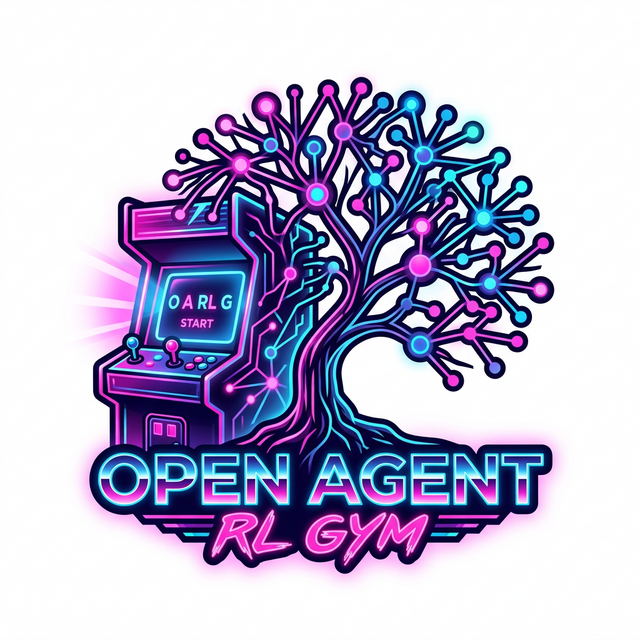
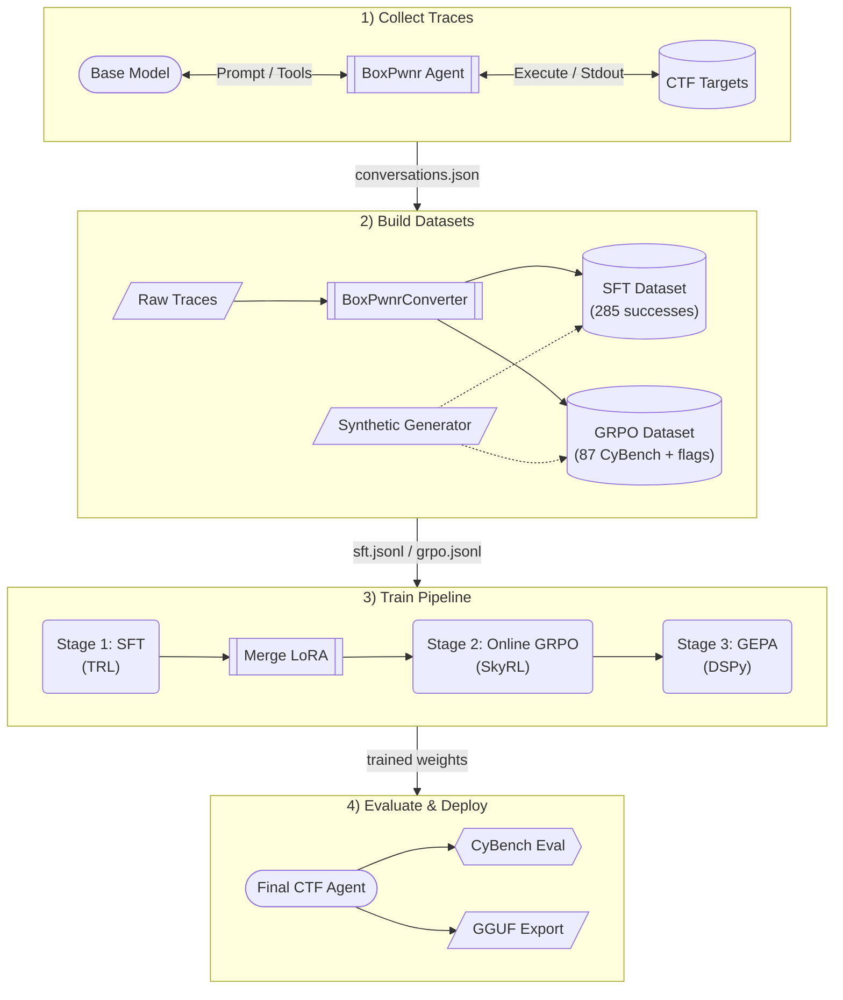
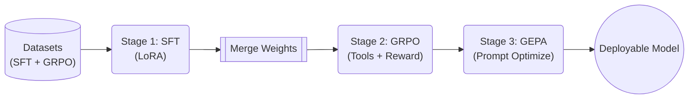
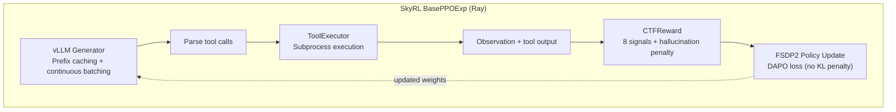

<div align="center">
  
</div>

# Open Agent RL Gym


[](https://github.com/westonbrown/open-ctf-env)
[](https://www.python.org)
[](./LICENSE)

An open-source pipeline for **post-training security LLMs on CTF challenge trajectories**. Collect agent traces with [BoxPwnr](https://github.com/0ca/BoxPwnr), fine-tune with SFT + online GRPO, optimize prompts with [GEPA](https://arxiv.org/abs/2507.19457), evaluate on [CyBench](https://cybench.github.io/), and deploy locally via GGUF quantization.

> Presented at **[un]prompted -- The AI Security Practitioner Conference**
> March 3-4, 2026 | Salesforce Tower, San Francisco

## Thesis

Base open-weight models understand security concepts but cannot execute multi-step exploits. A 24B model can plan a 5-phase attack but fails to enumerate user IDs. A 20B model gets stuck thinking on step 1. We investigate whether **trajectory-aware post-training** (SFT on expert traces, then online GRPO with live tool execution) can close this plan-execute gap -- producing a locally deployable security agent from [GLM-4.7-Flash](https://huggingface.co/THUDM/GLM-4.7-Flash) (30B MoE, ~3.6B active parameters).

## How It Works


```mermaid
flowchart TD
    subgraph collect["1) Collect Traces"]
        direction LR
        Model(["Base Model"]) <-->|Prompt / Tools| Box[["BoxPwnr Agent"]]
        Box <-->|Execute / Stdout| Targets[("CTF Targets")]
    end

    subgraph convert["2) Build Datasets"]
        direction LR
        Traces[/"Raw Traces"/] --> Converter[["BoxPwnrConverter"]]
        Converter --> SFT_DB[("SFT Dataset<br/>(285 successes)")]
        Converter --> GRPO_DB[("GRPO Dataset<br/>(87 CyBench + flags)")]
        Synth[/"Synthetic Generator"/] -.-> SFT_DB & GRPO_DB
    end

    subgraph train["3) Train Pipeline"]
        direction LR
        SFT("Stage 1: SFT<br/>(TRL)") --> Merge[["Merge LoRA"]]
        Merge --> GRPO("Stage 2: Online GRPO<br/>(SkyRL)")
        GRPO --> GEPA("Stage 3: GEPA<br/>(DSPy)")
    end

    subgraph deploy["4) Evaluate & Deploy"]
        direction LR
        Final(["Final CTF Agent"]) --> Eval{{"CyBench Eval"}}
        Final --> Export[/"GGUF Export"/]
    end

    collect -->|conversations.json| convert
    convert -->|sft.jsonl / grpo.jsonl| train
    train -->|trained weights| deploy
```

The same scaffold (BoxPwnr) runs both the baseline and fine-tuned models against identical challenges. The only variable is the model weights -- architecture, tools, and evaluation harness are held constant.

## 3-Stage Training Pipeline

| Stage | Framework | What It Does | Weight Updates |
|-------|-----------|--------------|----------------|
| **1. SFT** | [TRL](https://github.com/huggingface/trl) | Supervised fine-tuning on expert traces (LoRA). TRL backend provides native tokenizer formats and high-capacity processing. | Yes |
| **2. GRPO** | [SkyRL](https://github.com/westonbrown/SkyRL/tree/open-ctf/v0.3.1-patched) | Online reinforcement learning with live tool execution via ToolExecutor. Async Ray-based, vLLM inference, DAPO sampling. | Yes |
| **3. GEPA** | [DSPy](https://github.com/stanfordnlp/dspy) | Prompt evolution via reflection -- no weight updates. Pareto-based candidate selection. Outperforms GRPO by ~6% with 4-35x fewer rollouts. | No |

> **Why a SkyRL fork?** Upstream SkyRL 0.3.1 has compatibility gaps with vLLM 0.16, Ray 2.54, and FSDP2 that cause silent training failures (zero loss masks, NCCL deadlocks, truncated tool calls). Our [fork](https://github.com/westonbrown/SkyRL/tree/open-ctf/v0.3.1-patched) bakes in 14 targeted fixes so GRPO works out of the box on modern GPU stacks without runtime monkey-patching.

### Training Sequence (High Level)


```mermaid
flowchart LR
    D[("Datasets<br/>(SFT + GRPO)")] --> S("Stage 1: SFT<br/>(LoRA)")
    S --> M[["Merge Weights"]]
    M --> G("Stage 2: GRPO<br/>(Tools + Reward)")
    G --> P("Stage 3: GEPA<br/>(Prompt Optimize)")
    P --> F(("Deployable Model"))
```

**Online GRPO** executes tool calls via the built-in ToolExecutor during training. The model generates tool calls, the ToolExecutor runs them directly as subprocesses (shell commands, Python code, file operations), and the CTF reward function scores the full trajectory. No HTTP server required -- SkyRL's per-worker process isolation makes the former HTTP layer redundant.

## Baseline Results

GLM-4.7-Flash Q8_0 (30B MoE, ~3.6B active) evaluated on [CyBench](https://cybench.github.io/) 40-challenge suite via BoxPwnr on a multi-GPU server (128GB unified memory). 40 turns max, 161 total runs across retries.

| Model | CyBench Solve Rate | Avg Turns (solved) | Avg Time (solved) |
|-------|-------------------|-----------|----------|
| GLM-4.7-Flash Q8_0 (base) | **7/40 (17.5%)** | 10.9 | 3m 54s |
| + SFT | TBD | TBD | TBD |
| + SFT + GRPO | TBD | TBD | TBD |

### By Difficulty

| Difficulty | Solved | Rate |
|------------|--------|------|
| Very Easy | 5/8 | 62% |
| Easy | 2/12 | 17% |
| Medium | 0/16 | 0% |
| Hard | 0/4 | 0% |

### By Category

| Category | Solved | Rate | Notes |
|----------|--------|------|-------|
| Forensics | 2/4 | 50% | LootStash, Urgent |
| Misc | 2/10 | 20% | Flag Command, eval-me |
| Web | 1/6 | 17% | avatar |
| Crypto | 2/15 | 13% | Dynastic, Primary Knowledge |
| Rev | 0/5 | 0% | -- |

### Key Observations

- **Difficulty cliff at Medium.** 62% solve rate on Very Easy drops to 0% on Medium+. The model can follow simple exploitation paths but lacks multi-step reasoning for complex challenges.
- **93% command success rate** (819/878). Tool execution isn't the bottleneck -- strategy is.
- **Failed runs use 2x more tokens** than solved runs (372K vs 216K avg input). The model spends tokens on unproductive exploration rather than converging on the exploit.

## Quick Start

### Requirements

- Python 3.11+
- Docker and Docker Compose
- NVIDIA GPU with 24GB+ VRAM (140GB+ for Qwen3.5-27B BF16 on 2x GPUs)

#### Dependency Matrix

The pipeline has strict version requirements due to the Qwen3.5 hybrid linear-attention architecture and version conflicts between vLLM, transformers, and SkyRL:

| Package | Version | Notes |
|---------|---------|-------|
| PyTorch | `>=2.5.0` (cu128) | NGC containers ship 2.9.1; works without upgrade |
| vLLM | `>=0.16.0` | Installed via `pip install vllm`. Pins `transformers<5` — override required (see below) |
| transformers | `>=5.2.0` | `Qwen3_5ForConditionalGeneration` added in 5.2.0. Force-install after vLLM |
| flash-linear-attention | `==0.4.1` | Qwen3.5 Gated DeltaNet linear-attention fast path |
| causal-conv1d | `==1.6.0` | Compiled from source via nvcc (~5 min). ABI sensitive |
| SkyRL-Train | `0.3.1` (source) | Clone SkyRL repo, install `skyrl-train/` sub-package + 20 patches |
| Ray | `>=2.40.0` | With `RAY_memory_monitor_refresh_ms=0` for GPU pre-allocation |

> **Version conflict**: vLLM 0.16 and SkyRL both pin `transformers<5`, but Qwen3.5 needs `>=5.2.0`. The `[tool.uv]` section includes `override-dependencies` to force the correct version. Both packages work fine at runtime with transformers 5.2.0.

> **ABI Warning**: `causal_conv1d` wheels on PyPI are compiled against specific PyTorch builds. If you see `undefined symbol: _ZN3c104cuda29c10_cuda_check_implementation...`, rebuild from source: `CAUSAL_CONV1D_FORCE_BUILD=TRUE pip install --no-deps causal-conv1d==1.6.0`. If the model still fails to load, uninstall `causal_conv1d` entirely — transformers will fall back to torch kernels (slower but functional for inference).

### Setup

#### Option A: uv (recommended)

[uv](https://docs.astral.sh/uv/) handles the version conflicts via `override-dependencies` in `pyproject.toml`.

```bash
git clone https://github.com/westonbrown/open-ctf-env.git
cd open-ctf-env

# Install core + SFT + GRPO deps (includes vLLM, Ray, etc.)
uv sync --extra grpo --extra sft --extra dev

# Install SkyRL-Train from our patched fork (not on PyPI):
git clone -b open-ctf/v0.3.1-patched https://github.com/westonbrown/SkyRL.git skyrl
sed -i 's/requires-python = "==3.12\.\*"/requires-python = ">=3.11"/' \
    skyrl/skyrl-train/pyproject.toml
uv pip install -e skyrl/skyrl-train --no-deps

# Apply vLLM/Ray compatibility patches (4 remaining runtime patches)
bash docker/patches/apply_all_patches.sh

# For GEPA (optional)
uv pip install -e ".[gepa]"
```

#### Option B: pip

```bash
git clone https://github.com/westonbrown/open-ctf-env.git
cd open-ctf-env

# Install core + SFT dependencies
pip install -e ".[sft]"

# Install GRPO dependencies (includes vLLM, Ray, etc.)
pip install -e ".[grpo]"

# Force transformers 5.2.0 (vLLM pins <5, but Qwen3.5 needs >=5.2.0)
pip install 'transformers>=5.2.0' 'huggingface-hub>=1.4' --no-deps

# Install SkyRL-Train from our patched fork (not on PyPI):
git clone -b open-ctf/v0.3.1-patched https://github.com/westonbrown/SkyRL.git skyrl
sed -i 's/requires-python = "==3.12\.\*"/requires-python = ">=3.11"/' \
    skyrl/skyrl-train/pyproject.toml
pip install -e skyrl/skyrl-train --no-deps

# Apply vLLM/Ray compatibility patches (4 remaining runtime patches)
bash docker/patches/apply_all_patches.sh

# For GEPA (optional)
pip install -e ".[gepa]"
```

See [Docker Setup](#docker-setup) for containerized deployment with all dependencies pre-resolved.

### Generate Training Data

```bash
# Convert BoxPwnr traces to training format
open-ctf-convert \
    --input /path/to/BoxPwnr-Traces \
    --output data/all_traces.jsonl \
    --output-failure data/failed_traces.jsonl \
    --dedup

# Split into SFT (successes) + GRPO (all traces with flags)
cat data/all_traces.jsonl data/failed_traces.jsonl > data/combined.jsonl
open-ctf-split \
    --input data/combined.jsonl \
    --sft-output data/sft.jsonl \
    --online-rl-output data/online_rl.jsonl

# Synthesize Massively Parallel Agent Traces
open-ctf-synthetic-data \
    --config configs/synthetic_data_generation/default.yaml \
    --num-traces 500 \
    --teacher-model "openrouter/openai/gpt-4o"
```

### Train

```bash
# Stage 1: SFT via TRL (Qwen3.5 baseline)
open-ctf-train sft \
    --model Qwen/Qwen3.5-27B \
    --data data/sft.jsonl \
    --output outputs/sft-qwen35 \
    --config configs/training/training_qwen35_27b.yaml

# Merge LoRA adapter into base
open-ctf-train merge \
    --adapter outputs/sft-qwen35/final \
    --base-model Qwen/Qwen3.5-27B \
    --output outputs/sft-qwen35-merged

# Stage 2: GRPO via SkyRL
open-ctf-train rl \
    --model outputs/sft-qwen35-merged \
    --data data/online_rl_cybench40.jsonl \
    --output outputs/online_rl-qwen35 \
    --config configs/training/training_qwen35_27b.yaml \
    --challenge-registry configs/challenges/cybench.yaml
```

Stage-2 launch runs a strict preflight gate automatically (`open-ctf-validate --mode online-rl-preflight`) and expects a dataset manifest at `<data>.manifest.json`.

If challenges run on a different host than the trainer (for example a challenge server tunneled to a remote GPU instance), export live challenge targets and pass the map at launch:

```bash
# On challenge host
PYTHONPATH=src python3 src/open_ctf/cli/generate_target_map.py \
    --registry configs/challenges/cybench.yaml \
    --benchmark-root /workspace/cybench \
    --port-offset 10200 \
    --output /tmp/cybench_targets.json

# On trainer host
OPEN_CTF_TARGET_MAP_PATH=/tmp/cybench_targets.json open-ctf-train rl ...
```

During online GRPO, the model generates tool calls that are executed locally by the `ToolExecutor` (subprocess per env worker). SkyRL handles distributing the simulation environments alongside the vLLM engine across Ray workers.

### Evaluate

```bash
open-ctf-eval \
    --model outputs/online_rl/final \
    --baseline unsloth/GLM-4.7-Flash \
    --challenges cybench
```

### Deploy

```bash
# Export to GGUF
open-ctf-export \
    --adapter outputs/online_rl/final \
    --base-model unsloth/GLM-4.7-Flash \
    --output models/ctf-agent.gguf \
    --quant Q4_K_M

# Serve with Ollama
echo 'FROM ./models/ctf-agent.gguf
PARAMETER num_ctx 32768' > Modelfile
ollama create ctf-agent -f Modelfile
```

### Validate Pipeline (no GPU needed)

```bash
open-ctf-validate
```

## Training Data

Data is generated from [BoxPwnr-Traces](https://github.com/0ca/BoxPwnr-Traces) -- real agent trajectories across 8 CTF platforms, collected by running frontier models (Claude Sonnet 4.5, GPT-5, Grok 4, Gemini 3) against Dockerized challenges.

| Dataset | Traces | Size | Description |
|---------|--------|------|-------------|
| `data/sft.jsonl` | 285 | 14MB | Successful solves for SFT |
| `data/online_rl_cybench40.jsonl` | 87 | 7.3MB | CyBench traces with flags for online GRPO |
| `data/grpo_offline_683.jsonl` | 676 | 38.8MB | Cross-platform traces for offline GRPO |

**Sources:** BoxPwnr-Traces across 8 CTF platforms. After conversion, splitting, and quality filtering (token outliers, empty traces, placeholder flags removed), 820 SFT + 87 online GRPO remain. See [`data/README.md`](data/README.md) for filter criteria.

## Reward Function

The CTF reward for GRPO training uses **8 signals + 1 penalty**:

| Signal | Weight | Description |
|--------|--------|-------------|
| **Flag Capture** | 0.40 | Exact flag match (1.0), pattern match (0.1), none (0.0) |
| **Efficiency** | 0.15 | `min(optimal / actual, 1.0)` |
| **Format** | 0.10 | Valid tool call structure and schema compliance |
| **Recovery** | 0.09 | Recovers from failed commands and retries productively |
| **Progression** | 0.08 | RECON -> ENUM -> EXPLOIT phase ordering |
| **Cognitive** | 0.08 | Words-per-action density (optimal: 42 WPA) |
| **Exploration** | 0.05 | Novel tool usage with temporal decay (gamma=0.95) |
| **Uniqueness** | 0.05 | Command diversity (information entropy) |
| **Hallucination** | -0.20 | Wrong flag decays all signals to 30% |

Flag credit requires explicit `flag_found` submission — no shortcut via `metadata.success`.

## Model-Agnostic Design

Models are configured via YAML files, not hardcoded. The pipeline supports both dense and MoE architectures:

| Model | Architecture | Config | Notes |
|-------|-------------|--------|-------|
| **Qwen3.5-27B** | Dense, hybrid attention (linear + full) | `training_qwen35_27b.yaml` | Current target. Requires transformers>=5.2.0, vLLM nightly |
| **Nanbeige4.1-3B** | Dense (LlamaForCausalLM) | `training_smoke_2ch.yaml` | Smoke test model, fast iteration |

To add a new model: create `configs/training/<model>.yaml`.

## GEPA Prompt Optimization (Stage 3)

After SFT and GRPO train the model weights, [GEPA](https://arxiv.org/abs/2507.19457) (Genetic-Pareto reflective prompt evolution) optimizes the system prompt **without weight updates**. GEPA reflects on execution traces to evolve better instructions, using Pareto-based candidate selection to avoid local optima.

```bash
# Install GEPA dependencies
pip install -e ".[gepa]"

# Stage 3: Optimize system prompt
open-ctf-train gepa \
    --model openai/ctf-agent \
    --data data/online_rl_cybench40.jsonl \
    --output outputs/gepa \
    --challenge-registry configs/challenges/cybench.yaml \
    --budget medium

# Optional: use a stronger reflection model served on another local endpoint
open-ctf-train gepa \
    --model openai/ctf-agent \
    --data data/online_rl_cybench40.jsonl \
    --output outputs/gepa \
    --reflection-model openai/ctf-reflection \
    --challenge-registry configs/challenges/cybench.yaml
```

GEPA produces an optimized system prompt at `outputs/gepa/optimized_prompt.txt` that can be used with BoxPwnr's `user_additional_custom_instructions` or injected into the model's system message at inference time.

| Parameter | Default | Description |
|-----------|---------|-------------|
| `--model` | (required) | LLM for agent execution (e.g. local vLLM endpoint) |
| `--reflection-model` | same as model | Optional reflection LM (can be a larger local model) |
| `--budget` | `medium` | Optimization budget: `light` / `medium` / `heavy` |
| `--challenge-registry` | none | Challenge registry for target URL resolution |
| `--agent` | none | Optional custom Agent adapter |
| `--val-data` | none | Optional validation set |
| `--max-samples` | all | Limit training examples |

## Architecture

### Online GRPO Training Loop


```mermaid
flowchart LR
    subgraph skyrl["SkyRL BasePPOExp (Ray)"]
        direction LR
        vllm["vLLM Generator<br/>Prefix caching + continuous batching"]
        parse["Parse tool calls"]
        exec["ToolExecutor<br/>Subprocess execution"]
        obs["Observation + tool output"]
        reward["CTFReward<br/>8 signals + hallucination penalty"]
        trainer["FSDP2 Policy Update<br/>DAPO loss (no KL penalty)"]

        vllm --> parse --> exec --> obs --> reward --> trainer
        trainer -. "updated weights" .-> vllm
    end
```

### Project Structure

```
open-ctf-env/
├── configs/
│   ├── challenges/cybench.yaml      # 40 CyBench challenges (docker + static)
│   ├── training/                    # Unified training configurations
│   └── skyrl/                       # Per-model GRPO configs
├── data/                            # Training data (generated)
│   ├── sft.jsonl                    # 285 successful traces
│   ├── online_rl_cybench40.jsonl    # 87 CyBench traces with flags
│   ├── dataset_info.json            # SFT dataset metadata
├── docker/Dockerfile                # Multi-stage (targets: base, sft, grpo)
├── src/open_ctf/
│   ├── agent/                       # Pluggable agent protocol (Agent)
│   ├── challenges/                  # ChallengeRegistry + ChallengeManager
│   ├── cli/                         # CLI entry points
│   ├── data/                        # BoxPwnr trace converter + splitter
│   ├── envs/
│   │   ├── tool_executor.py         # SubprocessExecutor (13 tools)
│   │   └── skyrl/openctf_env.py     # SkyRL BaseTextEnv bridge
│   ├── synthetic_data_generation/   # Offline World Manifests & Generators
│   ├── formatters/                  # Model chat template formatters
│   ├── rewards/reward.py            # CTFReward (8 signals + penalty)
│   └── training/
│       ├── sft/
│       │   └── trl.py               # TRL SFT backend
│       ├── online_rl/
│       │   ├── entrypoint.py        # Stage-2 online RL entrypoint
│       │   ├── runtime.py           # SkyRL runtime + config conversion
│       │   ├── step_reward.py       # Per-step shaping reward adapter
│       │   └── trajectory_logger.py # Rollout + reward telemetry
│       └── gepa.py                  # GEPA prompt optimizer (DSPy)
├── tests/                           # Reward, executor, registry, drift tests
└── references/                      # SkyRL, BoxPwnr sources
```

## BoxPwnr Tool Set

Training data, the reward function, the ToolExecutor, and the environment logic all share the same 13-tool vocabulary. Every tool the model learns during SFT is available for live execution during online GRPO.

| Tier | Tools | Description |
|------|-------|-------------|
| **Execution** | `shell_command`, `exec_command`, `write_stdin`, `python_code`, `execute_command` | Shell scripts, interactive PTY sessions, Python |
| **File Ops** | `read_file`, `grep`, `file_search`, `apply_patch` | Read, search, patch files in the container |
| **Meta** | `flag_found`, `web_search`, `list_sessions`, `close_session` | Flag submission, web search, session management |

## CLI Commands

| Command | Purpose |
|---------|---------|
| `open-ctf-train sft` | Stage 1: SFT via TRL |
| `open-ctf-train merge` | Merge LoRA adapter into base model |
| `open-ctf-train rl` | Stage 2: Online GRPO via SkyRL |
| `open-ctf-train gepa` | Stage 3: GEPA prompt optimization (no weight updates) |
| `open-ctf-convert` | Convert BoxPwnr traces to training format |
| `open-ctf-split` | Split datasets into SFT and GRPO sets |
| `open-ctf-challenges` | Manage challenge containers (setup / status / teardown) |
| `open-ctf-eval` | Evaluate and compare models on CyBench |
| `open-ctf-validate` | Validate pipeline without GPU |
| `open-ctf-export` | Export LoRA adapter to GGUF |
| `open-ctf-synthetic-data` | High-throughput offline data generator |

## Roadmap

### Phase 1: Pipeline + Infrastructure (Done)
- [x] Lossless trace converter (tool-calling + chat-command formats)
- [x] Training data: 820 SFT + 87 online GRPO traces from BoxPwnr across 8 platforms
- [x] SFT Training with TRL
- [x] Multi-signal CTF reward function (8 signals + hallucination penalty)
- [x] Online GRPO Training with SkyRL (Ray + vLLM)
- [x] OpenCTF Gym Environment with direct Subprocess ToolExecutor
- [x] CyBench benchmark runner with per-challenge metrics
- [x] GGUF export pipeline
- [x] Validation pipeline (`open-ctf-validate`)
- [x] Unified Dockerfile separated into stages (SFT / GRPO)

### Phase 2: Baseline + Train + Evaluate (In Progress)

**Baseline**
- [x] CyBench 40-challenge baseline (GLM-4.7-Flash Q8_0 via BoxPwnr) -- 7/40 (17.5%)

**Train**
- [x] Stage 1: SFT (820 traces, BF16 LoRA, 5 epochs)
- [x] Merge LoRA adapter
- [ ] Stage 2: Online GRPO (live tool execution, DAPO, 4 generations, vLLM colocate)
- [ ] Stage 3: GEPA prompt optimization (evolve system prompt, no weight updates)

**Evaluate**
- [ ] Compare base vs SFT vs GRPO vs GEPA on CyBench 40-challenge suite

**Release (Target: March 3)**
- [ ] Export final model to GGUF
- [ ] Publish results
- [ ] Upload weights to HuggingFace
- [ ] Tag v1.0.0 release

## Docker Setup

The recommended way to run the pipeline with all dependencies pre-resolved.

### Base Image

All stages build on the [NGC PyTorch container](https://catalog.ngc.nvidia.com/orgs/nvidia/containers/pytorch):

```
nvcr.io/nvidia/pytorch:25.11-py3
```

This provides CUDA 12.8, PyTorch 2.9.1+cu128, and NCCL. The GRPO stage upgrades PyTorch to 2.10.0 and installs vLLM nightly for Qwen3.5 support.

### Build

```bash
# SFT stage (TRL + LoRA)
docker build -t open-ctf:sft --target sft -f docker/Dockerfile .

# GRPO stage (SkyRL + Ray + vLLM nightly + 20 patches)
docker build -t open-ctf:grpo --target grpo -f docker/Dockerfile .
```

### Run via Compose

```bash
# Stage 1: SFT
MODEL=Qwen/Qwen3.5-27B docker compose run --rm sft

# Merge LoRA adapter
docker compose run --rm merge

# Stage 2: Online GRPO
docker compose run --rm grpo
```

See [`docker-compose.yaml`](docker-compose.yaml) for all services and environment variables.

### Patches

The GRPO stage applies **20 compatibility patches** for SkyRL 0.3.1 + vLLM + Ray 2.54. These are automatically applied during Docker build. For bare-metal installs, run:

```bash
bash docker/patches/apply_all_patches.sh
```

Patches must be re-applied after any `pip install` that upgrades SkyRL, vLLM, or Ray.

### vLLM Serving (Qwen3.5)

```bash
vllm serve /path/to/qwen35-27b \
  --max-model-len 8192 --dtype auto \
  --gpu-memory-utilization 0.85 --trust-remote-code \
  --enable-auto-tool-choice --tool-call-parser qwen3_coder \
  --reasoning-parser qwen3 --enforce-eager
```

> vLLM stable (0.16.0) does **not** support Qwen3.5. Use the nightly wheel: `pip install -U vllm --extra-index-url https://wheels.vllm.ai/nightly`

## Related Work

- [CyBench](https://cybench.github.io/) -- Cybersecurity benchmark, 40 challenges, ICLR 2025 Oral ([paper](https://arxiv.org/abs/2408.08926))
- [BoxPwnr](https://github.com/0ca/BoxPwnr) -- LLM-powered CTF solver (data collection + evaluation)
- [SkyRL](https://github.com/westonbrown/SkyRL/tree/open-ctf/v0.3.1-patched) -- Ray-based RL training framework (online GRPO with vLLM); our patched fork of [NovaSky-AI/SkyRL](https://github.com/NovaSky-AI/SkyRL)
- [GEPA](https://arxiv.org/abs/2507.19457) -- Reflective prompt evolution, outperforms GRPO by ~6% (ICLR 2026 Oral)
- [DSPy](https://github.com/stanfordnlp/dspy) -- Programming framework for LM pipelines (GEPA integration)
- [DeepSeek R1](https://arxiv.org/abs/2501.12948) -- SFT → GRPO pipeline inspiration

## License

MIT License -- See [LICENSE](./LICENSE) for details.
