# Architecture

Open CTF Environment is a 2-stage training pipeline for fine-tuning LLMs on CTF tasks using BoxPwnr agent traces.

## System Overview

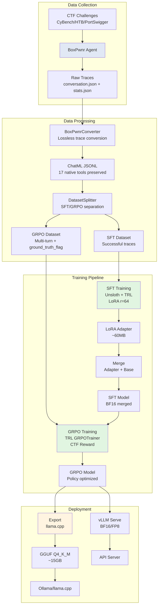

## Module Structure

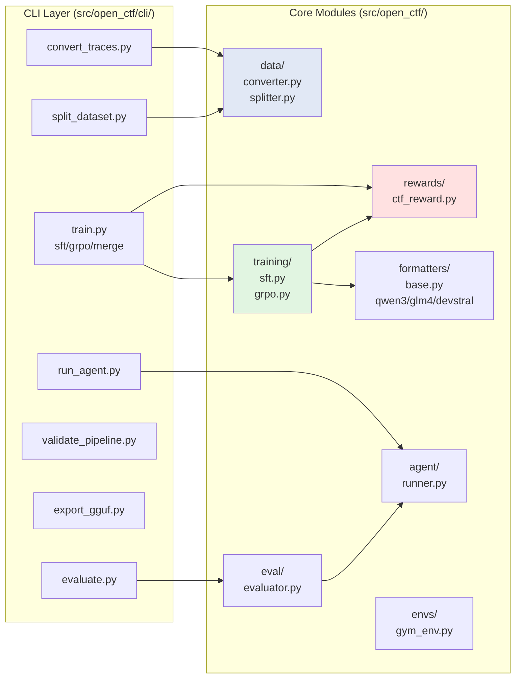

## Training Data Flow

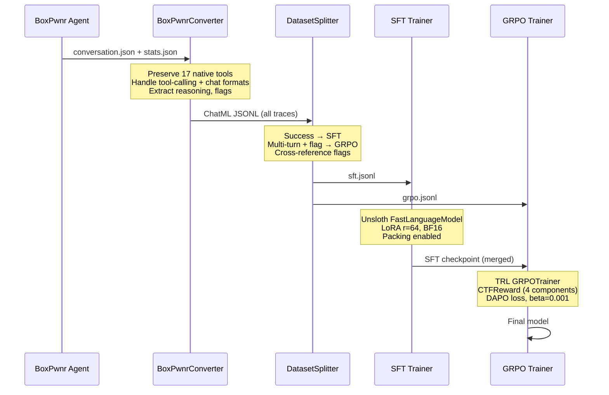

## CTF Reward Function

```mermaid
graph TD
    C[Completion] --> E[Extract Tool Calls + Text]
    E --> F1[Flag Score 0.30]
    E --> F2[Grammar Score 0.20]
    E --> F3[Efficiency Score 0.35]
    E --> F4[Format Score 0.15]

    F1 --> M[Weighted Sum]
    F2 --> M
    F3 --> M
    F4 --> M

    M --> N[Add Noise ±0.05]
    N --> R[Final Reward]

    subgraph "Flag Score"
        F1A[Exact match:<br/>ground_truth_flag] --> F1B[1.0]
        F1C[Pattern match:<br/>FLAG\{...\}] --> F1D[0.1]
        F1E[No flag] --> F1F[0.0]
    end

    subgraph "Grammar Score"
        F2A[Classify tools:<br/>RECON/ENUM/EXPLOIT] --> F2B[Check phase order]
        F2B --> F2C[Presence: 0.6<br/>Order: 0.4]
    end

    subgraph "Efficiency Score"
        F3A[optimal_steps /<br/>actual_steps] --> F3B[min(..., 1.0)]
        F3C[No metadata] --> F3D[0.5 neutral]
    end

    subgraph "Format Score"
        F4A[Valid tool_calls<br/>JSON structure] --> F4B[valid / total]
    end

    style F1 fill:#ffe1e1
    style F2 fill:#e1f5e1
    style F3 fill:#e1e8f5
    style F4 fill:#fff4e1
```

## Model Formatters

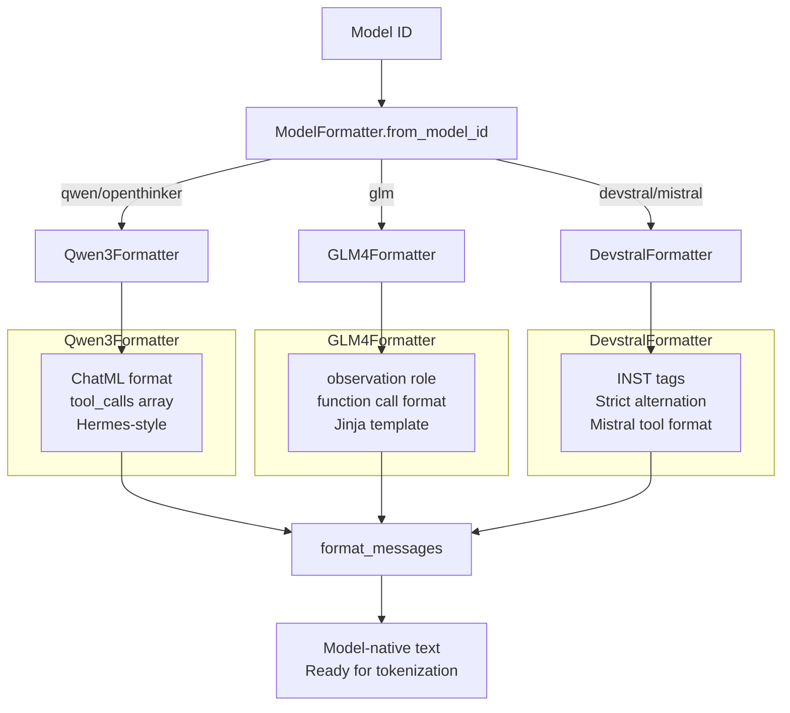

## Training Execution Flow

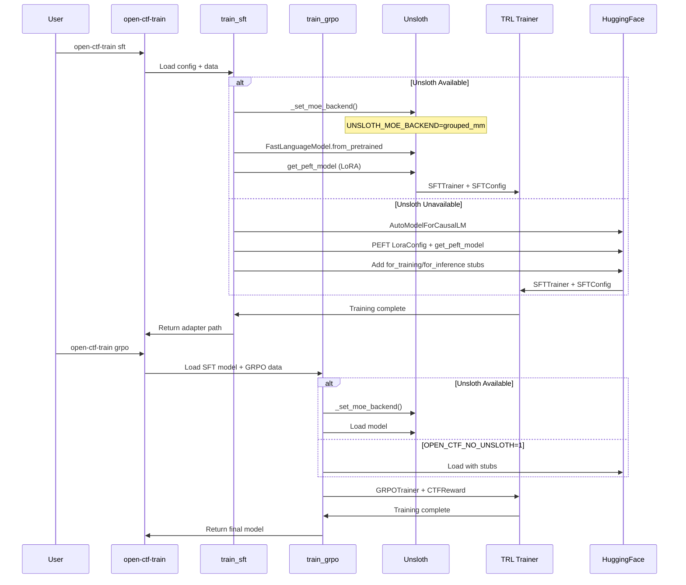

## Hardware Compatibility

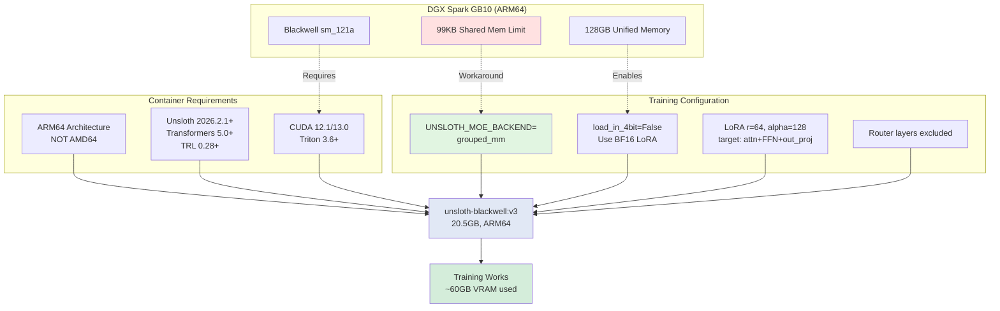

## Evaluation Pipeline

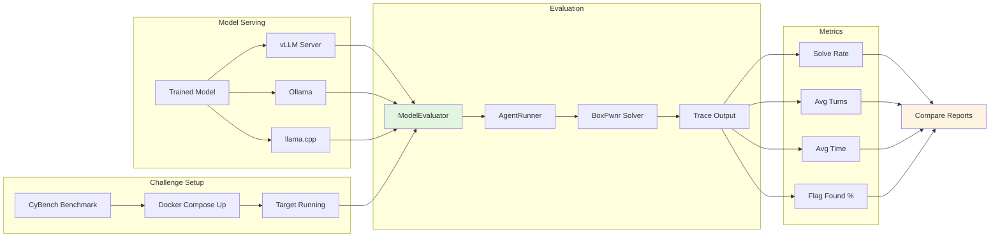

## BoxPwnr Tool Categories

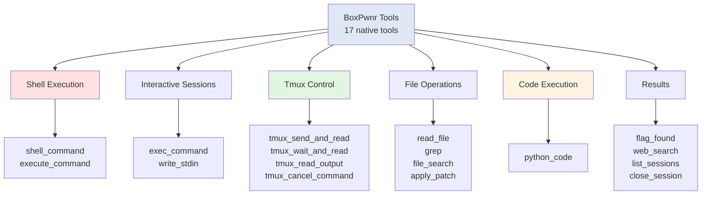

## Skill Grammar (Reward Component)

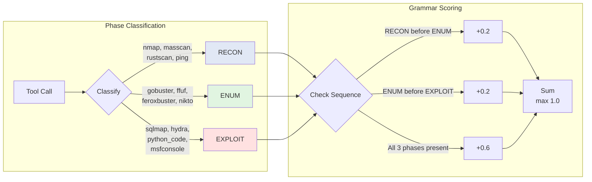

## Hardware Requirements

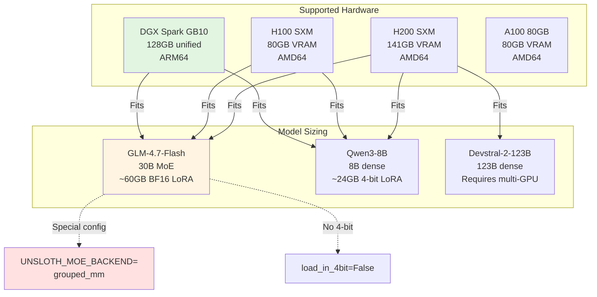

## Key Design Decisions

### 1. Lossless Trace Conversion

**Problem**: Early converters collapsed all tools to a single `shell` tool, losing fine-grained capability data.

**Solution**: BoxPwnrConverter preserves all 17 native tool names, handles both structured `tool_calls` and chat-command `<COMMAND>` formats, and extracts reasoning from multi-part content.

### 2. Dual-Backend Training

**Problem**: Unsloth has known issues on some platforms (GB10 GRPO dtype bug, Triton shared memory limits).

**Solution**: Both `sft.py` and `grpo.py` implement dual loading:
- **Path A**: Try Unsloth with `grouped_mm` backend (fast, optimized)
- **Path B**: Fall back to HuggingFace transformers + PEFT (slower, always works)
- Controlled via `OPEN_CTF_NO_UNSLOTH=1` environment variable

### 3. Model-Specific Formatters

**Problem**: Different model families (Qwen, GLM, Mistral) have incompatible chat templates and tool-calling conventions.

**Solution**: `ModelFormatter` abstract base with auto-detection factory. Each subclass handles:
- Role token mapping (e.g., GLM's `<|observation|>` for tool results)
- Tool call serialization (structured arrays vs inline function calls)
- Reasoning tag placement (interleaved vs separate)

### 4. MoE-Aware Configuration

**Problem**: MoE models have unique constraints:
- No 4-bit quantization support (BitsAndBytes limitation)
- Triton MoE kernels exceed GB10 shared memory limit (99KB vs 104KB+ needed)
- Router layer fine-tuning can destabilize training

**Solution**:
- Auto-detect MoE models, enforce BF16 LoRA
- Set `UNSLOTH_MOE_BACKEND=grouped_mm` to use `torch._grouped_mm` (no Triton)
- Exclude router layers from LoRA target_modules
- Document memory requirements (60GB for GLM-4.7-Flash)

## Configuration Files

### `src/open_ctf/configs/training.yaml`

Central configuration for both training stages:

```yaml
model:
  name: "unsloth/GLM-4.7-Flash"
  max_seq_length: 8192
  load_in_4bit: false  # MoE requires BF16

lora:
  r: 64               # Higher capacity than Unsloth demo (8)
  alpha: 128
  target_modules: [q_proj, k_proj, v_proj, o_proj,
                   gate_proj, up_proj, down_proj, out_proj]

sft:
  epochs: 3
  batch_size: 2
  learning_rate: 2.0e-4
  packing: true       # 3x throughput improvement

grpo:
  epochs: 1
  learning_rate: 5.0e-6
  beta: 0.001         # Low KL penalty for exploration
  loss_type: dapo     # Dynamic advantage normalization
  num_generations: 4
```

### `src/open_ctf/configs/challenges.yaml`

Challenge definitions for evaluation. Maps challenge IDs to vulnerability types, difficulty, platforms.

## CLI Entry Points

After `pip install -e .`, these commands are available:

| Command | Module | Purpose |
|---------|--------|---------|
| `open-ctf-train` | `cli.train` | SFT, GRPO, merge subcommands |
| `open-ctf-convert` | `cli.convert_traces` | BoxPwnr trace → ChatML conversion |
| `open-ctf-split` | `cli.split_dataset` | Split data into SFT/GRPO sets |
| `open-ctf-agent` | `cli.run_agent` | Run agent against CTF challenges |
| `open-ctf-eval` | `cli.evaluate` | Evaluate and compare models |
| `open-ctf-validate` | `cli.validate_pipeline` | Validate setup without GPU |
| `open-ctf-export` | `cli.export_gguf` | Export LoRA to GGUF quantized format |

## Container Strategy

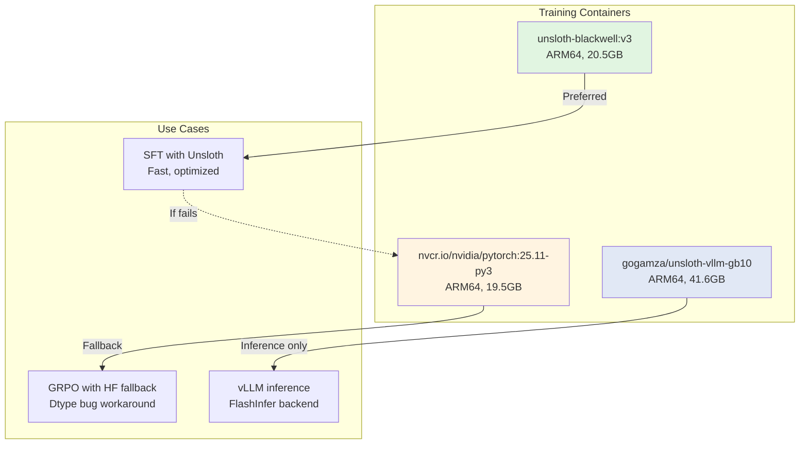

**Why Custom Containers?**
- Official `unsloth/unsloth` is **AMD64 only**
- DGX Spark is **ARM64** (aarch64)
- `unsloth-blackwell:v3` is an ARM64 build with all required libraries

**Library Versions (unsloth-blackwell:v3, built Feb 15 2026)**:
- unsloth: 2026.2.1 (latest)
- transformers: 5.1.0 (required for GLM-4.7-Flash)
- trl: 0.28.0 (latest)
- peft: 0.18.1 (latest)
- torch: 2.10.0a0 (NVIDIA optimized)
- triton: 3.6.0

## Performance Characteristics

| Stage | VRAM Usage | Time (20 samples) | Throughput |
|-------|------------|-------------------|------------|
| **SFT** | ~60GB (BF16 LoRA) | ~15-30 min | 2-3 samples/min |
| **GRPO** | ~80GB (generation overhead) | ~45-60 min | 4 gens × 1-2 samples/min |
| **Merge** | ~45GB (model + adapter) | ~3-5 min | N/A |

**GB10 Notes**:
- Unified CPU-GPU memory: 273 GB/s bandwidth (shared)
- No dedicated VRAM - memory allocation is dynamic
- `nvidia-smi` reports `[N/A]` for memory stats
- Actual usage visible via `docker stats` or container monitoring

## Extension Points

### Adding New Model Formatters

1. Create `src/open_ctf/formatters/mymodel.py` extending `ModelFormatter`
2. Implement `format_messages()` and `get_tool_definitions()`
3. Add detection logic to `base.py` factory method
4. Add test case to `validate_pipeline.py`

### Adding New Reward Components

1. Create new reward function in `src/open_ctf/rewards/`
2. Ensure `__call__(completions, prompts=None, **kwargs)` signature
3. Add `__name__` attribute for TRL logging
4. Import and instantiate in `cli/train.py` `cmd_grpo()`

### Adding New Platforms

1. Install platform support in `references/boxpwnr/`
2. Add platform to `agent/runner.py` `_get_platform()`
3. Update challenge format in `src/open_ctf/configs/challenges.yaml`
4. Document in `docs/deployment.md`
