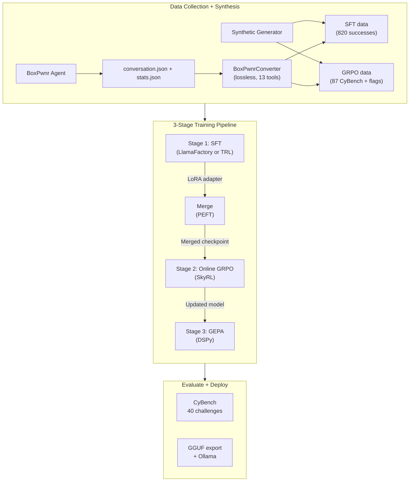
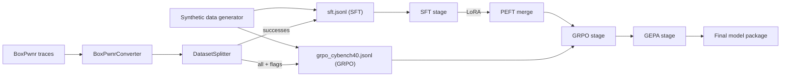
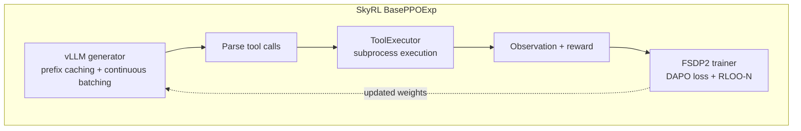
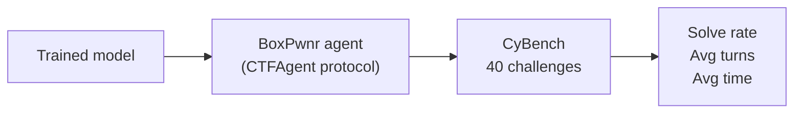

# Architecture

Open CTF Environment is a **3-stage post-training pipeline** for fine-tuning LLMs on CTF challenge trajectories using [LlamaFactory](https://github.com/hiyouga/LlamaFactory) (SFT), [SkyRL](https://github.com/NovaSky-AI/SkyRL) (online GRPO), and [GEPA](https://arxiv.org/abs/2507.19457) (prompt evolution).

## System Overview



## Module Structure

```
src/open_ctf/
├── agent/
│   ├── protocol.py              # CTFAgent protocol + AgentResult dataclass
│   ├── boxpwnr_adapter.py      # BoxPwnr adapter implementing CTFAgent
│   └── runner.py                # BoxPwnr AgentRunner (low-level)
├── challenges/
│   ├── registry.py              # ChallengeRegistry — YAML-backed challenge lookup
│   └── manager.py               # ChallengeManager — Docker container lifecycle
├── cli/
│   ├── train.py                 # open-ctf-train (sft, grpo, gepa, merge)
│   ├── convert_traces.py        # open-ctf-convert
│   ├── split_dataset.py         # open-ctf-split
│   ├── evaluate.py              # open-ctf-eval (--agent for pluggable agents)
│   ├── challenges.py            # open-ctf-challenges (setup/status/teardown)
│   ├── validate_pipeline.py     # open-ctf-validate
│   └── export_gguf.py           # open-ctf-export
├── data/
│   ├── converter.py             # BoxPwnr trace → ChatML conversion
│   └── splitter.py              # SFT/GRPO dataset splitting
├── envs/
│   ├── tool_executor.py         # SubprocessExecutor + RemoteBatchExecutor
│   └── skyrl/
│       ├── openctf_env.py       # OpenCTFTextEnv (SkyRL BaseTextEnv subclass)
│       └── tool_groups.py       # 13 tool schema definitions for SkyRL
├── synthetic_data_generation/   # Offline World Manifests & Generators
│   ├── manifest.py              # Enforces Spatial limits & K8s fault injects
│   ├── executor.py              # CPU-bound tool execution mocking
│   └── generator.py             # Orchestrates BaseAgentAdapters
├── formatters/
│   ├── base.py                  # ModelFormatter abstract base + auto-detection
│   ├── qwen3.py                 # ChatML + Hermes tool format
│   ├── glm4.py                  # GLM-4.7 observation role + MoE tool format
│   └── devstral.py              # Mistral INST tags + strict alternation
├── rewards/
│   └── reward.py                # CTFReward (8 signals + hallucination penalty)
└── training/
    ├── sft/
    │   ├── llamafactory.py      # LlamaFactory SFT backend
    │   └── trl.py               # TRL SFT backend
    ├── online_rl/
    │   ├── entrypoint.py        # Stage-2 online RL entrypoint
    │   ├── runtime.py           # SkyRL runtime + config conversion
    │   ├── step_reward.py       # Per-step shaping reward adapter
    │   └── trajectory_logger.py # Rollout + reward telemetry
    └── gepa.py                  # GEPA prompt optimizer (DSPy + CTFAgentDSPyAdapter)

configs/
├── challenges/
│   └── cybench.yaml             # 40 CyBench challenges (25 docker + 15 static)
├── llamafactory/                # Per-model SFT configs
│   ├── nanbeige_3b.yaml
│   ├── glm47_flash.yaml
│   └── devstral_24b.yaml
└── skyrl/                       # Per-model GRPO configs
    ├── nanbeige_3b.yaml
    ├── glm47_flash.yaml
    └── devstral_24b.yaml
```

## Training Data Flow



## CTF Reward Function

The reward function (`src/open_ctf/rewards/reward.py`) scores agent trajectories on 6 process reward signals plus a hallucination penalty. All process signals are **ungated** — they provide gradient signal regardless of flag capture to prevent reward sparsity during early training.

| Signal | Weight | What It Measures |
|--------|--------|------------------|
| **Flag Capture** | 0.20 | `metadata.success` > exact match > pattern match (0.1) |
| **Efficiency** | 0.25 | `min(optimal / actual, 1.0)` steps |
| **Format** | 0.20 | Valid tool call JSON structure |
| **Progression** | 0.15 | RECON → ENUM → EXPLOIT phase ordering |
| **Exploration** | 0.10 | Novel tool usage weighted toward early trajectory |
| **Uniqueness** | 0.10 | Command diversity (detects stuck loops) |
| **Hallucination** | -0.10 | Penalty for `flag_found` calls with wrong flag (decayed by similarity) |

## Model Formatters

Each model family has a formatter that handles chat template differences:

| Formatter | Models | Template | Tool Format |
|-----------|--------|----------|-------------|
| `Qwen3Formatter` | Nanbeige4.1-3B, Qwen3 | ChatML (`<\|im_start\|>`) | Hermes (`<tool_call>`) |
| `GLM4Formatter` | GLM-4.7-Flash | GLM4 (observation role) | GLM4MOE (XML function calls) |
| `DevstralFormatter` | Devstral-Small-2-24B | Mistral (`[INST]`) | Mistral tool format |

`ModelFormatter.from_model_id()` auto-detects the appropriate formatter from the model name.

## Online RL Architecture (Stage 2: GRPO)

### Why BaseTextEnv, Not SkyRL-Agent

We deliberately use `skyrl-gym`'s low-level `BaseTextEnv` interface rather than the higher-level `skyrl-agent` framework (`AutoAgentRunner`, `ReActAgent`). The reasons:

1. **13 BoxPwnr tools** don't exist in `skyrl-agent`'s `TOOL_REGISTRY` — wrapping our `SubprocessExecutor` inside their tool class hierarchy would add an unnecessary abstraction layer.
2. **Token format parity**: Tool schemas in the GRPO system prompt must exactly match what the model saw during SFT (verified by `test_tokenizer_drift`). SkyRL-Agent's own prompt construction would break this.
3. **Multi-signal reward**: SkyRL-Agent's verifiers are binary pass/fail. Our `CTFReward` computes 6 continuous process signals.
4. **Per-challenge routing**: CTF challenges require Docker container lifecycle management and per-challenge target URLs — not supported by SkyRL-Agent's task abstraction.

### SkyRL Integration



- **Generator** (Ray actor): vLLM inference engine produces 8 completions per prompt.
- **Environment** (`OpenCTFTextEnv`): Each generation gets its own env instance with a `SubprocessExecutor` for tool execution. No HTTP server — direct subprocess calls.
- **Trainer** (Ray actor): FSDP2 computes DAPO loss with config-driven advantage estimation (for example RLOO or RLOO-N).
- **Placement**: Current Qwen3.5 RunPod/B200 baseline uses `run_engines_locally: true` + `colocate_all: false` (trainer and vLLM on separate GPUs).

### Tool Execution

13 tools shared across training data, reward function, and the ToolExecutor:

| Tier | Tools | Description |
|------|-------|-------------|
| **Execution** | `shell_command`, `exec_command`, `write_stdin`, `python_code`, `execute_command` | Shell scripts, interactive PTY sessions, Python exploits |
| **File Ops** | `read_file`, `grep`, `file_search`, `apply_patch` | Read, search, modify files in the container |
| **Meta** | `flag_found`, `web_search`, `list_sessions`, `close_session` | Flag submission, web search, session management |

## Configuration Architecture

### Per-Framework Configs

```
configs/llamafactory/<model>.yaml    ← LlamaFactory SFT (native YAML format)
configs/skyrl/<model>.yaml           ← SkyRL GRPO (native YAML format)
configs/challenges/<benchmark>.yaml  ← Challenge registry (custom YAML)
```

LlamaFactory and SkyRL configs use each framework's native format directly — no translation layer.

### Key Settings (GLM-4.7-Flash, 32K Context)

| Parameter | SFT | GRPO |
|-----------|-----|------|
| Context length | 32768 (`cutoff_len`) | 32768 (`max_prompt_length`) |
| Max completion | N/A | 8192 (`max_generate_length`) |
| LoRA rank | 64 | 64 |
| LoRA targets | Attention + shared expert only | Same |
| Learning rate | 2e-4 | 5e-6 |
| Epochs | 5 | 1 |
| Batch size | 1 (MoE routing NaN fix) | 1 |
| Loss | Cross-entropy | DAPO |
| Packing | Yes (3x throughput) | N/A |
| Samples per prompt | N/A | 8 |
| Max tool turns | N/A | 50 |
| Trainer strategy | Single GPU / DeepSpeed | FSDP2 + Ray |
| Advantage estimator | N/A | RLOO / RLOO-N (config-dependent) |

## Container Strategy

Three Docker targets from a single multi-stage Dockerfile, separated to avoid dependency conflicts between LlamaFactory, TRL, and SkyRL transformer version pins:

| Target | Base | Purpose |
|--------|------|---------|
| `sft` | `nvcr.io/nvidia/pytorch:25.11-py3` | LlamaFactory SFT + merge + validate + export |
| `sft-trl` | `nvcr.io/nvidia/pytorch:25.11-py3` | TRL SFT backend for newer model families (for example Qwen3.5) |
| `grpo` | `nvcr.io/nvidia/pytorch:25.11-py3` | SkyRL GRPO + Ray + vLLM |

```bash
docker build -t open-ctf:sft  --target sft  -f docker/Dockerfile .
docker build -t open-ctf:sft-trl --target sft-trl -f docker/Dockerfile .
docker build -t open-ctf:grpo --target grpo -f docker/Dockerfile .
```

## Evaluation Pipeline



Evaluation uses the same BoxPwnr scaffold as data collection. The only variable is model weights — architecture, tools, and evaluation harness are held constant. The `CTFAgent` protocol supports pluggable agents: use `--agent boxpwnr` (default) or `--agent custom:module.Class`.

## Key Design Decisions

### 1. LlamaFactory for SFT

**Problem**: Custom `sft.py` had Unsloth dependency, manual message normalization, and broke on new hardware.

**Solution**: LlamaFactory handles tool formats, packing, multi-GPU, and LoRA natively via YAML config. 11 built-in tool format classes cover all model families. No Python code changes per experiment.

### 2. SkyRL for GRPO

**Problem**: Custom GRPO script required 6 monkey-patches for GLM-4.7-Flash MoE on Blackwell GB10 (prefix check, dtype cast, weight sync translation, NCCL segfault, etc.).

**Solution**: SkyRL uses Ray process isolation — vLLM runs in a separate process from training. This removes the old in-repo monkey-patch-heavy GRPO loop. Remaining upstream compatibility fixes are isolated in `docker/patches/`.

### 3. BaseTextEnv Over SkyRL-Agent

**Problem**: SkyRL-Agent's `ReActAgent` and `TOOL_REGISTRY` are designed for SWE-Bench tasks. CTF challenges need 13 custom tools, multi-signal rewards, per-challenge Docker routing, and strict SFT-GRPO token format parity.

**Solution**: Use `skyrl-gym`'s `BaseTextEnv` directly. Tool execution via `SubprocessExecutor`, reward via `CTFReward`, schemas injected into prompts deterministically. Plugs into SkyRL-Train's `BasePPOExp` without the agent abstraction layer.

### 4. Model-Agnostic YAML Design

**Problem**: Hardcoded model assumptions (MoE batch_size=1, BF16-only, specific template) made it difficult to test new architectures.

**Solution**: All model-specific settings live in YAML configs. To add a model: create `configs/llamafactory/<model>.yaml` and `configs/skyrl/<model>.yaml`. No Python code changes.

### 5. MoE-Aware Configuration

MoE models (GLM-4.7-Flash) have unique constraints documented in their config files:
- No 4-bit quantization (BitsAndBytes + MoE routing incompatibility)
- `batch_size=1` (MoE routing NaN with padding tokens)
- `colocate_all: true` for legacy colocated MoE profiles (Qwen3.5/B200 baseline uses non-colocated local engines)
- Router layers excluded from LoRA targets

## Hardware Compatibility

| Hardware | SFT (Dense 3B) | SFT (MoE 30B) | GRPO (Dense 3B) | GRPO (MoE 30B) |
|----------|----------------|----------------|------------------|-----------------|
| DGX Spark GB10 (128GB) | QLoRA 4-bit | BF16 LoRA | Colocate mode | Colocate mode |
| H200 (141GB) | QLoRA 4-bit | BF16 LoRA | Colocate mode | Zero-offload possible |
| B200 (192GB) | QLoRA 4-bit | BF16 LoRA | Non-colocated local engines | Non-colocated local engines |

## Extension Points

### Adding New Models

1. Create `configs/llamafactory/<model>.yaml` with SFT hyperparameters
2. Create `configs/skyrl/<model>.yaml` with GRPO hyperparameters
3. Add a formatter in `src/open_ctf/formatters/` if the chat template is non-standard
4. Add detection logic to `formatters/base.py` factory method

### Adding New Reward Signals

1. Add the signal computation to `src/open_ctf/rewards/reward.py`
2. Add its weight to the configurable weights dict
3. Ensure weights sum to 1.0

### Adding New Benchmarks

Challenge registries are YAML-driven. To add a new benchmark:
1. Create `configs/challenges/<name>.yaml` with challenge definitions
2. Run `open-ctf-challenges setup --registry configs/challenges/<name>.yaml`
3. No changes to training pipeline, reward function, or tool schemas
