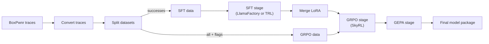
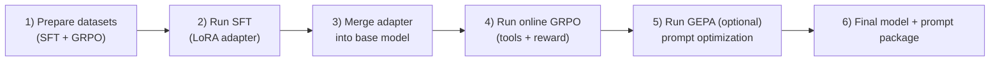

# Training Guide

Open CTF uses a **3-stage training pipeline**: SFT (supervised fine-tuning) for knowledge acquisition, online GRPO (reinforcement learning with live tool execution) for efficiency optimization, and GEPA (prompt evolution) for no-weight-update refinement.

## Pipeline Overview



### High-Level Training Sequence



| Stage | Framework | What It Does | Weight Updates |
|-------|-----------|--------------|----------------|
| **1. SFT** | [LlamaFactory](https://github.com/hiyouga/LlamaFactory) / [TRL](https://github.com/huggingface/trl) | YAML-driven LlamaFactory SFT by default, with TRL backend support for newer model families (for example Qwen3.5). | Yes |
| **2. GRPO** | [SkyRL](https://github.com/NovaSky-AI/SkyRL) | Online RL with live tool execution via ToolExecutor (subprocess). Ray-based, vLLM, DAPO. | Yes |
| **3. GEPA** | [DSPy](https://github.com/stanfordnlp/dspy) | Prompt evolution via reflection. Pareto-based candidate selection. ~6% better than GRPO with 4-35x fewer rollouts. | No |

## Data Preparation

### 1. Convert BoxPwnr Traces

```bash
# Convert successful traces only (recommended for SFT)
open-ctf-convert \
    --input targets/ \
    --output data/sft_train.jsonl \
    --success-only --dedup

# Also save failures (useful for GRPO exploration)
open-ctf-convert \
    --input targets/ \
    --output data/sft_train.jsonl \
    --output-failure data/failures.jsonl
```

### 2. Split into SFT and GRPO Datasets

```bash
open-ctf-split \
    --input data/sft_train.jsonl \
    --sft-output data/sft.jsonl \
    --online-rl-output data/online_rl.jsonl \
    --max-online-rl-tokens 32768
```

### Data Format

**SFT** uses ChatML format:

```json
{
  "messages": [
    {"role": "system", "content": "..."},
    {"role": "user", "content": "Solve: http://target"},
    {"role": "assistant", "content": "...", "tool_calls": [...]},
    {"role": "tool", "tool_call_id": "...", "name": "shell_command", "content": "..."}
  ],
  "metadata": {"source": "boxpwnr", "platform": "cybench"}
}
```

**GRPO** adds ground truth for reward computation:

```json
{
  "messages": [...],
  "ground_truth_flag": "FLAG{...}",
  "metadata": {"optimal_steps": 12, "vulnerability_type": "idor"}
}
```

## Stage 1: Supervised Fine-Tuning (SFT)

SFT uses **LlamaFactory by default** to teach domain knowledge, tool schemas, and reasoning patterns. For newer model families requiring newer Transformers support (for example Qwen3.5), use the **TRL backend** via `--backend trl`.

### Quick Start

```bash
open-ctf-train sft \
    --model Nanbeige/Nanbeige4.1-3B \
    --data data/sft.jsonl \
    --output outputs/sft

# Example: force TRL backend (Qwen3.5+ and other newer models)
open-ctf-train sft \
    --model Qwen/Qwen3.5-27B \
    --data data/sft.jsonl \
    --output outputs/sft-qwen35 \
    --backend trl
```

### Configuration

Model-specific configs live in `configs/llamafactory/`:

| Model | Config | Template | Tool Format | Notes |
|-------|--------|----------|-------------|-------|
| **Nanbeige4.1-3B** | `nanbeige_3b.yaml` | `chatml` | `qwen` | Default, 3B dense, QLoRA 4-bit |
| **GLM-4.7-Flash** | `glm47_flash.yaml` | `glm4_7` | `glm4_moe` | MoE, BF16 LoRA, batch_size=1 |
| **Devstral-Small-2-24B** | `devstral_24b.yaml` | `mistral` | (default) | Dense, QLoRA 4-bit |

Example config (`configs/llamafactory/nanbeige_3b.yaml`):

```yaml
model_name_or_path: Nanbeige/Nanbeige4.1-3B
trust_remote_code: true
stage: sft
do_train: true
finetuning_type: lora
lora_rank: 64
lora_alpha: 128
lora_dropout: 0.0
lora_target: q_proj,k_proj,v_proj,o_proj,gate_proj,up_proj,down_proj
template: chatml
tool_format: qwen
cutoff_len: 32768
packing: true
neat_packing: true
per_device_train_batch_size: 2
gradient_accumulation_steps: 8
learning_rate: 2.0e-4
num_train_epochs: 5
bf16: true
gradient_checkpointing: true
quantization_bit: 4
quantization_method: bitsandbytes
```

### SFT Key Parameters

| Parameter | Recommended | Notes |
|-----------|-------------|-------|
| `cutoff_len` | 32768 | Context window for training |
| `num_train_epochs` | 5 | Research shows short SFT (1-3) can underfit for RL |
| `learning_rate` | 2e-4 | Standard for LoRA SFT |
| `packing` | true | 3x throughput improvement |
| `lora_rank` | 64 | Higher rank = more capacity |
| `template` | model-specific | `chatml` for ChatML, `glm4_7` for GLM, `mistral` for Devstral |
| `tool_format` | model-specific | `qwen` for Hermes/ChatML, `glm4_moe` for GLM |

### MoE Model Notes (GLM-4.7-Flash)

- **No 4-bit quantization**: MoE expert tensors are incompatible with BitsAndBytes. Use BF16 LoRA (`quantization_bit` omitted).
- **batch_size=1**: Padding tokens through MoE router produce NaN gradients. Compensate with `gradient_accumulation_steps: 16`.
- **Router layers excluded**: Only attention + FFN shared layers targeted by LoRA.

## Merging LoRA Adapters

After SFT, merge the LoRA adapter into the base model for GRPO:

```bash
open-ctf-train merge \
    --adapter outputs/sft \
    --base-model Nanbeige/Nanbeige4.1-3B \
    --output outputs/sft-merged
```

## Stage 2: Online GRPO (Reinforcement Learning)

GRPO uses **SkyRL** to optimize for flag capture efficiency with live tool execution via the **ToolExecutor** (direct subprocess). The model generates tool calls, the ToolExecutor runs them locally (shell, Python, file ops), and the CTF reward function scores the full trajectory. No HTTP server required — SkyRL's per-worker process isolation handles everything.

### Prerequisites

1. **Merged SFT model**: GRPO starts from the SFT checkpoint.
2. **CyBench challenge containers** (optional): For live challenge execution (`open-ctf-challenges setup`).

### Quick Start

```bash
open-ctf-train rl \
    --model outputs/sft-qwen35-merged \
    --data data/online_rl_cybench40.jsonl \
    --output outputs/online_rl-qwen35 \
    --config src/open_ctf/configs/training_qwen35_27b.yaml \
    --challenge-registry configs/challenges/cybench.yaml
```

`open-ctf-train rl` now runs `open-ctf-validate --mode grpo-preflight` automatically and requires `<data>.manifest.json` by default. Use `--allow-missing-manifest` only for ad-hoc debugging.

For remote challenge infrastructure (for example DGX containers tunneled to RunPod), generate a live challenge target map on the challenge host and pass it to GRPO:

```bash
# On the host running challenge containers (DGX)
PYTHONPATH=src python3 scripts/generate_live_target_map.py \
    --registry configs/challenges/cybench.yaml \
    --benchmark-root /workspace/cybench \
    --port-offset 10200 \
    --output /tmp/cybench_targets.json

# On the trainer host (RunPod)
OPEN_CTF_TARGET_MAP_PATH=/tmp/cybench_targets.json \
open-ctf-train rl \
    --model outputs/sft-qwen35-merged \
    --data data/online_rl_cybench40.jsonl \
    --output outputs/online_rl-qwen35 \
    --config src/open_ctf/configs/training_qwen35_27b.yaml \
    --challenge-registry configs/challenges/cybench.yaml
```

### Configuration

The GRPO launch profiles in this repo are the `src/open_ctf/configs/training*.yaml` files:

| Model | Config | Placement | Notes |
|-------|--------|-----------|-------|
| **Qwen3.5-27B (current RunPod/B200 baseline)** | `src/open_ctf/configs/training_qwen35_27b.yaml` | `run_engines_locally: true`, `colocate_all: false` | Trainer and vLLM on separate GPUs |
| **Nanbeige4.1-3B (legacy baseline)** | `src/open_ctf/configs/training.yaml` | `vllm_mode: colocate` | Single-GPU fallback profile |

Example generated SkyRL topology (from `training_qwen35_27b.yaml`):

```yaml
trainer:
  placement:
    colocate_all: false

generator:
  run_engines_locally: true
  backend: vllm
  n_samples_per_prompt: 2
  max_turns: 60
  sampling_params:
    max_generate_length: 8192

environment:
  env_class: openctf
```

### Reward Function

The CTF reward scores completions on **8 signals + 1 penalty**:

| Signal | Weight | Description |
|--------|--------|-------------|
| **Flag Capture** | 0.20 | Exact match (1.0) or pattern match (0.1) |
| **Efficiency** | 0.20 | `min(optimal / actual, 1.0)` |
| **Progression** | 0.12 | RECON → ENUM → EXPLOIT phase ordering |
| **Exploration** | 0.08 | Novel tool usage weighted toward early trajectory |
| **Uniqueness** | 0.08 | Command diversity (detects stuck loops) |
| **Format** | 0.15 | Valid tool call structure and schema compliance |
| **Recovery** | 0.07 | Recovery after failed commands |
| **Cognitive** | 0.10 | Coherent reasoning/execution progression |
| **Hallucination** | -0.10 | Penalty for `flag_found` calls with wrong flag (decayed by similarity) |

All process signals are ungated -- they provide gradient signal regardless of flag capture.

### GRPO Key Parameters

| Parameter | Recommended | Notes |
|-----------|-------------|-------|
| `lr` | 5e-6 | Much lower than SFT to avoid instability |
| `n_samples_per_prompt` | 2 (Qwen3.5-27B) | Better wall-clock throughput on dual-B200 while retaining group-relative signal |
| `max_turns` | 60 | Tool-calling iterations per generation for long-horizon trajectories |
| `max_generate_length` | 8192 | Per-turn generation limit |
| `run_engines_locally` + `colocate_all` | `true` + `false` | Working LoRA-safe topology on RunPod B200 |
| `advantage_estimator` | `rloo` | Stable with current SkyRL runtime |
| `kl_loss_coef` | 0.0 | No KL penalty (pure DAPO) |

### SkyRL Architecture

SkyRL uses Ray actors for fully async GRPO:

- **Generator**: vLLM inference engine produces completions in a separate process.
- **Trainer**: FSDP2 handles distributed training with gradient checkpointing.
- **Environment**: `OpenCTFTextEnv` (in `src/open_ctf/envs/skyrl/openctf_env.py`) bridges SkyRL and the `ToolExecutor` via direct subprocess calls. No HTTP server.
- **Placement**: Current Qwen3.5 production profile uses `run_engines_locally: true` + `colocate_all: false` so trainer and vLLM can be pinned to separate GPUs.

## Stage 3: GEPA (Prompt Evolution)

GEPA optimizes the system prompt without changing model weights. It uses DSPy's reflective agent pattern with Pareto-based candidate selection. Both the agent LM and the reflection LM default to the **same model** — no cloud APIs required. Both can point at a local vLLM server.

### How GEPA Improves Over Time

```
Iteration 1:
  Seed Prompt → Evaluate on minibatch (3 challenges) → Score each [0.8, 0.2, 0.5]
       ↓
  Reflection LM analyzes traces: "Agent found IDOR but never enumerated IDs"
       ↓
  Mutation: "When you discover an ID parameter, enumerate nearby IDs (±20)"
       ↓
  Candidate Prompt v1.1

Iteration 2:
  Evaluate BOTH prompts on next minibatch
  Seed:   [0.3, 0.7, 0.4]
  v1.1:   [0.6, 0.7, 0.8]  ← better on challenges A and C
       ↓
  Pareto Selection: v1.1 dominates seed → seed dropped
       ↓
Iteration 3...N:
  Reflect on v1.1 failures → v1.2, v1.3 → Evaluate → Pareto select → repeat
```

Pareto selection keeps prompts that excel at **different challenges** (non-dominated solutions), avoiding local optima. The final output is the prompt with the best average score.

### Quick Start

```bash
# Default: agent and reflection LM are the same local model
# Set OPENAI_API_BASE=http://localhost:8001/v1 to point at local vLLM
open-ctf-train gepa \
    --model openai/ctf-agent \
    --data data/online_rl.jsonl \
    --output outputs/gepa

# Stronger reflection: serve a larger model on a separate port
open-ctf-train gepa \
    --model openai/ctf-agent \
    --data data/online_rl.jsonl \
    --output outputs/gepa \
    --reflection-model openai/larger-model

# Custom agent mode: wrap any CTFAgent in a DSPy Module
open-ctf-train gepa \
    --model openai/ctf-agent \
    --data data/online_rl.jsonl \
    --output outputs/gepa \
    --agent my_module.MyAgent \
    --challenge-registry configs/challenges/cybench.yaml \
    --budget heavy
```

When `--agent` is set, GEPA wraps the CTFAgent in a `CTFAgentDSPyAdapter` so the DSPy optimizer can evolve the system prompt while the agent handles generation and tool execution.

### CLI Flags

| Flag | Default | Description |
|------|---------|-------------|
| `--model` | (required) | LLM model id for `dspy.LM` (local vLLM recommended) |
| `--data` | (required) | Path to GRPO JSONL data (challenges) |
| `--output` | (required) | Output directory for optimized prompt |
| `--reflection-model` | same as `--model` | LLM for reflection. For stronger mutations, use a larger local model. |
| `--budget` | `medium` | Budget preset: `light`, `medium`, or `heavy` |
| `--agent` | `None` | Dotted path to a CTFAgent class (e.g. `my_module.MyAgent`) |
| `--challenge-registry` | `None` | Path to challenge registry YAML for target URL resolution |
| `--val-data` | `None` | Validation JSONL (separate from train) |
| `--max-samples` | `None` | Max training examples |

### Configuration

GEPA settings live in the `gepa:` section of `training.yaml`:

```yaml
gepa:
  seed_prompt: null              # Override default CTF agent prompt (null = use built-in)
  reflection_model: null         # Reflection LM (null = same as agent model)
  max_iters: 20                  # Max tool-calling iterations per challenge
  reflection_minibatch_size: 3   # Samples per GEPA reflection batch
  seed: 42
  budget: light                  # Budget preset: light / medium / heavy
  num_threads: 1                 # Parallel challenge evaluations (1 = sequential)
```

### Two LMs, Two Roles

| Role | Temperature | Max Tokens | Purpose |
|------|-------------|------------|---------|
| **Agent LM** | 0.7 | 4,096 | Solves CTF challenges (tool calls) |
| **Reflection LM** | 1.0 | 32,000 | Analyzes traces, proposes prompt mutations |

The higher temperature on the reflection LM encourages diverse prompt mutations. Both default to the same model. For better results, serve a larger model for reflection on a separate vLLM port:

```bash
# GPU 0: Agent model (fast, smaller)
vllm serve my-3b-model --port 8001

# GPU 1: Reflection model (smarter, larger)
vllm serve my-27b-model --port 8002
```

Then configure:
```yaml
gepa:
  reflection_model: "openai/my-27b-model"  # points to port 8002
```

GEPA can run in offline mode (stub tools, scores structure) or online mode (real tools, scores flag capture). Online mode uses the same ToolExecutor as GRPO.

## Full Pipeline

```bash
# 1. Convert traces
open-ctf-convert --input targets/ --output data/all.jsonl --dedup
open-ctf-split --input data/all.jsonl

# 2. SFT
open-ctf-train sft --model Nanbeige/Nanbeige4.1-3B --data data/sft.jsonl --output outputs/sft

# 3. Merge
open-ctf-train merge --adapter outputs/sft --base-model Nanbeige/Nanbeige4.1-3B --output outputs/sft-merged

# 4. GRPO
open-ctf-train rl --model outputs/sft-merged --data data/online_rl.jsonl --output outputs/online_rl \
    --config src/open_ctf/configs/training.yaml

# 5. GEPA (optional — same model for agent + reflection, no cloud APIs)
open-ctf-train gepa --model openai/ctf-agent --data data/online_rl.jsonl --output outputs/gepa

# 6. Export
open-ctf-export --adapter outputs/online_rl/final --base-model Nanbeige/Nanbeige4.1-3B --output models/ctf-agent.gguf --quant Q4_K_M
```

## Docker Training

```bash
# Stage 1: SFT (LlamaFactory image)
docker compose run --rm sft

# Stage 1: SFT (TRL backend image, for newer model families)
docker compose run --rm sft-trl

# Merge LoRA
docker compose run --rm merge

# Stage 2: GRPO (SkyRL image, needs OPEN_CTF_ENV_URL)
docker compose run --rm grpo

# Validate
docker compose run --rm validate
```

## Monitoring

Training logs to W&B when `report_to: wandb` is set. Set `WANDB_API_KEY` in your environment, or disable:

```yaml
output:
  report_to: none
```

## Hardware Requirements

| Stage | Model | Minimum GPU | Recommended |
|-------|-------|-------------|-------------|
| SFT | Nanbeige4.1-3B (QLoRA 4-bit) | 1x 24GB | 1x 80GB |
| SFT | GLM-4.7-Flash (BF16 LoRA) | 1x 80GB | DGX Spark (128GB) |
| GRPO | Nanbeige4.1-3B | DGX Spark (128GB) | 1x H200 (141GB) |
| GRPO | GLM-4.7-Flash | DGX Spark (128GB) | 1x B200 (192GB) |
| GEPA | Any | No GPU required | — |
