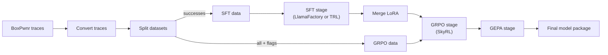
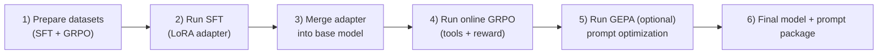

# Training Guide

Open CTF uses a **3-stage training pipeline**: SFT (supervised fine-tuning) for knowledge acquisition, online GRPO (reinforcement learning with live tool execution) for efficiency optimization, and GEPA (prompt evolution) for no-weight-update refinement.

## Pipeline Overview



### High-Level Training Sequence



| Stage | Framework | What It Does | Weight Updates |
|-------|-----------|--------------|----------------|
| **1. SFT** | [LlamaFactory](https://github.com/hiyouga/LlamaFactory) / [TRL](https://github.com/huggingface/trl) | YAML-driven LlamaFactory SFT by default, with TRL backend support for newer model families (for example Qwen3.5). | Yes |
| **2. GRPO** | [SkyRL](https://github.com/NovaSky-AI/SkyRL) | Online RL with live tool execution via ToolExecutor (subprocess). Ray-based, vLLM, DAPO. | Yes |
| **3. GEPA** | [DSPy](https://github.com/stanfordnlp/dspy) | Prompt evolution via reflection. Pareto-based candidate selection. ~6% better than GRPO with 4-35x fewer rollouts. | No |

## Data Preparation

### 1. Convert BoxPwnr Traces

```bash
# Convert successful traces only (recommended for SFT)
open-ctf-convert \
    --input targets/ \
    --output data/sft_train.jsonl \
    --success-only --dedup

# Also save failures (useful for GRPO exploration)
open-ctf-convert \
    --input targets/ \
    --output data/sft_train.jsonl \
    --output-failure data/failures.jsonl
```

### 2. Split into SFT and GRPO Datasets

```bash
open-ctf-split \
    --input data/sft_train.jsonl \
    --sft-output data/sft.jsonl \
    --grpo-output data/grpo.jsonl \
    --max-grpo-tokens 32768
```

### Data Format

**SFT** uses ChatML format:

```json
{
  "messages": [
    {"role": "system", "content": "..."},
    {"role": "user", "content": "Solve: http://target"},
    {"role": "assistant", "content": "...", "tool_calls": [...]},
    {"role": "tool", "tool_call_id": "...", "name": "shell_command", "content": "..."}
  ],
  "metadata": {"source": "boxpwnr", "platform": "cybench"}
}
```

**GRPO** adds ground truth for reward computation:

```json
{
  "messages": [...],
  "ground_truth_flag": "FLAG{...}",
  "metadata": {"optimal_steps": 12, "vulnerability_type": "idor"}
}
```

## Stage 1: Supervised Fine-Tuning (SFT)

SFT uses **LlamaFactory by default** to teach domain knowledge, tool schemas, and reasoning patterns. For newer model families requiring newer Transformers support (for example Qwen3.5), use the **TRL backend** via `--backend trl`.

### Quick Start

```bash
open-ctf-train sft \
    --model Nanbeige/Nanbeige4.1-3B \
    --data data/sft.jsonl \
    --output outputs/sft

# Example: force TRL backend (Qwen3.5+ and other newer models)
open-ctf-train sft \
    --model Qwen/Qwen3.5-27B \
    --data data/sft.jsonl \
    --output outputs/sft-qwen35 \
    --backend trl
```

### Configuration

Model-specific configs live in `configs/llamafactory/`:

| Model | Config | Template | Tool Format | Notes |
|-------|--------|----------|-------------|-------|
| **Nanbeige4.1-3B** | `nanbeige_3b.yaml` | `chatml` | `qwen` | Default, 3B dense, QLoRA 4-bit |
| **GLM-4.7-Flash** | `glm47_flash.yaml` | `glm4_7` | `glm4_moe` | MoE, BF16 LoRA, batch_size=1 |
| **Devstral-Small-2-24B** | `devstral_24b.yaml` | `mistral` | (default) | Dense, QLoRA 4-bit |

Example config (`configs/llamafactory/nanbeige_3b.yaml`):

```yaml
model_name_or_path: Nanbeige/Nanbeige4.1-3B
trust_remote_code: true
stage: sft
do_train: true
finetuning_type: lora
lora_rank: 64
lora_alpha: 128
lora_dropout: 0.0
lora_target: q_proj,k_proj,v_proj,o_proj,gate_proj,up_proj,down_proj
template: chatml
tool_format: qwen
cutoff_len: 32768
packing: true
neat_packing: true
per_device_train_batch_size: 2
gradient_accumulation_steps: 8
learning_rate: 2.0e-4
num_train_epochs: 5
bf16: true
gradient_checkpointing: true
quantization_bit: 4
quantization_method: bitsandbytes
```

### SFT Key Parameters

| Parameter | Recommended | Notes |
|-----------|-------------|-------|
| `cutoff_len` | 32768 | Context window for training |
| `num_train_epochs` | 5 | Research shows short SFT (1-3) can underfit for RL |
| `learning_rate` | 2e-4 | Standard for LoRA SFT |
| `packing` | true | 3x throughput improvement |
| `lora_rank` | 64 | Higher rank = more capacity |
| `template` | model-specific | `chatml` for ChatML, `glm4_7` for GLM, `mistral` for Devstral |
| `tool_format` | model-specific | `qwen` for Hermes/ChatML, `glm4_moe` for GLM |

### MoE Model Notes (GLM-4.7-Flash)

- **No 4-bit quantization**: MoE expert tensors are incompatible with BitsAndBytes. Use BF16 LoRA (`quantization_bit` omitted).
- **batch_size=1**: Padding tokens through MoE router produce NaN gradients. Compensate with `gradient_accumulation_steps: 16`.
- **Router layers excluded**: Only attention + FFN shared layers targeted by LoRA.

## Merging LoRA Adapters

After SFT, merge the LoRA adapter into the base model for GRPO:

```bash
open-ctf-train merge \
    --adapter outputs/sft \
    --base-model Nanbeige/Nanbeige4.1-3B \
    --output outputs/sft-merged
```

## Stage 2: Online GRPO (Reinforcement Learning)

GRPO uses **SkyRL** to optimize for flag capture efficiency with live tool execution via the **ToolExecutor** (direct subprocess). The model generates tool calls, the ToolExecutor runs them locally (shell, Python, file ops), and the CTF reward function scores the full trajectory. No HTTP server required — SkyRL's per-worker process isolation handles everything.

### Prerequisites

1. **Merged SFT model**: GRPO starts from the SFT checkpoint.
2. **CyBench challenge containers** (optional): For live challenge execution (`open-ctf-challenges setup`).

### Quick Start

```bash
open-ctf-train grpo \
    --model outputs/sft-merged \
    --data data/grpo.jsonl \
    --output outputs/grpo \
    --config configs/skyrl/glm47_flash.yaml
```

### Configuration

GRPO configs live in `configs/skyrl/`:

| Model | Config | Placement | Notes |
|-------|--------|-----------|-------|
| **Nanbeige4.1-3B** | `nanbeige_3b.yaml` | `colocate_all: true` | Dense, fast iteration |
| **GLM-4.7-Flash** | `glm47_flash.yaml` | `colocate_all: true` | MoE safe default |

Example config (`configs/skyrl/nanbeige_3b.yaml`):

```yaml
trainer:
  strategy: fsdp2
  bf16: true
  gradient_checkpointing: true
  train_batch_size: 1
  max_prompt_length: 32768
  placement:
    colocate_all: true
  policy:
    model:
      path: outputs/sft-merged/
      lora:
        rank: 64
        alpha: 128
    optimizer_config:
      lr: 5.0e-6
  algorithm:
    advantage_estimator: rloo_n
    kl_loss_coef: 0.0

generator:
  backend: vllm
  n_samples_per_prompt: 8
  max_turns: 50
  sampling_params:
    max_generate_length: 8192
    temperature: 1.0

environment:
  env_class: openctf
```

### Reward Function

The CTF reward scores completions on **6 signals + 1 penalty**:

| Signal | Weight | Description |
|--------|--------|-------------|
| **Flag Capture** | 0.20 | Exact match (1.0) or pattern match (0.1) |
| **Efficiency** | 0.25 | `min(optimal / actual, 1.0)` |
| **Format** | 0.20 | Valid tool call JSON structure |
| **Progression** | 0.15 | RECON → ENUM → EXPLOIT phase ordering |
| **Exploration** | 0.10 | Novel tool usage weighted toward early trajectory |
| **Uniqueness** | 0.10 | Command diversity (detects stuck loops) |
| **Hallucination** | -0.10 | Penalty for `flag_found` calls with wrong flag (decayed by similarity) |

All process signals are ungated -- they provide gradient signal regardless of flag capture.

### GRPO Key Parameters

| Parameter | Recommended | Notes |
|-----------|-------------|-------|
| `lr` | 5e-6 | Much lower than SFT to avoid instability |
| `n_samples_per_prompt` | 8 | Completions per prompt for ranking |
| `max_turns` | 50 | Tool-calling iterations per generation |
| `max_generate_length` | 8192 | Per-turn generation limit |
| `colocate_all` | true | Safe default, avoids weight sync issues |
| `advantage_estimator` | rloo_n | RLOO-N (OpenThoughts-aligned) |
| `kl_loss_coef` | 0.0 | No KL penalty (pure DAPO) |

### SkyRL Architecture

SkyRL uses Ray actors for fully async GRPO:

- **Generator**: vLLM inference engine produces completions in a separate process.
- **Trainer**: FSDP2 handles distributed training with gradient checkpointing.
- **Environment**: `OpenCTFTextEnv` (in `src/open_ctf/envs/skyrl/openctf_env.py`) bridges SkyRL and the `ToolExecutor` via direct subprocess calls. No HTTP server.
- **Placement**: `colocate_all: true` offloads weights to CPU between gen/train phases. Slower but eliminates all weight sync bugs for MoE models.

## Stage 3: GEPA (Prompt Evolution)

GEPA optimizes the system prompt without changing model weights. It uses DSPy's reflective agent pattern with Pareto-based candidate selection.

### Quick Start

```bash
open-ctf-train gepa \
    --model openai/ctf-agent \
    --data data/grpo.jsonl \
    --output outputs/gepa \
    --reflection-model anthropic/claude-sonnet-4-20250514
```

GEPA can run in offline mode (stub tools, scores structure) or online mode (real tools, scores flag capture). Online mode uses the same ToolExecutor as GRPO.

## Full Pipeline

```bash
# 1. Convert traces
open-ctf-convert --input targets/ --output data/all.jsonl --dedup
open-ctf-split --input data/all.jsonl

# 2. SFT
open-ctf-train sft --model Nanbeige/Nanbeige4.1-3B --data data/sft.jsonl --output outputs/sft

# 3. Merge
open-ctf-train merge --adapter outputs/sft --base-model Nanbeige/Nanbeige4.1-3B --output outputs/sft-merged

# 4. GRPO
open-ctf-train grpo --model outputs/sft-merged --data data/grpo.jsonl --output outputs/grpo \
    --config configs/skyrl/nanbeige_3b.yaml

# 5. GEPA (optional)
open-ctf-train gepa --model outputs/grpo/final --output outputs/gepa

# 6. Export
open-ctf-export --adapter outputs/grpo/final --base-model Nanbeige/Nanbeige4.1-3B --output models/ctf-agent.gguf --quant Q4_K_M
```

## Docker Training

```bash
# Stage 1: SFT (LlamaFactory image)
docker compose run --rm sft

# Stage 1: SFT (TRL backend image, for newer model families)
docker compose run --rm sft-trl

# Merge LoRA
docker compose run --rm merge

# Stage 2: GRPO (SkyRL image, needs OPEN_CTF_ENV_URL)
docker compose run --rm grpo

# Validate
docker compose run --rm validate
```

## Monitoring

Training logs to W&B when `report_to: wandb` is set. Set `WANDB_API_KEY` in your environment, or disable:

```yaml
output:
  report_to: none
```

## Hardware Requirements

| Stage | Model | Minimum GPU | Recommended |
|-------|-------|-------------|-------------|
| SFT | Nanbeige4.1-3B (QLoRA 4-bit) | 1x 24GB | 1x 80GB |
| SFT | GLM-4.7-Flash (BF16 LoRA) | 1x 80GB | DGX Spark (128GB) |
| GRPO | Nanbeige4.1-3B | DGX Spark (128GB) | 1x H200 (141GB) |
| GRPO | GLM-4.7-Flash | DGX Spark (128GB) | 1x B200 (192GB) |
| GEPA | Any | No GPU required | — |
