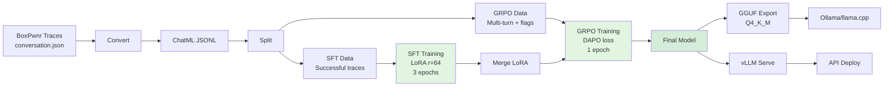

# Training Guide

Open CTF uses a 2-stage training pipeline: SFT (supervised fine-tuning) for knowledge acquisition, followed by GRPO (Group Relative Policy Optimization) for efficiency optimization.

## Pipeline Overview



## Data Preparation

### 1. Convert BoxPwnr Traces

```bash
# Convert successful traces only (recommended for SFT)
open-ctf-convert \
    --input targets/ \
    --output data/sft_train.jsonl \
    --success-only --dedup

# Also save failures (useful for GRPO negative examples)
open-ctf-convert \
    --input targets/ \
    --output data/sft_train.jsonl \
    --output-failure data/failures.jsonl
```

### 2. Split into SFT and GRPO Datasets

```bash
open-ctf-split \
    --input data/sft_train.jsonl \
    --sft-output data/sft_boxpwnr.jsonl \
    --grpo-output data/grpo_boxpwnr.jsonl \
    --max-grpo-tokens 32768
```

### Data Format

**SFT** uses ChatML format:

```json
{
  "messages": [
    {"role": "system", "content": "..."},
    {"role": "user", "content": "Solve: http://target"},
    {"role": "assistant", "content": "...", "tool_calls": [...]},
    {"role": "tool", "tool_call_id": "...", "name": "shell_command", "content": "..."}
  ],
  "metadata": {"source": "boxpwnr", "platform": "cybench"}
}
```

**GRPO** adds ground truth for reward computation:

```json
{
  "messages": [...],
  "ground_truth_flag": "FLAG{...}",
  "metadata": {"optimal_steps": 12, "vulnerability_type": "idor"}
}
```

## Stage 1: Supervised Fine-Tuning (SFT)

SFT teaches the model domain knowledge, tool schemas, and reasoning patterns.

### Quick Start

```bash
open-ctf-train sft \
    --model unsloth/GLM-4.7-Flash \
    --data data/sft_boxpwnr.jsonl \
    --output outputs/sft
```

### Full Pipeline

```bash
bash scripts/launch_training.sh --sft-only
```

### Configuration

Edit `configs/training.yaml`:

```yaml
model:
  name: "unsloth/GLM-4.7-Flash"
  max_seq_length: 8192
  # MoE models: use BF16 LoRA (4-bit QLoRA not supported for MoE)
  load_in_4bit: false

lora:
  r: 64
  alpha: 128
  dropout: 0
  target_modules: [q_proj, k_proj, v_proj, o_proj, gate_proj, up_proj, down_proj]
  use_rslora: true

sft:
  epochs: 3
  batch_size: 2
  gradient_accumulation_steps: 8
  learning_rate: 2.0e-4
  warmup_ratio: 0.03
  weight_decay: 0.01
  lr_scheduler_type: cosine
  packing: true
```

### Key Parameters

| Parameter | Recommended | Notes |
|-----------|-------------|-------|
| `epochs` | 3 | More epochs can improve tool-use accuracy |
| `batch_size` | 2 | Adjust based on GPU memory |
| `learning_rate` | 2e-4 | Standard for LoRA SFT |
| `packing` | true | Significantly improves throughput |
| `lora.r` | 64 | Higher rank = more capacity |

## Stage 2: GRPO (Reinforcement Learning)

GRPO optimizes for flag capture efficiency using the CTF reward function.

### Quick Start

```bash
open-ctf-train grpo \
    --model outputs/sft/final \
    --data data/grpo_boxpwnr.jsonl \
    --output outputs/grpo
```

### Configuration

```yaml
grpo:
  epochs: 1
  batch_size: 1
  gradient_accumulation_steps: 8
  learning_rate: 5.0e-6
  warmup_ratio: 0.10
  beta: 0.001
  loss_type: dapo
  num_generations: 4
  max_completion_length: 4096
```

### Reward Function

The CTF reward scores completions on four dimensions:

| Component | Weight | Description |
|-----------|--------|-------------|
| **Flag Capture** | 0.30 | Exact flag match (1.0) or pattern match (0.1) |
| **Skill Grammar** | 0.20 | RECON -> ENUM -> EXPLOIT phase ordering |
| **Efficiency** | 0.35 | Fewer steps = higher reward |
| **Format** | 0.15 | Valid tool call structure |

### Key Parameters

| Parameter | Recommended | Notes |
|-----------|-------------|-------|
| `beta` | 0.001 | Low KL penalty for CTF exploration |
| `loss_type` | dapo | Dynamic advantage normalization |
| `num_generations` | 4 | Completions per prompt for ranking |
| `learning_rate` | 5e-6 | Much lower than SFT to avoid instability |

## Merging LoRA Adapters

After training, merge the LoRA adapter into the base model:

```bash
open-ctf-train merge \
    --adapter outputs/grpo/final \
    --output outputs/merged
```

## Full Pipeline (SFT + GRPO + Merge)

```bash
bash scripts/launch_training.sh
```

This runs SFT, then GRPO, then merges the final adapter.

## Docker Training

For GPU training with Docker:

```bash
# SFT
docker compose run --rm sft

# GRPO (uses OPEN_CTF_NO_UNSLOTH=1 fallback for compatibility)
docker compose run --rm grpo
```

## Monitoring

Training logs to W&B by default. Set `WANDB_API_KEY` in your environment, or disable with:

```yaml
output:
  report_to: none
```

## DGX Spark / GB10 Notes

The NVIDIA DGX Spark (Grace Blackwell GB10) has specific constraints for MoE model training:

### MoE Models (GLM-4.7-Flash)

- **4-bit QLoRA is NOT supported** for MoE models (BitsAndBytes limitation). Use BF16 LoRA instead (`load_in_4bit: false`). GLM-4.7-Flash needs ~60GB VRAM for BF16 LoRA.
- **Triton shared memory limit**: GB10 has 99KB per thread block vs 104-147KB needed by MoE Triton kernels. Set `UNSLOTH_MOE_BACKEND=grouped_mm` (done automatically by our training code) to use `torch._grouped_mm` instead.
- **GRPO dtype bug**: Unsloth's GRPO kernels have a Half/BFloat16 mismatch on GB10. Use `OPEN_CTF_NO_UNSLOTH=1` for GRPO stage.
- **Router layers**: Not targeted by LoRA (per Unsloth recommendation for stability).

### Recommended Container Setup

```bash
# SFT with Unsloth (set MOE backend for MoE models)
docker run --gpus all \
  -e UNSLOTH_MOE_BACKEND=grouped_mm \
  -v ./data:/workspace/data -v ./outputs:/workspace/outputs \
  unsloth/unsloth open-ctf-train sft --model unsloth/GLM-4.7-Flash ...

# GRPO without Unsloth (bypass dtype bug)
docker run --gpus all \
  -e OPEN_CTF_NO_UNSLOTH=1 \
  -v ./data:/workspace/data -v ./outputs:/workspace/outputs \
  nvcr.io/nvidia/pytorch:25.11-py3 open-ctf-train grpo ...
```

### Fallback Options

If `grouped_mm` still fails on GB10:
1. Try `UNSLOTH_MOE_BACKEND=native_torch` (12x slower but avoids all Triton kernels)
2. Use `OPEN_CTF_NO_UNSLOTH=1` for both SFT and GRPO (pure HuggingFace + PEFT)
3. Use a dense model (e.g., Qwen3-8B) where 4-bit QLoRA works fine

## Hardware Requirements

| Stage | Minimum GPU | Recommended |
|-------|-------------|-------------|
| SFT (GLM-4.7-Flash, BF16 LoRA) | 1x 80GB (A100) | DGX Spark (128GB) |
| SFT (8B dense, 4-bit) | 1x 24GB (RTX 4090) | 1x 80GB (A100/H100) |
| GRPO (8B model) | 1x 80GB (A100/H100) | 1x 141GB (H200) |
| SFT (120B model) | 8x H100 80GB | 8x H200 141GB |
